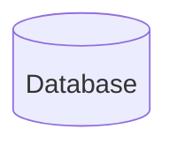

import Tabs from '@theme/Tabs';
import TabItem from '@theme/TabItem';

# Flow charts/Diagrams
Using charts, flow diagrams etc 
[Mermaid](http://mermaid.js.org/syntax/flowchart.html)

Maybe we can use this somewhere.

:::tip PID Tuning

<Tabs>
  <TabItem value="Yes" label="NO Filtering">
:::caution help :::
</TabItem>
  <TabItem value="No" label="Filtering is working">This is an orange</TabItem>
</Tabs>

:::

:::caution

|P|I|D|O|B|FF|
|-|-|-|-|-|--|
|2|4|5|6|9| 8|

:::

:::tip[Use tabs in admonitions]

<Tabs>
  <TabItem value="apple" label="Apple">This is an apple 🍎</TabItem>
  <TabItem value="orange" label="Orange">This is an orange 🍊</TabItem>
  <TabItem value="banana" label="Banana">This is a banana 🍌</TabItem>
</Tabs>

:::