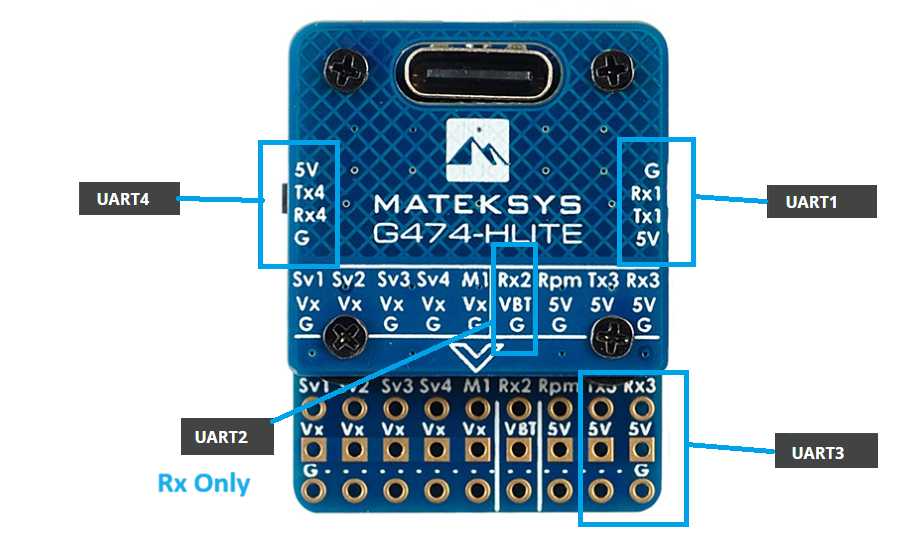

# Matek G474-HLite

:::info Specifications  
### Hardware Specifications： 
MCU: STM32G474CE  
IMU: ICM42688-P  
Black Box: W25N01G (128MB)  
Baro: SPL06 (I2C2）   
LED: LED_STRIP port  
Beeper: Buzzer output  
USB: Type-C  
UARTS: UART1, UART2 (Rx Only)，UART3, UART4   
ADC: Battery measurement VBat 2-6s (5.4-30v)
Servo Pins: CH1-CH4  
Motor Pins: M1
Voltage range Vx: 4.5V~14V  
RPM Inputs: RPM Frequency input     
Dimensions: 30mm x 23mm x 13mm  
Weight: 9g  
:::

### Rotorflight Target
When updating Rotorflight firmware. Please use the MATEKG474HELI target.

### Motorised Tail
The H-Lite FC is configured with 4 servos and 1 motor. If you wish to use this board for a motorised tail it can be added in the CLI using the following command (just copy and past this into the CLI then push [ENTER]). 

`resource SERVO 4 none`  
`resource motor 2 A06`  
`save`  

### Wiring

### UART ports

### Manuals
Detail specifications and doccumentation available at the Matek website.  
[Matek G474-HLite website](https://www.mateksys.com/?portfolio=g474-hlite)
