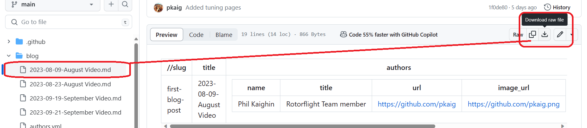

# Adding a Blog Post

To make a new Blog post open the [Blog Directory](https://github.com/pkaig/Rotorflight-Docs/tree/main/blog). Click on one of the previous posts to use as a template then chose download.  

Make the changes you wish using a text editor. Click on the **Blog** folder and **Add File**. Upload your new blog file.

