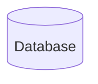

# Flow charts/Diagrams
Using charts, flow diagrams etc 
[Mermaid](http://mermaid.js.org/syntax/flowchart.html)

Maybe we can use this somewhere.

```mermaid
graph TD;
    A-->B;
    A-->C;
    B-->D;
    C-->D;
```

```mermaid
flowchart LR
    id1[(Database)]
```

