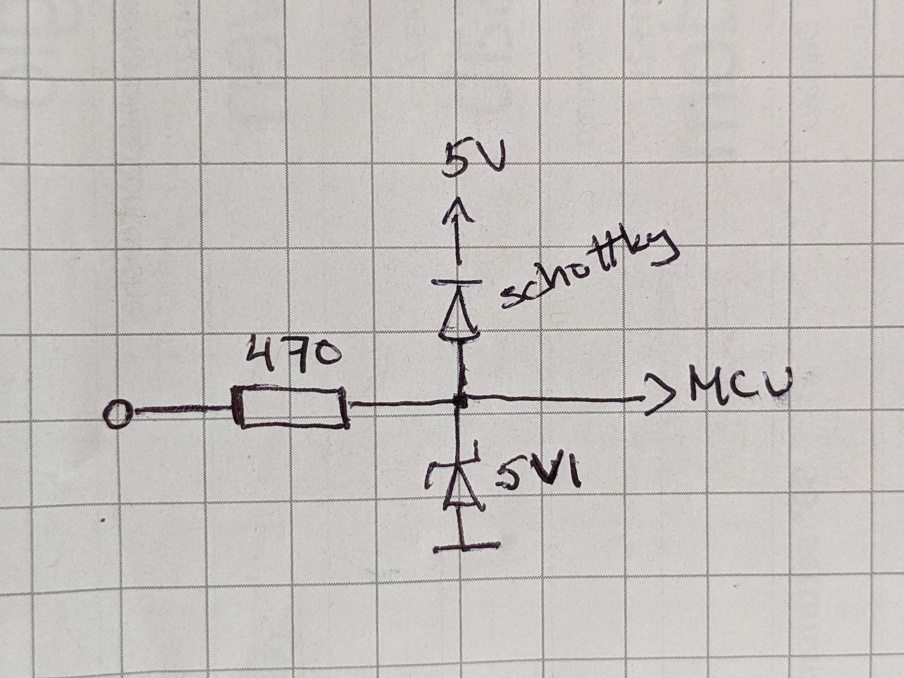

# Design Requirements

This page collects the generic hardware requirements for all Flight Controller designs for Rotorflight.

The actual Reference Designs for Rotorflight-2 can be found [here](https://github.com/rotorflight/rotorflight/wiki/Rotorflight-FC-Reference-Design).

__For an FC to be fully supported by Rotorflight-2 (RF2), it must follow one of the Reference Designs.__

## General

Rotorflight is based on Betaflight, and thus has the same basic requirements for the hardware.

Please read the Design Guidelines for [Betaflight](https://github.com/betaflight/betaflight/blob/4.4.0-RC5/docs/Manufacturer%20Design%20Guidelines.md)
first.

## Features

The following features and peripherals are mandatory:

- Gyroscope & Accelerometer
- Barometer
- Blackbox (flash chip or SD card)
- Indicator LEDs (Power, GPIO)
- DFU button
- USB socket
- Regulated +5V for external devices (RPM sensor, GPS, Compass, LED strips, etc.)
- Voltage sensor (ADC) for Vx and +5V

Optional peripherals and features:

- Voltage sensor (ADC) for main battery (Vbat)

### Gyroscope & Accelerometer

The supported gyro&acc chips are:

- BMI270
- ICM42688P
- ~~ICM20689~~ (supported but poor performance)
- ~~ICM20602~~ (supported but poor performance)

Other models are not supported.

### Barometer

The supported barometer chips are:

- SPL06
- DPS310
- ~~BMP280~~ (supported but poor performance)
- ~~BMP388~~ (supported but poor performance)

Other barometer models - like BMP390 - will be supported in the future.

### Blackbox Flash

The minimum suggested flash size for the Blackbox is 1Gbit (128Mb x 8).

The supported SPI flash chips are:

- Winbond W25N01G
- ~~Winbond W25Q64~~ (supported but not large enough for RF use)
- ~~Winbond W25Q128~~ (supported but not large enough for RF use)
- ~~Winbond W25Q256~~ (supported but not large enough for RF use)

Larger flash chips - like W25N02 and W25N04 - will be supported in the future.

## Connectors

A helicopter Flight Controller typically have two kinds of connectors. The servo and motors are connected to standard 0.1" pin headers, with 6V-8.4V power on the center pin. The power is usually provided by a BEC in the ESC. The other connectors are usually UARTs or multi-function connectors, with 5V power. Most commonly these are JST type connectors (XH,PA,GH,etc).

It is also very useful to have the motor/servo headers on one end of the FC, and the other connectors on the other. This helps to remember that the other side has BEC (>6V) voltage, and the other side has 5V.

The standard "JR" style servo plugs are thicker than 0.1", usually 2.65mm. If more than 4 headers are located side by side, an extra gap of 0.5mm is required after every 4x3 header block. Otherwise the servo plugs will not fit in properly.

## Servo and Motor Outputs

### Cyclic Servos

Three servos are required for cyclic. The reference designs also have a pin for an optional fourth cyclic servo, which can be a solder pad on the PCB.

The servo pins should be selected so that they are _on the same timer_.
DMA is not required for servos, but the pins should have it available for future use.

The servo header is a standard 0.1" pin header. It's common to have the cyclic servos side-by-side, as a 3x3 header block.

### Tail servo / ESC

The tail servo pin should be selected so that it is on a different timer than the cyclic servos. For ESC/motor use, DMA must also be available without conflicts. The pin and timer selection must allow DShot BitBang.

### Main ESC

Main ESC/motor pin should be selected so that it is on a different timer than the tail motor/servo. The pin must have DMA available without conflicts. The pin and timer selection must allow DShot BitBang.

### ESC telemetry / RPM

The ESC telemetry pin can be an Rx on any UART.

If a combined ESC telemetry and RPM input pin is preferred, then the pin should be selected so that it can act as a UART Rx, and a timer input, for example PA1 or PA3.

The RPM input requires a free timer. The timer can't be shared with other functions. 

TIM2 and TIM5 can accommodate 4 RPM inputs, one on each channel. Other timers can accommodate only one RPM input.
It is preferred to use TIM2 or TIM5 for RPM inputs.

The RPM inputs require over-voltage protection diodes. Any pin header that provides the servo power (VX) and can act as an RPM input, must have the protection diode on the signal pin. This is due to a shortcoming in a commonly used HobbyWing RPM sensor.

## Extension Ports

The extension ports are for any extra peripherals, including receivers.

The ports are primarily for UARTs, but because of the STM32 flexibility, they can be configured for other functions too.

Possible functions are:

- UART
- I2C
- RPM input
- LED strip
- Extra PWM (servo) output
- Extra DShot (motor) output
- Camera Control
- Voltage and current measurements (ADC)
- RSSI input
- External OSD
- Video Tx Control (VTX)

The physical connector should be 4-pin JST-GH [GND, 5V, RX, TX], or other JST style polarised connector.

### UARTs

It is preferable to have as many UARTs available as possible.

### Receiver

Typically, any of the UART connectors can be used for connecting the receiver.

If a dedicated receiver port is preferred, UART3/4 on PC10/PC11 is the best choice due to its flexibility.

#### DSM

Spektrum DSM can't be connected to a UART socket, as it requires 3.3V.
The DSM socket is a JST-ZH with [3.3V GND DATA] pins.

The options for connecting a DSM receiver are:

- Provide a standard DSM socket
- Connect to a generic UART socket with 3.3V power (instead of 5V)
- Connect to a generic UART socket with an adapter, converting 5V to 3.3V

### Compass

An external compass connects to an I2C interface, which can be provided by one of the multi-function headers (UART/I2C/...)

Usually a compass is integrated into an external GPS unit.

Note! The external I2C can't be shared with the internal barometer, as this would not allow using that pin header for anything else than I2C.

### GPS

An external GPS connects to any of the UART (multi-function) headers.

If a GPS specific header is preferred, a 6-pin socket with [GND,SDA,SCL,TX,RX,5V] can be added (Pixhawk compatible).

### LED STRIP

The WS2812B LED strip requires a GPIO pin with a timer and DMA capability.

It can be provided on one of the multi-function header (shared with UART etc.)

## Other Features

### LEDs

At least one power LED and one indicator LED (GPIO) are mandatory.

Preferably, a two colour (green+red) indicator LED on two GPIO pins can be used.

### Boot/DFU button

There _must_ be a bootloader DFU button on the PCB, accessible _without_ opening the FC case.

### SWD

The SWD pins PA13 and PA14 must be exposed on test pads on the PCB, along with the GND and +3.3V pads.

## Power

### 5V

A 5V power must be provided for the external devices.

The regulator should be able to provide at last 1A current, preferably 2A.

### VX (BEC power)

The system is powered from the VX Power bus, which can be provided by a BEC or a 2S LiPo battery.

The VX power is fed into the FC via the ESC pin headers (Throttle, Telem, RPM).

Large ESCs usually have two or three pairs of BEC power wires, for increasing the current capacity. The FC should have input pins for all of them.

For very large helicopters, it may be reasonable to have a separate connector (XT30) for the VX power input.

## ESD Protection

The STM32 GPIO pins are _NOT_ protected for over-voltage (details in ST Application Notes).
Thus, any pins exposed on external connectors should be protected by TVS diodes and current limiting resistors.

The signal pins on the sockets with servo power (Vx) should have 470ohm resistors.

The signal pins on the expansion sockets with +5V power should have 22ohm resistors.

The higher resistance (470ohm) on the servo/ESC pins provides protection against accidental polarity reversal (unplugging the ESC/BEC plug wrong way around).

The lower resistance (22ohm) on the expansion sockets is required for the various protocols used.
It is still offering some over-current protection, while not interfering with the signals.

The easiest way to implement the protection is to use an ESD protection IC with integrated steering and TVS diodes:

Or using discrete components:

## Miscellaneous Notes

### TIM1 and TIM8

DShot BitBang requires one "pacing" timer, either TIM1 or TIM8. In the design, one of them must be reserved for BitBang use.

One "pacing" timer channel and one DMA channel is required for each GPIO port (PA,PB,PC,PD) with motor pins. It is preferred to have all motor pins located on the same GPIO port, thus using only one timer and DMA channel.

