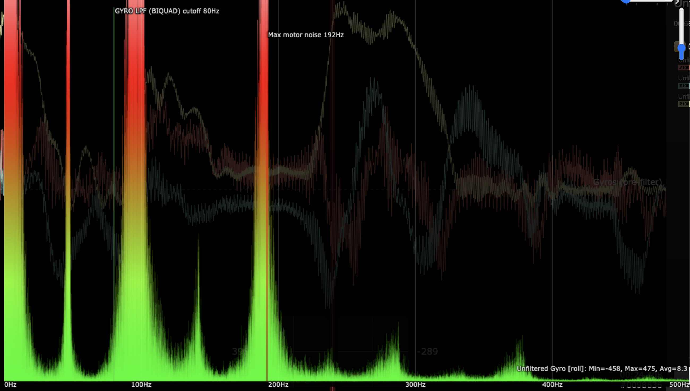

# First Flight & Filter Tuning

It is crucial to tune the filters based on your helicopter to gain the maximum performance while keeping noise out of the control loop. A good filter tuning should be just strong enough to suppress the peaks in the gyro readouts. A filter too weak may have peaks leaked inside the loop, and a filter too strong, while making the gyro signal clean, may lower the maximum gains later which cause a "sloppy" and delayed feel.

It is highly recommended to use the RPM filter on RF. A good starting point is to use a single with Q = 2.5 on the fundamental and a double with Q = 2.5 on the second harmonic for the main rotor. For tail rotor, a single with Q = 2.5 on fundamental and second harmonic will most likely do the job. Motor filter should be turned on as well for non-direct drive machines. A first-order Gyro low pass filter with cutoff frequency of 100hz should be turned on. Notice: a low Q value makes the filter wide and strong, a high Q value makes the filter narrow and weak. It is always preferred to have highest Q value possible without leaking too much vibrations. 

# First Flight
(Assume the default setting was discussed and set to be reasonable. Right now the roll/yaw gains are a bit too high)
The default setting would more than likely ensure a controllable hover. Take off with rpm set to the highest you want to use and hover for a minute or two. If you notice any fast vibrations, land immediately. 

# Filter Tuning
Open log and click on filtered gyro. Click Gyro[roll/pitch/yaw] legends on the right to show a FFT (frequency response) of the filtered gyro. Ideally, you should see very high magnitude at the very left, and low values at other range. If you see a peak, look for the frequency of the peak and try to divide it with its fundamental frequency. For example, 2800rpm/60 = 46.7hz. If you see a sharp peak at 186hz, which is 4 times, turn on the notch filter on the 4th harmonic of the main blades with Q = 4.0. 

If theres a peak that is not divisible by main or tail blade fundamental and persist at different rpm, it might be due to some other sources of vibration, e.g. skids, tail fin, tail belt. etc. Check your helicopter first, but if you could not resolve it, use a notch filter centered at the exact frequency of the vibration and set the cutoff close to the left end of the peak. 

If there is a "bump" at the fundamental & second harmonic, consider lowering the Q values or use double filter on the fundamental. However, it is not advised to lower the Q value below 2.0 as it might significantly affect performance. Two of the main reasons that cause high vibration at those frequencies are blade tracking and blade imbalance. Check them first if you want to achieve a higher performance.

For the low pass filter, it is not advised to lower it below 60hz, which might start to affect performance significantly. When there is no peak existing but there is high "grass" at around 60-80hz especailly when doing maneuvers, try lower it. Remember, its better if this cutoff is high so lower it (especially below 80hz) if absolutely necessary.

A well-tuned filter should have no sharp peaks and might have small bumps at 40-80hz. 

# Further Tuning
The noise is usually much higher during 3D flight especially on the second harmonic of the main blades. If peaks appears after 3D flights, consider lower Q value on the second harmonics. Tall "grass" is usually fine.

## Example: A Relatively Well Tuned Dilter During 3D Maneuvers

### RAW Gyro:  

  
### Filtered Gyro:
  