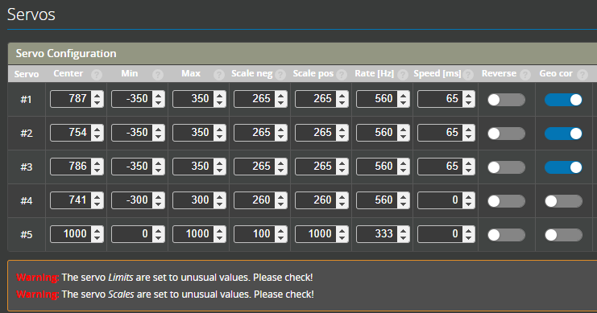
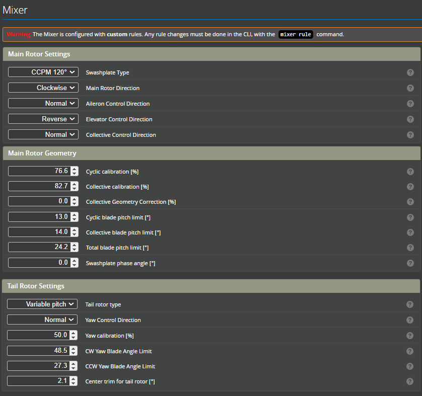
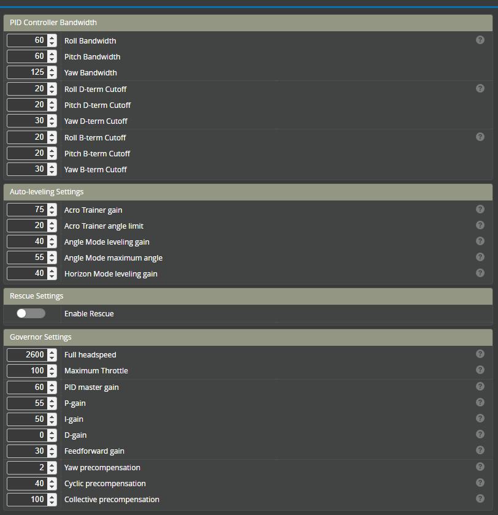

import Tabs     from '@theme/Tabs';
import TabItem  from '@theme/TabItem';

import noFilter         from './img/no-filter.png';
import Filter           from './img/working-filter.png';

import jonas_m7         from './img/jw-m7.jpeg';
import jonas_m7_light   from './img/jw-m7-light.jpeg';
import Jiawen_M7        from './img/jiawen-m7.jpeg';
import Jiawen_nimbus    from './img/jiawen-nimbus.png';

# Tuning examples and presets

:::caution
  Please use the supplied defaults until a maiden flight has been conducted and the filtering is confirmed. Once this is done higher gains can be tested. Skipping this step and using these settings without adequate filtering could result in an uncontrollable helicopter. 
    <table>
        <td>
            **No filter**
            
        </td>
        <td>
            **Filters are working**
            
        </td>
    </table> 
:::
:::danger
⚠ THE CREATORS OF THESE PRE-SETS ASSUME NO RESPONSIBILITY OR LIABILITY FOR DAMAGE CAUSED BY USING THEIR PARAMETERS. IMPROPER USE MAY LEAD TO LOSS OF VEHICLE, INJURY OR DEATH. PROCEED AT YOUR OWN RISK. ⚠
:::

## How to use these presets?
There are two options for using these pre-sets. 
1. Follow the screen shots to configure your helicopter.  
2. Load from the supplied Diff file. **Please note:** This method may overwright some of your previously configured settings. Please check and confirm carefully.

## OMP M7
 
:::info[OMPHOBBY M7]
### Jonas Wackershauser - M7  

This is a high headspeed version of my M7 tune. 
<Tabs>
    <TabItem value="OMPHOBBY M7" label="OMPHOBBY M7" default>
    

        
    

    </TabItem>
    <TabItem value="View Pre-set" label="View Pre-set">
        <Tabs>
            <TabItem value="Author’s Notes" label="Author’s Notes" default>
            Author’s Notes - READ BEFORE USING THIS TUNE  

            **Creator:**&nbsp;&emsp;&emsp;&emsp;&emsp;&emsp;&nbsp;&nbsp;&emsp;&emsp;&emsp;Jonas Wackershauser @Johnny31297   
            **Revision Date:**&ensp;&emsp;&emsp;&emsp;&emsp;&nbsp;&emsp;03.07.2024  
            **Rotorflight Version:**&emsp;&emsp;&emsp;&nbsp;2.0.0 Release  
            **Rotorflight Hardware:**&emsp;&emsp;&nbsp;RadioMaster NEXUS  
            **Tune Attributes:**&emsp;&emsp;&emsp;&emsp;&emsp;Precise, Locked-In, 3D, Robotic  

            Hey there! As the creator of the OMPHOBBY M7 and avid Rotorflight 2 user, I want to share my personal Rotorflight 2 tune for my models with you. This is a highly tuned 3D setup for the M7, featuring great stability, excellent setpoint tracking and very precise and locked-in response. Be aware that this setup is specifically tuned for my chosen components, and that it might not perform optimally if you fly different components. You can, however, use it as a baseline for your own tune. As always, first verify that your filters are working correctly, then proceed onto the PIDFOB numbers.  

            This tune is set up to work with a universal transmitter profile. Channel order is AECR1T23.  
            Ensure all channels reach ±100% travel!  
            AUX1 for arming as per ELRS convention.  
            AUX2 for profile switching. ⚠ Mind the profile assignments, ensure proper AUX2 mapping ⚠  
            Profile #1 at -100% for 1400RPM  
            Profile #2 at -33% for 1850RPM  
            Profile #3 at +33% for 2100RPM  
            Profile #4 at +100% for Autorotation with bailout.  
            AUX3 controls PWM output on the SBUS port, for disabling a backup capacitor.  

            Enjoy!  

            **Helicopter:**&nbsp;&nbsp;&nbsp;&nbsp;&nbsp;OMPHOBBY M7  
            **Main Rotor Blades:**&nbsp;&nbsp;&nbsp;RotorTech 700mm Ultimate  
            **Tail Rotor Blades:**	RotorTech 106mm Ultimate  
            **Swash Servos:** 	KST HLS X20-2208  
            **Yaw Servo:**		KST HLS X20-1035  
            **FBL/Receiver:**	RadioMaster NEXUS & RP3-H  
            **Motor:**			SUNNYSKY R4530-518KV  
            **Pinion:**			13t  
            **ESC:**			Scorpion Tribunus II 14-200A  
            **Battery:**		OMPHOBBY 12S 5100mAh 70C  
            **Backup:**		    OMPHOBBY 25F 8V4 Capacitors  
            **Dampers:** 		90° Shore Rubber, 0.2mm Compression per side  
            **Servo Arms:**		OMPHOBBY 18mm Aluminium  
            **Geometry:**	 	32mm 3D  
            **ESC Setup:**		BEC 8V2, ESC Governor Prestored Values  
            **Tx Settings:**	ELRS 500Hz Wide  

            <iframe width="560" height="315" src="https://www.youtube.com/embed/U16wO_Fw58E?si=g8HEymzsBBCnx8Fl" title="YouTube video player" frameborder="0" allow="accelerometer; autoplay; clipboard-write; encrypted-media; gyroscope; picture-in-picture; web-share" referrerpolicy="strict-origin-when-cross-origin" allowfullscreen></iframe>

        </TabItem>
        <TabItem value="Recommended Filters" label="Recommended Filters" default>
              
        </TabItem>
        <TabItem value="I have checked and filters are enabled and working" label="I have checked: filters are enabled and working">
            #### Diff all
            [**Jonas M7 Diff All**](./diff-all/RTFL_cli_OMP_M7_Jonas_W_20240703_140425.txt)  - This is suitable for all Rotorflight Controllers  

            #### Servos
              
            Mixer: Calibration  
              

            #### Headspeed: 1400RPM  
              
            #### Headspeed: 1850RPM
              
            #### Headspeed: 2100RPM
              
            #### Autorotation
            
        </TabItem>
    </Tabs>
    </TabItem>
</Tabs>
:::

:::info[OMPHOBBY M7 light]
### Jonas Wackershauser - M7 Light  
This is a low headspeed version of my M7 tune.  

<Tabs>
    <TabItem value="OMPHOBBY M7" label="OMPHOBBY M7" default>
    

        
    

    </TabItem>
    <TabItem value="View Pre-set" label="View Pre-set">
        <Tabs>
        <TabItem value="Author’s Notes" label="Author’s Notes" default>
            Author’s Notes - READ BEFORE USING THIS TUNE  

            **Creator:**&nbsp;&emsp;&emsp;&emsp;&emsp;&emsp;&nbsp;&nbsp;&emsp;&emsp;&emsp;Jonas Wackershauser @Johnny31297   
            **Revision Date:**&ensp;&emsp;&emsp;&emsp;&emsp;&nbsp;&emsp;03.07.2024  
            **Rotorflight Version:**&emsp;&emsp;&emsp;&nbsp;2.0.0 Release  
            **Rotorflight Hardware:**&emsp;&emsp;&nbsp;RadioMaster NEXUS  
            **Tune Attributes:**&emsp;&emsp;&emsp;&emsp;&emsp;Precise, Locked-In, 3D, Robotic   

        Hey there! As the creator of the OMPHOBBY M7 and avid Rotorflight 2 user, I want to share my personal Rotorflight 2 tune for my models with you. This setup is for my light, low RPM M7 setup on 6S, weighing only 4.1kg RTF! Be aware that this setup is specifically tuned for my chosen components, and that it might not perform optimally if you fly different components. You can, however, use it as a baseline for your own tune. As always, first verify that your filters are working correctly, then proceed onto the PIDFOB numbers.  

            This tune is set up to work with a universal transmitter profile. Channel order is AECR1T23.  
            Ensure all channels reach ±100% travel!  
            AUX1 for arming as per ELRS convention.  
            AUX2 for profile switching. ⚠ Mind the profile assignments, ensure proper AUX2 mapping ⚠  
            Profile #1 at -100% for 900RPM  
            Profile #2 at -33% for 1250RPM  
            Profile #3 at +33% for 1650RPM  
            Profile #4 at +100% for Autorotation with bailout.  

            Enjoy!  

            **Helicopter:** 		OMPHOBBY M7  
            **Main Rotor Blades:** 	RotorTech 700mm Ultimate  
            **Tail Rotor Blades:**	RotorTech 116mm Ultimate  
            **Swash Servos:** 	KST X20-1806 Low Profile  
            **Yaw Servo:**		KST X20-1806 Low Profile  
            **FBL/Receiver:**	RadioMaster NEXUS & RP3-H  
            **Motor:**			SUNNYSKY R4520-840Kv  
            **Pinion:**			13t  
            **ESC:**			Scorpion Tribunus III 06-160A  
            **Battery:**		OMPHOBBY 6S 5100mAh 70C  
            **Backup:**		-  
            **Dampers:** 		90° Shore Rubber  
            **Servo Arms:**		OMPHOBBY 18mm Plastic  
            **Geometry:**	 	32mm 3D  
            **ESC Setup:**		BEC 8V2, ESC Governor Prestored Values   

            <iframe width="560" height="315" src="https://www.youtube.com/embed/lA4fO8km_bM?si=_O2wPotfAKVEsUXe" title="YouTube video player" frameborder="0" allow="accelerometer; autoplay; clipboard-write; encrypted-media; gyroscope; picture-in-picture; web-share" referrerpolicy="strict-origin-when-cross-origin" allowfullscreen></iframe>

        </TabItem>
        <TabItem value="Recommended Filters" label="Recommended Filters" default>
              
        </TabItem>
        <TabItem value="I have checked and filters are enabled and working" label="I have checked: filters are enabled and working">
            #### Diff all
            [**Jonas M7 Diff All Light**](./diff-all/RTFL_cli_M7_Light_Jonas_W_20240705_122837.txt)  - This is suitable for all Rotorflight Controllers  

            #### Servos
              
            Mixer: Calibration  
              

            #### Headspeed: 900RPM  
              
            #### Headspeed: 1250RPM
              
            #### Headspeed: 1650RPM
              
            #### Autorotation
            
        </TabItem>
    </Tabs>
    </TabItem>
</Tabs>
:::

:::info[OMPHOBBY M7]
### Jiawen Bao - M7  

<Tabs>
    <TabItem value="OMPHOBBY M7" label="OMPHOBBY M7" default>
    

        
    

    </TabItem>
    <TabItem value="View Pre-set" label="View Pre-set">
        <Tabs>
        <TabItem value="Author’s Notes" label="Author’s Notes" default>
            Author’s Notes - READ BEFORE USING THIS TUNE  

            **Creator:**&nbsp;&emsp;&emsp;&emsp;&emsp;&emsp;&nbsp;&nbsp;&emsp;&emsp;&emsp;Jiawen Bao @etocii   
            **Rotorflight Version:**&emsp;&emsp;&emsp;&nbsp;2.0.0 Release  
            **Rotorflight Hardware:**&emsp;&emsp;&nbsp;Flydragon F722 v2.2  
            **Tune Attributes:**&emsp;&emsp;&emsp;&emsp;&emsp;Precise, Locked-In, 3D, Robotic   

            This tune has a single profile using the Rotorflight Governor with maximum headspeed of 2200RPM. 

            **Helicopter:** 		OMPHOBBY M7  
            **Main Rotor Blades:** 	RotorTech 715mm Ultimate  
            **Tail Rotor Blades:**	RotorTech 106mm Ultimate  
            **FBL/Receiver:**	Flydragon F722v2  
            **Motor:**			SUNNYSKY R4530  
            **Pinion:**			13t  
            **ESC:**			Hobbywing 260A v5  
            **Dampers:** 		POM  

            <iframe width="560" height="315" src="https://www.youtube.com/embed/lk8hiFstBJM?si=nfFoVsEjYLGLDJU-" title="YouTube video player" frameborder="0" allow="accelerometer; autoplay; clipboard-write; encrypted-media; gyroscope; picture-in-picture; web-share" referrerpolicy="strict-origin-when-cross-origin" allowfullscreen></iframe>
        </TabItem>
        <TabItem value="Recommended Filters" label="Recommended Filters" default>
              
        </TabItem>
        <TabItem value="I have checked and filters are enabled and working" label="I have checked: filters are enabled and working">
            #### Diff all
            [**Jiawen M7 Diff All**](./diff-all/RTFL_cli_OMP_M7_Jiawen_20240708_212743.txt)  - This is suitable for all Rotorflight Controllers  

            #### Servos
              
            Mixer: Calibration  
              

            #### Headspeed: 2200RPM  
              
        </TabItem>
    </Tabs>
    </TabItem>
</Tabs>
:::

## XLPower Nitro Nimbus
:::info[XLPower Nitro Nimbus]
### Jiawen Bao - Nitro Nimbus.  

<Tabs>
    <TabItem value="Nitro Nimbus" label="Nitro Nimbus" default>
    

        
    

    </TabItem>
    <TabItem value="View Pre-set" label="View Pre-set">
        <Tabs>
        <TabItem value="Author’s Notes" label="Author’s Notes" default>
            Author’s Notes - READ BEFORE USING THIS TUNE  

            **Creator:**&nbsp;&emsp;&emsp;&emsp;&emsp;&emsp;&nbsp;&nbsp;&emsp;&emsp;&emsp;Jiawen Bao @etocii   
            **Rotorflight Version:**&emsp;&emsp;&emsp;&nbsp;2.0.0 Release  
            **Rotorflight Hardware:**&emsp;&emsp;&nbsp;Flydragon F722 v2.2  
            **Tune Attributes:**&emsp;&emsp;&emsp;&emsp;&emsp;Precise, Locked-In, 3D, Robotic   

            This tune has a single profile using the Rotorflight Governor with maximum headspeed of 2200RPM. 

            **Helicopter:** 		XLPower Nitro Nimbus  
            **Main Rotor Blades:** 	RotorTech 580mm Ultimate  
            **Tail Rotor Blades:**	RotorTech 96mm Ultimate  
            **FBL/Receiver:**	    Flydragon F722v2  
            ***Servos:***           Theta C1, D1  
            **Engine:**			    OS55HZR  
            **RPM sensor:**			ALIGN sensor   

        <iframe width="560" height="315" src="https://www.youtube.com/embed/SX1gI6EBy5k?si=LQsTeogDzOPADhxx" title="YouTube video player" frameborder="0" allow="accelerometer; autoplay; clipboard-write; encrypted-media; gyroscope; picture-in-picture; web-share" referrerpolicy="strict-origin-when-cross-origin" allowfullscreen></iframe>

        </TabItem>
        <TabItem value="Recommended Filters" label="Recommended Filters" default>
              
        </TabItem>
        <TabItem value="I have checked and filters are enabled and working" label="I have checked: filters are enabled and working">
            #### Diff all
            [**Jiawen Nimbus Diff All**](./diff-all/RTFL_cli_Nimbus_Nitro_20240712_125546.txt)  - This is suitable for all Rotorflight Controllers  
              
            [**S5 on SBUS Port**](./diff-all/S5-on-Sbus.txt) - Jiawen uses the SBUS port as an extra servo which is used to control the glow ignighter. This file will configur the extra servo. This file is suitable for Flydragon F722V2, FlywingF405 and NEXUS.

            #### Servos
              
            Mixer: Calibration  
              

            #### Headspeed: 2100RPM  
            With a throttle signal of 100%  
              
              
        </TabItem>
    </Tabs>
    </TabItem>
</Tabs>
:::