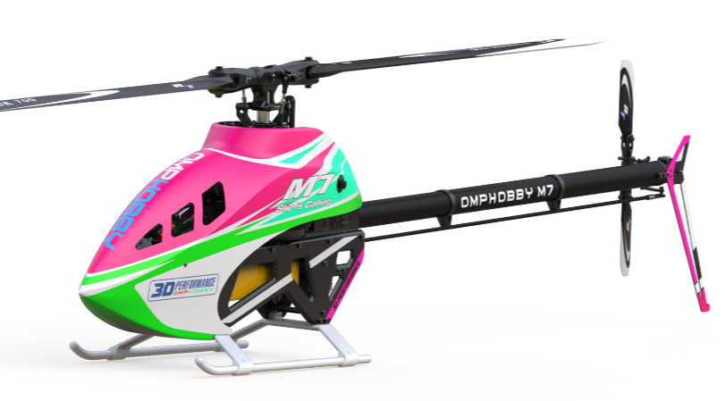
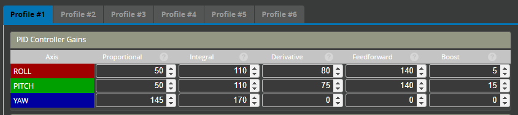
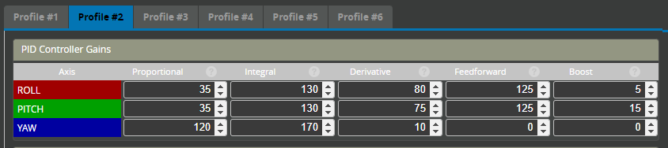
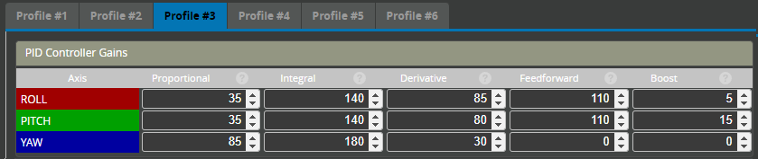
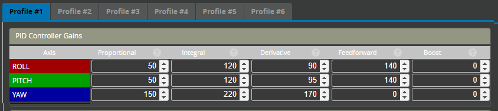
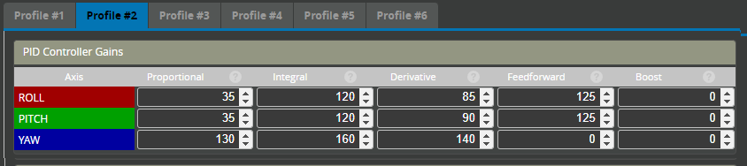
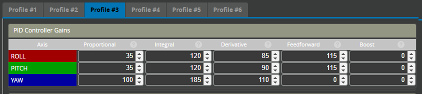

import Tabs from '@theme/Tabs';
import TabItem from '@theme/TabItem';

# Tuning examples and presets

:::caution
  Please use the supplied defaults until a maiden flight has been conducted and the filtering is confirmed. Once this is done higher gains can be tested. Skipping this step and using these settings without adequate filtering could result in an uncontrollable helicopter. 
:::
:::warning
⚠ THE CREATOR ASSUMES NO RESPONSIBILITY OR LIABILITY FOR DAMAGE CAUSED BY USING THIS DIFF. IMPROPER USE MAY LEAD TO LOSS OF VEHICLE, INJURY OR DEATH. PROCEED AT YOUR OWN RISK. ⚠
:::
## OMP M7

  
:::info[OMPHOBBY M7]
### Jonas Wackershauser
This is a high headspeed version of my M7 tune.

<Tabs>
  <TabItem value="My filters are disabled" label="My filters are disabled" default>
Use defaults as supplied  
  </TabItem>
  <TabItem value="Author’s Notes" label="Author’s Notes" default>
    Author’s Notes - READ BEFORE USING THIS TUNE  

    **Creator:**&nbsp;&emsp;&emsp;&emsp;&emsp;&emsp;Jonas Wackershauser @Johnny31297  
    **Revision Date:**&ensp;&emsp;&emsp;&emsp;&emsp;&emsp;03.07.2024  
    **Rotorflight Version:**&emsp;&emsp;&emsp;2.0.0 Release  
    **Rotorflight Hardware:**&emsp;&emsp;RadioMaster NEXUS  
    **Tune Attributes:**&emsp;&emsp;&emsp;&emsp;&emsp;Precise, Locked-In, 3D, Robotic  

    Hey there! As the creator of the OMPHOBBY M7 and avid Rotorflight 2 user, I want to share my personal Rotorflight 2 tune for my models with you. This is a highly tuned 3D setup for the M7, featuring great stability, excellent setpoint tracking and very precise and locked-in response. Be aware that this setup is specifically tuned for my chosen components, and that it might not perform optimally if you fly different components. You can, however, use it as a baseline for your own tune. As always, first verify that your filters are working correctly, then proceed onto the PIDFOB numbers.  

    This tune is set up to work with a universal transmitter profile. Channel order is AECR1T23.  
    Ensure all channels reach ±100% travel!  
    AUX1 for arming as per ELRS convention.  
    AUX2 for profile switching. ⚠ Mind the profile assignments, ensure proper AUX2 mapping ⚠ 
    Profile #1 at -100% for 1400RPM  
    Profile #2 at -33% for 1850RPM  
    Profile #3 at +33% for 2100RPM  
    Profile #4 at +100% for Autorotation with bailout.  
    AUX3 controls PWM output on the SBUS port, for disabling a backup capacitor.  

    Enjoy!  

    **Helicopter:** 		OMPHOBBY M7  
    **Main Rotor Blades:** 	RotorTech 700mm Ultimate  
    **Tail Rotor Blades:**	RotorTech 106mm Ultimate  
    **Swash Servos:** 	KST HLS X20-2208  
    **Yaw Servo:**		KST HLS X20-1035  
    **FBL/Receiver:**	RadioMaster NEXUS & RP3-H  
    **Motor:**			SUNNYSKY R4530-518Kv  
    **Pinion:**			13t  
    **ESC:**			Scorpion Tribunus II 14-200A  
    **Battery:**		OMPHOBBY 12S 5100mAh 70C  
    **Backup:**		    OMPHOBBY 25F 8V4 Capacitors  
    **Dampers:** 		90° Shore Rubber, 0.2mm Compression per side  
    **Servo Arms:**		OMPHOBBY 18mm Aluminium  
    **Geometry:**	 	32mm 3D  
    **ESC Setup:**		BEC 8V2, ESC Governor Prestored Values  
    **Tx Settings:**	ELRS 500Hz Wide  

  </TabItem>
  <TabItem value="Recommended Filters" label="Recommended Filters" default>
      
  </TabItem>

  <TabItem value="I have checked and filters are enabled and working" label="I have checked: filters are enabled and working">
    #### Diff all
    [JW-M7 Diff All](./diff-all/RTFL_cli_OMP_M7_Jonas_W_20240703_140425.txt)  
    #### Servos
      
    Mixer: Calibration  
      

    #### Headspeed: 1400RPM  
      
    #### Headspeed: 1850RPM
      
    #### Headspeed: 2100RPM
      
    #### Autorotation
    
    </TabItem>
</Tabs>

:::

:::info[OMPHOBBY M7 light]
### Jonas Wackershauser - Light Version
This is a low headspeed version of my M7 tune.

<Tabs>
  <TabItem value="My filters are disabled" label="My filters are disabled" default>
Use defaults as supplied  
  </TabItem>
  <TabItem value="Author’s Notes" label="Author’s Notes" default>
    Author’s Notes - READ BEFORE USING THIS TUNE  

    **Creator:**&nbsp;&emsp;&emsp;&emsp;&emsp;&emsp;Jonas Wackershauser @Johnny31297  
    **Revision Date:**&ensp;&emsp;&emsp;&emsp;&emsp;&emsp;03.07.2024  
    **Rotorflight Version:**&emsp;&emsp;&emsp;2.0.0 Release  
    **Rotorflight Hardware:**&emsp;&emsp;RadioMaster NEXUS  
    **Tune Attributes:**&emsp;&emsp;&emsp;&emsp;&emsp;Precise, Locked-In, 3D, Robotic  

    Hey there! As the creator of the OMPHOBBY M7 and avid Rotorflight 2 user, I want to share my personal Rotorflight 2 tune for my models with you. This is a highly tuned 3D setup for the M7, featuring great stability, excellent setpoint tracking and very precise and locked-in response. Be aware that this setup is specifically tuned for my chosen components, and that it might not perform optimally if you fly different components. You can, however, use it as a baseline for your own tune. As always, first verify that your filters are working correctly, then proceed onto the PIDFOB numbers.  

    This tune is set up to work with a universal transmitter profile. Channel order is AECR1T23.  
    Ensure all channels reach ±100% travel!  
    AUX1 for arming as per ELRS convention.  
    AUX2 for profile switching. ⚠ Mind the profile assignments, ensure proper AUX2 mapping ⚠  
    Profile #1 at -100% for 900RPM  
    Profile #2 at -33% for 1250RPM  
    Profile #3 at +33% for 1650RPM  
    Profile #4 at +100% for Autorotation with bailout.  

    Enjoy!  

    **Helicopter:** 		OMPHOBBY M7  
    **Main Rotor Blades:** 	RotorTech 700mm Ultimate  
    **Tail Rotor Blades:**	RotorTech 106mm Ultimate  
    **Swash Servos:** 	KST HLS X20-2208  
    **Yaw Servo:**		KST HLS X20-1035  
    **FBL/Receiver:**	RadioMaster NEXUS & RP3-H  
    **Motor:**			SUNNYSKY R4530-518Kv  
    **Pinion:**			13t  
    **ESC:**			Scorpion Tribunus II 14-200A  
    **Battery:**		OMPHOBBY 6S 5100mAh 70C  
    **Backup:**		    ----  
    **Dampers:** 		90° Shore Rubber, 0.2mm Compression per side  
    **Servo Arms:**		OMPHOBBY 18mm Aluminium  
    **Geometry:**	 	32mm 3D  
    **ESC Setup:**		BEC 8V2, ESC Governor Prestored Values  
    **Tx Settings:**	ELRS 500Hz Wide  

  </TabItem>
  <TabItem value="Recommended Filters" label="Recommended Filters" default>
      
  </TabItem>

  <TabItem value="I have checked and filters are enabled and working" label="I have checked: filters are enabled and working">
    #### Diff all
    [JW-M7 Diff All Light](./diff-all/RTFL_cli_M7_Light_Jonas_W_20240705_122837.txt)  
    #### Servos
      
    Mixer: Calibration  
      

    #### Headspeed: 900RPM  
      
    #### Headspeed: 1250RPM
      
    #### Headspeed: 1650RPM
      
    #### Autorotation
    
    </TabItem>
</Tabs>

:::