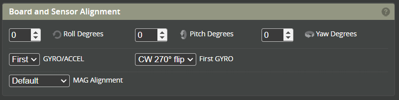

# Configuration

## System Configuration
### PID Loop Speed
This is the frequency that the control loop operates at. Set to between 1kHz and 2kHz. There is limited or no benefit in higher rates and will result in high loads for your flight controller. This could be an issue for F405 and F411 boards.  

### Accelerometer
This must be selected if you wish to use stability (6G modes) such as Angle, Horizon or Rescue modes. 

### Barometer
This is used for Altitude hold Rescue which is currently still being developed

### Magnetometer
Currently this does not provide any control functionality; however, can be used for telemetry. 

## Serial Ports
Please choose the functions you wish to assign to your UART. 

### Serial Rx
One of the first things you should do is connect a receiver to the FC. Your FC has several UARTs, and each UART has an RX and a TX. A receiver needs to be connected to an RX and/or TX pad, depending on the kind of receiver.

* DSM2/DMSX/IBUS/TBS need to be connected to a free UART RX.  
* SBUS also needs to be connected to an RX pad. However, it's an inverted signal, so set serialrx_inverted = ON if you have an F7 processor. If you're using an F4, use the SBUS pad and read this.

* FPort can be connected to a TX pad. It's also an inverted signal.  
* ELRS needs an RX and a TX on the same UART.  
* SBUS with SmartPort needs to be connected to a free UART RX and a TX of another free UART. Both signals are inverted.
Please see the documentation for your FC for more details on how to connect your receiver.  

### GPS
GPS is not currently used for Rotorflight for any flight controls. This can be used for telemetry purposes.

### ESC Telemetry
Set a UART to ESC Telemetry if you wish to use the [ESC_Sensor Feature](#features).

### Blackbox Logging
This enables a UART for external logging to an OpenLarger.

*** Link to go here ***

## Board and Sensor alignment

Change the roll, pitch and yaw gyro alignment value until the model on the status page moves in the same direction as the gyro board.

A method of determining what settings to use: 
* set Roll, Pitch and Yaw values to 0 degrees.  
* set Gyro alignment to CW-0 degrees.  
* Move the FC around until the movement of the FC matches the movement of the helicopter on the "Status" page. You may have to "reset Z axis".  
* Now take note of how you have to rotate/flip the board in order to get the FC oriented in the way you wish to mount it in the helicopter. An example would be that you have to rotate the board 180 and flip. You would chose 'CW180 Flip' in the Gyro alignment dropdown.    

## Features
:::caution
This section is used to enable or disable features. Features such as the Serial Rx, GPS, ESC Telemetry must be selected in the [Serial ports](#serial-ports) section before selecting the Feature here. 
:::

## Accelerometer Trim
This section is used to trim the roll and pitch axis while the helicopter is in Stability mode (e.g Angle, horizon or Rescue). 

The Transmitter trims for each cyclic axis must be at neutral when using Rotorflight (at 1500us). This will usually result in the helicopter drifting while in a stable hover. To correct for this drift the Accelerometer roll and pitch trims are to be used. 

This can be done either directly by the configurator or via the transmitter with Lua or Adjustments *** Links required***

