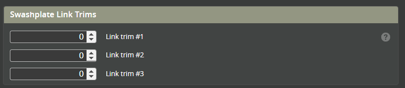
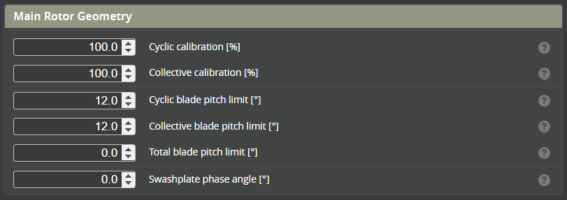
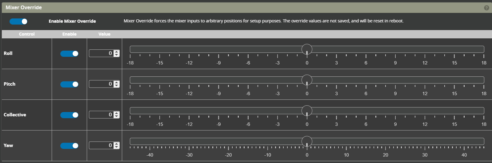

# Mixer

This section will describe the configuration of the mixer and calibrate the rotor blade angles

### Main Rotor Settings
#### Swashplate type
Choose the swash type that suits your helicopter.

#### Rotor direction
Choose the direction of rotation for the main rotor. This is looking down from on the top of the rotor.

#### Elevator Control direction
With the helicopter servos powered, push the elevator stick forward (pitch down). The swash should now pitch down towards the nose of the helicopter. If this is not the case, change the control direction from **[NORMAL]** to **[REVERSE]**.

#### Aileron Control direction
Push the Aileron stick to the right (right Aileron). The swash should also pitch towards the right. If this is not the case, change the control direction from **[NORMAL]** to **[REVERSE]**.

#### Collective Control direction
Push the collective stick forward (Increasing collective). The swash should now rise up towards the rotor head (to increase collective). If the swash goes down change the control direction from **[NORMAL]** to **[REVERSE]**.

## Swashplate Link Trims

Ideally the swashplate should be set with all 3 Collective servos at 90 deg while the blade angle is at 0 degrees. Some helicopters have fixed length swash links which means in order to get 0 degrees for blade centre the servo arms need to be raised or lowered. Use these link trims to provide that function.

For helicopters with adjustable swash links this should remain at 0 and the links adjusted to get a 0 degree blade angle.

## Main Rotor Geometry

#### Cyclic and Collective calibration
These settings are used to calibrate the mixer so that the blade angle matches the commanded angle for both the cyclic and collective. See the [calibration procedure](#calibrating-the-mixer) for details.

#### Cyclic and Collective blade pitch limits
These limits the maximum pitch limits that can be set by the Flight controller. As a guide these could be in the range of:
* 9-11 deg - scale
* 10-12 deg - sport 
* 11-14 deg - 3D 

#### Total blade pitch limit

#### Swashplate phase angle
Swashplate phase angle settings 

## Tail Rotor Settings

#### Tail rotor type
This is either Variable (for a servo controlled tail) or Motorized.

## Calibrating The mixer
:::note
The purpose of the mixer calibration is to set the helicopters physical blade angle to the angle commanded by the FC
:::
### Mixer override
Set the mixer override at the bottom of the pages to **ON**. This will open the override window.

### Collective Calibration
* Confirm with a blade pitch tool that with collective mixer at 0 deg the blades are also at 0 deg.  
* Set the collective mixer override to 9 deg. Measure the blade angle.   
* If the Blade angle is different from the Override angle, increase or dectease [Collective Calibration %](#cyclic-and-collective-calibration) until the bade angle matches.  
* Set collective back to 0 deg.

### Cyclic Calibration
* Set the pitch override to 9 deg.  
* Measure the blade pitch  
* Increase or decrease the [Cyclic Calibration %](#cyclic-and-collective-calibration)

### Variable pitch Yaw Calibration 
* Set YAW override to 0 deg.  
* Adjust linkage to get the tail blades to 0 degrees  
* Set the Override to a value (e.g. 14 deg)  
* Measure the tail blade angle  
* Adjust the [Yaw Calibration %](#tail-rotor-settings) so that the tail blade angle matches the commanded angle.  
