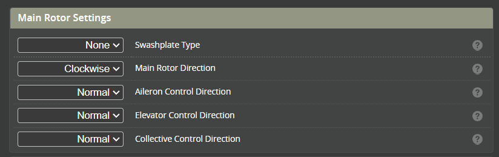

# Mixer

This section will describe the configuration of the mixer and calibrate the rotor blade angles

### Main Rotor Settings
#### Swashplate type
Choose the swash type that suits your helicopter.

#### Rotor direction
Choose the direction of rotation for the main rotor. This is looking down from on the top of the rotor.

#### Elevator Control direction
With the helicopter servos powered, tilt the heli forward (pitch down). The swash should now pitch up towards the tail of the helicopter. If this is not the case, change the control direction from **[NORMAL]** to **[REVERSE]**.

#### Aileron Control direction
Roll the heli to the right (right Aileron). The swash should pitch towards the left. If this is not the case, change the control direction from **[NORMAL]** to **[REVERSE]**.

#### Collective Control direction
Push the collective stick forward (Increasing collective). The swash should now rise up towards the rotor head (to increase collective). If the swash goes down change the control direction from **[NORMAL]** to **[REVERSE]**.

## Swashplate Link Trims

Ideally the swashplate should be set with all 3 Collective servos at 90 deg while the blade angle is at 0 degrees. Some helicopters have fixed length swash links which means in order to get 0 degrees for blade centre the servo arms need to be raised or lowered. Use these link trims to provide that function.

For helicopters with adjustable swash links this should remain at 0 and the links adjusted to get a 0 degree blade angle.

## Main Rotor Geometry

#### Cyclic and Collective calibration
These settings are used to calibrate the mixer so that the blade angle matches the commanded angle for both the cyclic and collective. See the [calibration procedure](#calibrating-the-mixer) for details.

#### Collective blade pitch limit

* Ideally, one should use this option to set the maximum allowed collective blade pitch. Therefore, if the person wants to change the collective pitch down the line, they should be able to adjust in the "rates" page confidently without worrying about servos binding.

* Practically, for most 3D helicopters, this is set to the maximum collective you will ever need (15-16deg) if the helicopter is physically capable of doing it

#### Cyclic blade pitch limit
* This is NOT the same as the collective calibration on other FBLS
* This is designed to let the FBL know how much cyclic travel the helicopter is PHYSICALLY capable of
* Usually adjust it so that around zero collective there is no physical interference anywhere. You might want to temporally increase the I gains (to around 200) on cyclic and move the cyclic stick to find the limits. MAKE SURE TO TURN THEM BACK
* Some 550+ size helicopter might be able to achieve 16+ degree of cyclic pitch, you could set it to the absolutely maximum but It is advised to limit it to around 16degree since practically it should never hit that much cyclic.

#### Total blade pitch limit
* This is probably the most difficult limit to understand and setup properly
* To find the total blade pitch limit, make sure the collective blade pitch limit and cyclic blade pitch limit. You might want to use the I-gain trick mentioned above
* Set the collective pitch to max, then move the cyclic. Increase the limit until either there is a physical limit or the fish-eye bearing (the ball) in the center of the swash drops at the max cyclic due to one servo reaching its limit.
* Repeat at lowest collective pitch
* You could also increase cyclic servo travels to gain more total blade pitch. However, nothing should be interfering
* Double check that theres NO binding or interference at ANY combination of collective and cyclic in their whole range.
* Make sure to turn the I-gains back to default in the end if the I-gain trick is used.

#### Swashplate phase angle
Usually set it per manufactur recommendtion. One could consider if theres bobbling that could not be resolved from changing the cross coupling gains or it is known that the rotor head design requires a non-zero phase angle.

## Tail Rotor Settings

#### Tail rotor type
This is either Variable (for a servo controlled tail) or Motorized.

## Calibrating The mixer
:::note
The purpose of the mixer calibration is to set the helicopters physical blade angle to the angle commanded by the FC
:::
### Mixer override
Set the mixer override at the bottom of the pages to **ON**. This will open the override window.

### Collective Calibration
* Confirm with a blade pitch tool that with collective mixer at 0 deg the blades are also at 0 deg.  
* Set the collective mixer override to 9 deg. Measure the blade angle.   
* If the Blade angle is different from the Override angle, increase or decrease [Collective Calibration %](#cyclic-and-collective-calibration) until the bade angle matches.  
* Set collective back to 0 deg.

### Cyclic Calibration
* Set the pitch override to 9 deg.  
* Measure the blade pitch  
* Increase or decrease the [Cyclic Calibration %](#cyclic-and-collective-calibration)

### Variable pitch Yaw Calibration 
* Set YAW override to 0 deg.
* In servo page, set the center so that the yaw servo arm is leveled.
* Adjust linkage to get the tail blades to 2-3 degrees or follow the manual
* Set the Center trim for tail rotor so that the tail blades are at 0 degrees
* Set the Override to a value (e.g. 30 deg)  
* Measure the tail blade angle (fold the tail blades and compare the angle to a 60 deg ruler)
* Adjust the [Yaw Calibration %](#tail-rotor-settings) so that the tail blade angle matches the commanded angle.  
