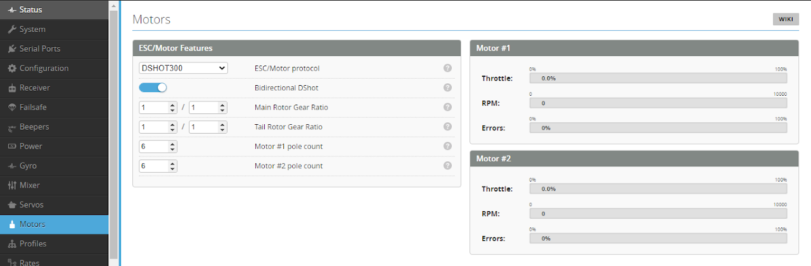
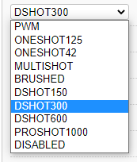

# Motor and ESC

The motor tab is used to configure the motor and ESC communications protocol as well as to provide the ability to test operation.

# ESC/Motor Features
Select ESC communications

ESC/Motor Protocol - Determine the ESC protocol required for your ESC. It is recommended that either DSHOT150 or DSHOT300 be used with a suitable BLheli_32 or BLheli_s (with updated firmware). DSHOT600 or faster are not required or recommended.

Bi-Directional D-shot - This switch is visible when ESC/Protocol is DSHOTxxx. It enables motor eRPM telemetry from supported ESC's via bi-directional dshot (i.e. the FC receives a speed feedback from the ESC). Please see Bidirectional DSHOT for more details. This is a requirement for the Governor and RPM filtering features unless other RPM feedback methods are used such as shown HERE.
Gear Ratio Configuration

Enter the number of teeth for the main rotor gearing [Teeth on Pinion gear]/[Teeth on Main Gear]. For a direct drive Main rotor this is just set to [ 1 ]/[ 1 ].

Enter the number of teeth for the Tail rotor gearing [Teeth on Tail gear]/[Teeth on Autorotation Gear]. For a direct drive tail this is just set to [ 1 ]/[ 1 ].

Note! - Some large helicopters may use a 2 stage gearing system (e.g. Pinion-1/Main-1/Pinion-2/Main-2). This will have to be calculated and entered as: [Pinion-1 X Pinion-2] / [Main-1 x Main-2].

Motor Pole count - Determine the number of magnetic poles for each motor. Count the number of magnets on the motors rotor. In the example below the magnets (circled) are fixed to the outer bell which in total has 14. This allows the flight controller to know how many electrical phase rotations are required to complete one physical motor revolution.

:::caution
Motor Override function

## Big warning!  
This functionality will make the motors spool up. Do this WITHOUT the main or tail rotors fitted!!  

Motor Override functionality is provided to test the operation of each motor directly.  
:::

Note: If you use the slider, make sure you release the mouse button. Nothing changes as long as you hold the mouse button down!

Note: The Test motors function in BLHeliSuite32 doesn't work when using Rotorflight. It will give an error like 'Initialization of Motor Test Mode failed! Please check current Unknown rev 4.2.13 support for this application function!'.

Motor and ESC Status
Throttle - This is the command being sent from the flight controller to the ESC.
RPM - The measured RPM telemetry feedback. As the motor spins this should read a value related to the current speed.
Errors - This shows the status of the RPM telemetry signal. This should be 0%

