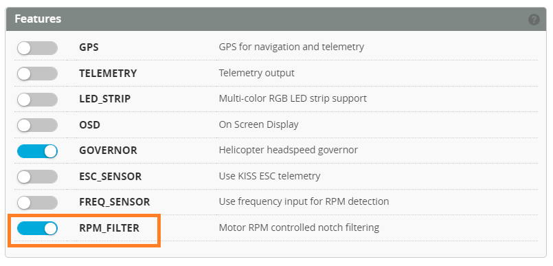
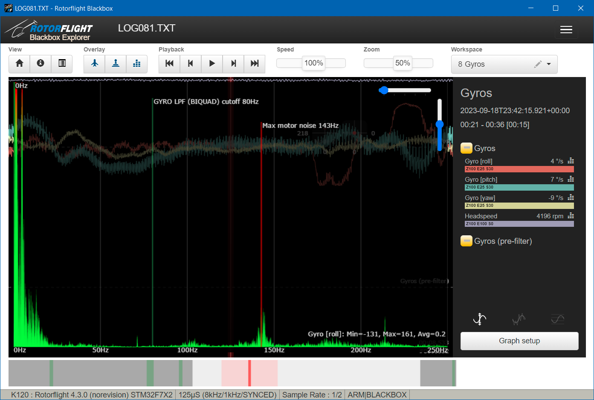

# RPM Filters

RPM filters clean up the gyro signals by filtering out vibrations that are coming from the rotating parts in a helicopter: the main rotor, tail rotor and motor(s).

The difference between an unfiltered and filtered signal is significant. Here's an example of filtered and unfiltered gyro signals:

RPM filtered gyro signals enable you to tune the helicopter better, for example by being able to use higher gains.

The RPM filters require real time motor speed information to be available to the flight controller. This can be obtained with a [Frequency Sensor](Rpm%20Measurement#frequency-sensor) or by using [Bidirectional DSHOT](Rpm%20Measurement#bidirectional-dshot).

Once the FC knows the motor speed, it can calculate the main and tail rotor speeds. For this it needs to know the *Main Rotor Gear Ratio* and the *Tail Rotor Gear Ratio*, which you can specify in the *Motors* tab.

For example, here are the ratios for my Gaui X3.

:::note
Direct drive motors have a ratio of 1:1.
:::

In order to use RPM filters, enable the feature *RPM_FILTER* in the *Configuration* tab.

Next, enable the *Gyro RPM Notch Filters* in the *Gyro* tab. These settings should be ok for a first flight.

Filters introduce latency. More filters mean more latency. So try to keep the number of filters low.

Double filters provide heavier filtering than single filters, but are also slower. They are sometimes needed on the 1st and/or 2nd harmonic.

:::tip
The Q factor defines how wide the filter is:
- Lower Q values make the filter wider
- Higher Q values make the filter smaller
:::

Wider filters are slower than narrow filters, so try to make the filters as small as possible without it being ineffective.

# Filter tuning

Make a blackbox log of a short flight with constant headspeed. Scroll to the point where the heli has spooled up and is hovering. Mark that point with the `I` key. Scroll near the end and mark that with the `O` key. Now bring up the *Analyzer Display* and enlarge it. It might look like:

This log was made with only a double fundamental filter. As you can see there's some noise around 144Hz. Since the headspeed is 4200 RPM, that must be near the second harmonic (4200/60 = 70*2 = 140Hz). Also note that the gyro signal in the background is also a bit noisy.

Now let's add some single filters for the 2nd (140Hz) and 3rd (210Hz) harmonic. Suddenly the log looks a lot cleaner:

