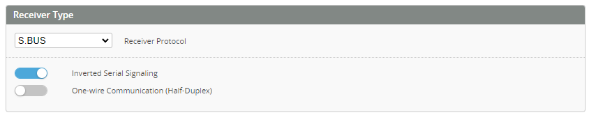
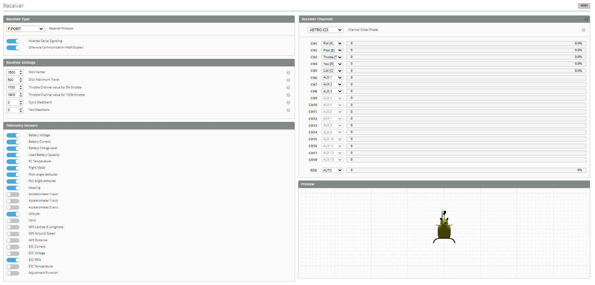
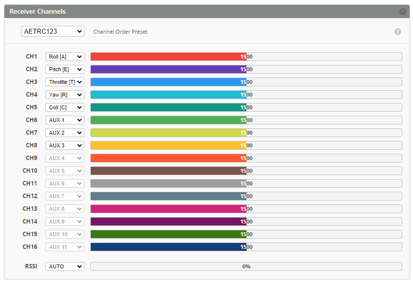
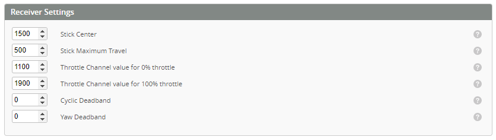

One of the first things you should do is to connect a receiver to the FC. Your FC has several UARTs, and each UART has a TX and an RX. A receiver needs to be connected to an RX and/or TX pad, depending on the type of receiver.

## Receiver Configuration

First activate `Serial Rx` on the UART you have connected your receiver.

## Receiver Type

There are many receiver protocols supported in Rotorflight, SBUS in the one of the most known receiver protocols, however it is not telemetry capable. On the Other hand FrSky F.Port and ELRS are the most used protocols because they support _telemetry_ and thus allow you to use the [Rotorflight LUA app](./LUA%20Scripts) to perform tuning using you radio.

* SBUS needs to be connected to an RX pad.

* [SBUS with S.Port](https://oscarliang.com/sbus-smartport-telemetry-naze32/): the SBUS pin needs to be connected to a free UART RX, and the S.Port pin needs to be connected to a free UART TX (of *another free UART*), and you activate `Telemetry: FrSky SmartPort` on that UART.

* F.Port needs be connected to a TX pad, with `Inverted Serial Signaling` activated ,and `Half-Duplex` activated.

* [CRSF/ELRS](https://www.expresslrs.org/2.0/quick-start/receivers/wiring-up/) needs an RX and a TX on the same UART. 

:::note
The `Inverted Serial Signaling` option will work only on F7/H7 type mcu, if you are using an F4 mcu, then you need to use and external signal inverter, or hack your receiver to get an Un-Inverted signal for SBUS, S.Port, and F.Port.
for more info check [Uninverted SBUS and Smart Port on Frsky Receivers](https://oscarliang.com/uninverted-sbus-smart-port-frsky-receivers/)
:::

Please see the documentation for your FC for more details on how to connect your receiver. 

## Receiver Channels

Select the corresponding channels order based on the selected receiver type.

* For FrSky receivers, set the channels in your radio as per the below order.

* For ELRS receivers, set the channels in your radio as per the below order.

:::note
For **CRSF/ELRS** always set *ARM* switch to *CH5* on the radio, also set *THR* to *CH6*
:::

* Revert channels on your transmitter if a channels responds the wrong way around. 

## Receiver Settings

* Adjust **Stick Center** as required by your radio to achieve 0% when the _ROLL, PITCH, YAW_ sticks are centered. 
* Adjust **Stick Maximum Travel** achieve 100% at the sticks limits.
* Adjust **Throttle Channel value for 0% throttle** to achieve 0% on the channel bar.
* Adjust **Throttle Channel value for 100% throttle** to achieve 100% on the channel bar.
    * NOTE! Throttle hold must send a value than is lower than 0% level, for example you can set you radio to send 1000us at 0% throttle, and 975us at throttle hold.
* Adjust **Cyclic Deadband** and **Yaw Deadband** to the smallest possible value that doesn't make your model drift in the *Rates Preview* window.

:::note
Do not use trim for Roll, Pitch or Yaw on your transmitter. 
:::

You should end up with something similar to this:  

## Telemetry Sensors

Use the below switches to enable/disable the telemetry sensors from the telemetry stream sent to your radio.

:::caution
Calibrating Stability Mode
The stability modes (Angle, Horizon or Rescue) can be calibrated so that the heli doesn't drift much when using such a mode. This can only be done via the [accelerometer trims](https://github.com/rotorflight/rotorflight/wiki/Using-stability-modes/_edit#calibrating-stability-modes). 
**Do not use trim on your transmitter**.
:::
