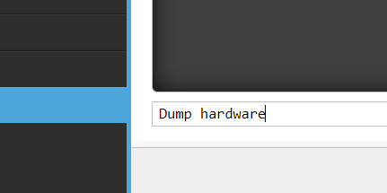

# Converting from RF1 to RF2

:::caution
It is really important that a Rotorflight 1 backup/dump file is not loaded to a Rotorflight 2 controller.   
:::

## Back Up hardware resources.

There have been a huge number of changes between versions of Rotorflight. 
The old RF1 backup/dump file is not compatible with the new RF2 version. Ultimately this means all of the tuning and configuration has to be done again starting from the Rotorflight 2 defaults. If you have already done custom remapping these can be transferred by using the ```dump hardware``` command in CLI and saving the output to a file.  




