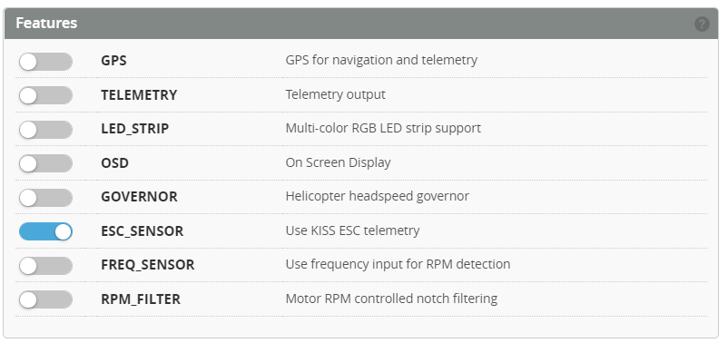

# ESC Telemetry

:::info
The purpose of ESC telemetry is to provide a method of reading the values provided by the ESC. These are things such as RPM, Temperature, Voltage, Current and mAh consumed. This is accomplished by connecting the ESC telemetry wire to the flight controller with a spare UART. 

ESC Telemetry currently supported are :  
* BLheli  
* HOBBYWING Platinum PRO V4, V4.1,& V5
* HOBBYWING FLYFUN V5 
* KONTRONIK  
* SCORPION
* OMPHOBBY
* ZTW
* APD (HV Pro UART telemetry)
:::

### Select Serial Port
The ESC telemetry pin TX needs to be connected to a spare UART RX. Select the UART from the Configuration page. 

### Enable the feature
Select **ESC_SENSOR** from the features to enable reading from the ESC.

If you wish these values to be returned to the Tx you will also have to select the **TELEMETRY** and have a telemetry capable Receiver.  

### Half Duplex (to be updated)
The Telemetry wire can be connected to the UART TX (as opposed to the RX) if the UART is set to half duplex. In most cases just leave this OFF. This still needs to be added to the configuration. Currently it is enabled through the CLI.

`set esc_sensor_halfduplex = ON` 

### Set the Protocol
This still needs to be added to the configuration. Currently it is enabled through the CLI.

Please enter the protocol you wish to use from the following commands:  
* `set esc_sensor_protocol = NONE`  
* `set esc_sensor_protocol = BLHELI32`  
* `set esc_sensor_protocol = HOBBYWINGV4`  
* `set esc_sensor_protocol = HOBBYWINGV5`
* `set esc_sensor_protocol = KONTRONIK`
* `set esc_sensor_protocol = SCORPION`  
* `set esc_sensor_protocol = OMPHOBBY` 
* `set esc_sensor_protocol = ZTW` 
* `set esc_sensor_protocol = APD` 

**For Hobbywing V4**
Additional parameters are provided for the voltage and current gains, and zero offsets.

* `set esc_sensor_hw4_voltage_gain = 0` 
* `set esc_sensor_hw4_current_gain = 0` 
* `set esc_sensor_hw4_current_offset = 0`  

Setting these parameters to zero will enable the Auto-Calculation within the firmware.
If you wish to fine tune the voltage and current you can use the below values as a starting point.

| Model                | Voltage gain | Current gain | Current offset |
| :------------------- | -----------: | -----------: | -------------: |
| Platinum LV 60A      |      109     |     0        |        0       |
| Platinum LV 80A      |      109     |     146      |        409     |
| Platinum LV 120A     |      109     |     110      |        377     |
| Platinum HV 130A     |      210     |     157      |        0       |
| Platinum HV 200A     |      210     |     157      |        477     |
| FlyFun HV 160A       |      210     |     66       |        381     |

### Power Config
Enable the Voltage and Current from the ESC Sensor

