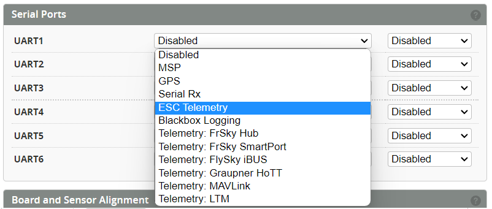

# ESC Telemetry

:::info
The purpose of ESC telemetry is to provide a method of reading the values provided by the ESC. These are things such as RPM, Temperature, Voltage, Current and mAh consumed. This is accomplished by connecting the ESC telemetry wire to the flight controller with a spare UART. 

ESC Telemetry currently supported are :  
* **BLHELI32**: BLheli and KISS 
* **HOBBYWING V4**:  Platinum PRO V4, V4.1,& FLYFUN V5
* **HOBBYWING V5**: Platinum V5 
* **SCORPION**: Unsc Telem
* **KONTRONIK**: Kosmik & Kolibri
* **OMPHOBBY**
* **ZTW**: Skyhawk
* **APD**: HV Pro UART telemetry
* **YGE**: OpenYGE V1.03547 or above
:::

### Select Serial Port
The ESC telemetry pin TX needs to be connected to a spare UART RX.

Select the UART from the Configuration page. 

### Select the Protocol

Select the correct ESC telemetry protocol based on the one you are using.

**For Hobbywing V4**
Additional parameters are provided for the voltage and current gains, and zero offsets.

* `set esc_sensor_hw4_voltage_gain = 0` 
* `set esc_sensor_hw4_current_gain = 0` 
* `set esc_sensor_hw4_current_offset = 0`  

These parameters are set to zero by default to enable the Auto-Calculation within the firmware.
If you wish to fine tune the voltage and current you can use the below values as a starting point.

| Model                | Voltage gain | Current gain | Current offset |
| :------------------- | -----------: | -----------: | -------------: |
| Platinum LV 60A      |      109     |     0        |        0       |
| Platinum LV 80A      |      109     |     146      |        409     |
| Platinum LV 120A     |      109     |     110      |        377     |
| Platinum HV 130A     |      210     |     157      |        0       |
| Platinum HV 200A     |      210     |     157      |        477     |
| FlyFun HV 160A       |      210     |     66       |        381     |

### Power Config
Enable the Voltage and Current from the `Power` Tab.

