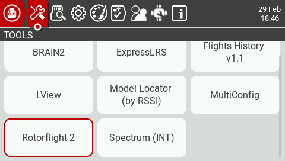
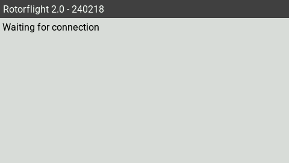
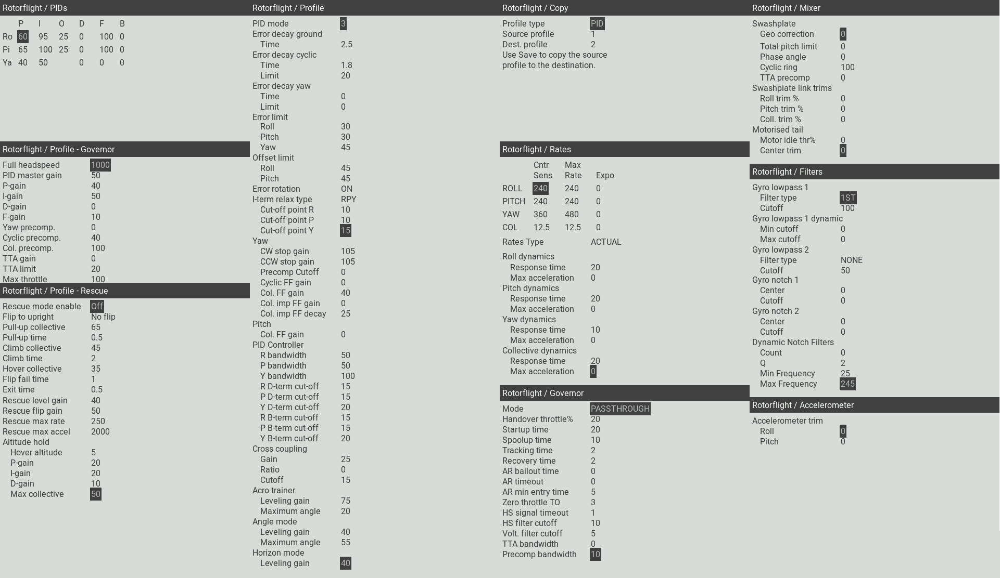

# LUA Scripts

## Introduction

You can adjust a variety of settings using only your transmitter with the [Rotorflight Lua scripts](https://github.com/rotorflight/rotorflight-lua-scripts). They allow you to change things like PIDs, rates, filters, failsafe and governed headspeed on the field. Prerequisites:

* OpenTX 2.3.12 or EdgeTX 2.5.0 or newer on the transmitter and
* a FrSky SmartPort or F.Port receiver
* or a Crossfire v2.11 or newer receiver
* or an ELRS 2.0.1 or newer receiver.

Examples:

* TX16S with a FrSky X4R using the [FrSkyX2](https://github.com/pascallanger/DIY-Multiprotocol-TX-Module/blob/master/Protocols_Details.md#frskyx2---64) protocol.
* Taranis X9D with a TBS Crossfire TX/RX module.
* Taranis QX7 and a FrSky R-XSR, using the FrSky D16 protocol (as long as you don't use the ACCST D16 2.1.1 LBT firmware on the R-XSR, because this firmware has telemetry bugs).
* TX16S with an ELRS 2.0.1 module and receiver.

If you're not using F.Port, start up the _Rotorflight Configurator_, go to the _Configuration_ tab and enable the _TELEMETRY_ feature. F.Port telemetry does work without enabling this feature.

If telemetry is working properly on your system, the Lua scripts should work as well.

## Installation

Download the [latest release](https://github.com/rotorflight/rotorflight-lua-scripts/releases) and copy the contents of the SCRIPTS folder to your transmitter. See also the [readme](https://github.com/rotorflight/rotorflight-lua-scripts#installing).

and copy the contents of the SCRIPTS folder to your transmitter.

You will know if you did this correctly if the `rf2.lua` file shows up in the `/SCRIPTS/TOOLS` directory. Also *Rotorflight conf* should now show up in the *Tools* menu of your transmitter.

## Usage

On your transmitter, go to the _Tools_ menu of your transmitter and select _Rotorflight conf_.

The first time you do this all scripts will be compiled and the _Tools_ menu will be displayed again. Select _Rotorflight conf_ again. Now the script will wait for a connection with the receiver.

Power up the receiver. The script will retrieve the API version used by Rotorflight and the device ID of the flight controller. After this you will see the main menu.

Here you can select what you want to change. For example, select _PIDs_.

Now you can change the values of your PIDs. If you want to save your changes, long press the wheel/roller. The _Page_ menu should now pop up. Select _Save page_ to send your changes to the flight controller. Or press Exit to exit the _Page_ menu.

There's quite a lot of settings you can adjust on the field. Here's an overview of all the pages:

Feel free to have a look at any page. As long as you don't select _Save page_, nothing will be changed.

## Background script

The optional background script offers RTC synchronization and RSSI through MSP. RTC synchronization will send the time of the transmitter to the flight controller. The script will beep if RTC synchronization has been completed. Blackbox logs and files created by the FC will now have the correct timestamp.

The background script can be setup as a special or global function in OpenTX. The image below shows how to configure the background script as a special function. By doing this, the script will automatically run as soon as the model is selected.

