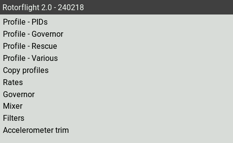
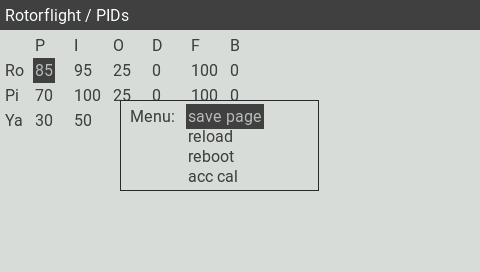
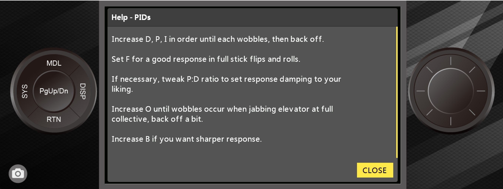

import Tabs     from '@theme/Tabs';
import TabItem  from '@theme/TabItem';
import styles   from './styles.module.css';

import EdgeTX   from './img/edgetx-logo.png';
import ETHOS    from './img/ethos-logo.png';

# Lua Scripts
## Introduction

You can adjust a variety of settings using only your transmitter with the Rotorflight Lua scripts. A Lua script once loaded to your transmitter adds extra pages to the interface. These pages allow you to change things like PIDs, rates, filters, failsafe and governed headspeed on the field. Prerequisites:

* OpenTX 2.3.12, EdgeTX 2.5.0 or newer or Ethos 1.4 or newer on the transmitter and:
  * an FrSky SmartPort or F.Port receiver.
  * or a CRSF v2.11 or newer receiver.
  * or an ELRS 2.0.1 or newer receiver (3.5.0 or newer if you are using ELRS custom telemetry).

Examples:

* TX16S with a FrSky X4R using the [FrSkyX2](https://github.com/pascallanger/DIY-Multiprotocol-TX-Module/blob/master/Protocols_Details.md#frskyx2---64) protocol.
* Frsky Ethos Radio (X20, X18, X14 etc) with either SPORT,FPORT receiver or ELRS with an external module.
* Taranis X9D with a TBS Crossfire TX/RX module.
* Taranis QX7 and a FrSky R-XSR, using the FrSky D16 protocol (as long as you don't use the ACCST D16 2.1.1 LBT firmware on the R-XSR, because this firmware has telemetry bugs).
* TX16S with an ELRS 2.0.1 module and receiver.

If you're not using F.Port, start up the _Rotorflight Configurator_, go to the _Configuration_ tab and enable the _TELEMETRY_ feature. F.Port telemetry does work without enabling this feature.

If telemetry is working properly on your system, the Lua scripts should work as well.

There are different Lua scripts depending on what radio you are using (edgeTX or Ethos). 

:::info Please choose to suit your Radio - EdgeTX or ETHOS
<Tabs groupId="operating-systems">
  <TabItem value="EdgeTX" label="EdgeTX">

## EdgeTX
 

### OpenTX/EdgeTX Installation

Download the [latest release](https://github.com/rotorflight/rotorflight-lua-scripts/releases) and copy the contents of the SCRIPTS folder to your transmitter. See also the [readme](https://github.com/rotorflight/rotorflight-lua-scripts#installing).

and copy the contents of the SCRIPTS folder to your transmitter.

You will know if you did this correctly if the `rf2.lua` file shows up in the `/SCRIPTS/TOOLS` directory. Also *Rotorflight 2* should now show up in the *Tools* menu of your transmitter.

### Usage

On your transmitter, go to the _Tools_ menu of your transmitter and select _Rotorflight 2_.

The first time you do this all scripts will be compiled and the _Tools_ menu will be displayed again. Select _Rotorflight conf_ again. Now the script will wait for a connection with the receiver.

Power up the receiver. The script will retrieve the API version used by Rotorflight and the device ID of the flight controller. After this you will see the main menu.

Here you can select what you want to change. For example, select _PIDs_.

Now you can change the values of your PIDs. If you want to save your changes, long press the wheel/roller. The _Page_ menu should now pop up. Select _Save page_ to send your changes to the flight controller. Or press Exit to exit the _Page_ menu.

There's quite a lot of settings you can adjust on the field. Here's an overview of all the pages:

Feel free to have a look at any page. As long as you don't select _Save page_, nothing will be changed.

### Background script

This optional background script offers RTC synchronization and RSSI through MSP.

RTC synchronization will send the time of the transmitter to the flight controller. The script will beep if RTC synchronization has been completed.

Blackbox logs and files created by the FC will now have the correct timestamp.

The background script can be setup as a special or global function in EdgeTX. 

The image below shows how to configure the background script as a special function.

By doing this, the script will automatically run as soon as the model is selected.

</TabItem>
  <TabItem value="ETHOS" label="ETHOS">
  ## ETHOS
  
### 1. Ethos Installation

Download the [Latest Ethos Lua Suite release](https://github.com/rotorflight/rotorflight-lua-ethos-suite/releases) and save the zip file to your PC\laptop

Open Frsky Ethos Suite and connect the USB-C cable, once connected, select Lua Development tools,

Select, Install Lua Scripts and choose the zip file from the download above, select rfsuite and Install Lua Sctipts. Close Ethos Suite

### Usage

Disconnect the transmitter and power off\on. Once powered on press SYS key and scroll to the end page, the following should be shown.

IMPORTANT: Changes will only be written to the eeprom when the aircraft is moved from Armed to Diasarmed, if you disconnect power when in an Armed state the changes will not be saved to eeprom.
If installing for ELRS please see the seperate section before returning to this section.

Ensure the aircraft receiver and FBL are powered, Select the ICON above and you should see the following:

In the example below of the PID's screen:

PID's #1 - Will change depending on which profile you have your transmitter profile\bank switch set i.e. PID's #2, PID's #3 etc

MENU - Will take you to the top level menu (Please ensure you have clicked SAVE before exiting)

SAVE - Will write your changes to eeprom

There is also a help screen with useful information on tuning methods

  </TabItem>
</Tabs>
:::