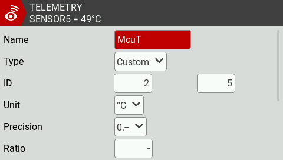

# ELRS Telemetry Reuse

The Crossfire Protocol (CRSF) used by ELRS does not include the full range of sensors that can be useful for rotorflight.

This tutorial will guide you through the process of *re-using/transforming* the unused ELRS sensor into a more useful Rotorflight sensors.

the following procedure will allow you to get the following telemetry sensors on your radio, these sensors are:

* Flight/Governor status and adjustment functions
* BEC Voltage
* VBUS(5V) Voltage
* Real time controller load
* Throttle
* ESC Temperature
* Headspeed
* MCU Temperature

To begin, enter CLI tab, copy and paste the below commands, and save and exit.

```
set crsf_flight_mode_reuse = GOV_ADJFUNC
set crsf_att_pitch_reuse = BEC_VOLTAGE
set crsf_att_roll_reuse = BUS_VOLTAGE
set crsf_att_yaw_reuse = RT_LOAD
set crsf_gps_heading_reuse = THROTTLE
set crsf_gps_ground_speed_reuse = ESC_TEMP
set crsf_gps_altitude_reuse = HEADSPEED
set crsf_gps_sats_reuse = MCU_TEMP
```

Next, go to your radio telemetry page and discover new sensors.

You should see eight sensors, called: *`FM, Ptch, Roll, Yaw, Hdg, Gspd, Alt, Sats`*

These sensors will be transformed to the following sensors respectively: *`FM, Bec Voltage, VBus Voltage , Real Time Load, Throttle, ESC Temperature, Headspeed, MCU Temperature`*

Copy the sensors from *`Ptch`* to *`Sats`*

Rename the sensors and modify the Unit, Precision, and ratio as per the below pictures.

#### For *Ptch*


#### For *Roll*


#### For *Yaw*


#### For *Hdg*


#### For *Gspd*


#### For *Alt*


#### For *Sats*



After you finish you will see the new sensors in your telemetry page as per below.


You can use these new sensors to monitor your heli and create useful alarms and warnings.
