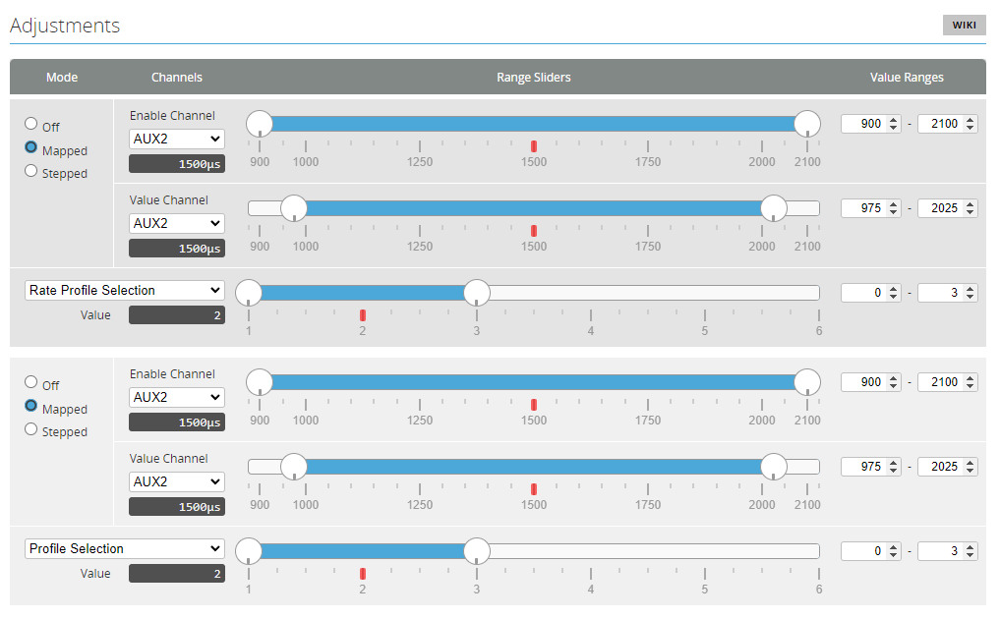

# Rotorflight Generic Radio Setup

This walkthrough will guide you through to create a basic radio model for rotorflight controller.

This is a guide for EdgeTx/OpenTx radios, it will work with both ELRS and F.port receivers.

The Channel order is AECR1T23 which required by ELRS receiver, but it will also works for F.Port, SBUS, and others.

:::note
The Rotorflight basic operation will require a minimum of 6 channels, but this is for basic operation only, additional channels will be required for other options, such as profile switching, Rescue, etc.

Normally you will need a total of 8 channels if you want to have options like *Profile switching* and *Rescue*.
:::

## Channels Arrangement

This following radio model uses 12 channels to get the best of Rotorflight options, the user can add or delete channels depending on his specific application, and required features.

These channels are configured as follows:

| Channel # | Function |
|--|--|
| CH1 | Aileron |
| CH2 | Elevator |
| CH3 | Collective |
| CH4 | Rudder |
| CH5 | AUX1 - Arming |
| CH6 | Throttle |
| CH7 | AUX2 - Profile Switching |
| CH8 | AUX3 - Rescue |
| CH9 | AUX4 - Blackbox |
| CH10 | AUX5 - Backup Pack|
| CH11 | AUX6 - Adjustment Enable Channel |
| CH12 | AUX7 - Adjustment Value Channel |

:::note
Use the below recommended setting for the ELRS Tx module.

* [Baud Rate](https://www.expresslrs.org/quick-start/transmitters/tx-prep/#radio-settings): *921k*
* [Packet Rate](https://www.expresslrs.org/software/switch-config/#channel-update-rate-versus-packet-rate): *500Hz*
* Telemetry Ratio: *1:32*
* [Switch Mode](https://www.expresslrs.org/software/switch-config/#summary-of-switch-configuration-modes): *Wide*
* [Tx Max Power](https://www.expresslrs.org/software/dynamic-transmit-power/#description): *250mW Dynamic*

Consult [ELRS Website](https://www.expresslrs.org/software/switch-config/) for more info.
:::

## Radio Setup

This [Generic Rotorflight Radio Model](./files/Generic_RF.yml) Yaml file contain all the options listed above.

### Radio Inputs Page Setup

Configure the inputs on the radio as per the below image.


Based on the image above:

The 3-position **SB** Switch will control *Arming* as below:

* Switch **SB**-*down*: Disarmed
* Switch **SB**-*middle*: Disarmed
* Switch **SB**-*up*: Armed

The 2-position **SF** Switch will control *Throttle Hold* as below:

* Switch **SF**-*down*: Throttle Hold
* Switch **SF**-*up*: Throttle Release

The 3-position **SE** Switch will control *Throttle percentage* and *Profile Switching* as below:

* Switch **SE**-*down*: Throttle 60%, Profile 1, and Rate 1
* Switch **SE**-*middle*: Throttle 70%, Profile 2, and Rate 2
* Switch **SE**-*up*: Throttle 80%, Profile 3, and Rate 2

The 2-position **SH** Momentary Switch will control *Rescue* as below:

* Switch **SH**-*down*: Rescue OFF
* Switch **SH**-*up*: Rescue ON

The 3-position **SA** Switch will control *Blackbox enable* and *Blackbox erase* as below:

* Switch **SA**-*down*: Blackbox Logging OFF
* Switch **SA**-*middle*: Blackbox Logging ON
* Switch **SA**-*up*: Erase Blackbox Logs

The 3-position **SC** Switch will control *Backup Buffer Pack* as below:

* Switch **SC**-*down*: Buffer OFF
* Switch **SC**-*middle*: Buffer ON
* Switch **SC**-*up*: Buffer ON

### Radio Mixer Page Setup

Additionally you can use CH11-AUX6 and CH12-AUX7 to perform in flight parameter adjustment using adjustment functions from the [Adjustments Tab](../Tutorial-Setup/Adjustments.md#adjustment-functions).


The above settings will allow you to adjust 30 parameters in flight using the radio trim switches with combination of the 6-position buttons.

The below table explain how each parameter can be accessed.


For example when 6-position *button 1* is activated, the *pitch trim switch* will change *Pitch P Gain* value, and when 6-position *button 3* is activated, the *throttle trim switch* will change *Governor D Gain* value, and so on.

## Rotorflight Setup

After completing the above radio setup, you can proceed to the Rotorflight Configurator to complete the setup on the flight controller side.

### Arming Setup

Proceed to Modes Tab and setup arming as per below picture.


Alternatively you can paste and save the below commands in CLI to easily achieve the same result.

```
aux 0 0 0 1800 2100 0 0
```

### Profile Switching Setup

Proceed to Adjustment Tab and setup Profiles and rates switching as per below picture.



Alternatively in CLI.

```
adjfunc 0 2 1 900 2100 1 975 2025 975 2025 0 0 3
adjfunc 1 1 1 900 2100 1 975 2025 975 2025 0 0 3
```

### Rescue Setup

Proceed to Modes Tab and setup Rescue mode as per below picture.


Alternatively in CLI.

```
aux 1 53 2 1800 2100 0 0
```

### Blackbox Setup

Proceed to Modes Tab and setup Blackbox Modes as per below picture.


Alternatively in CLI.

```
aux 2 26 3 1400 1600 0 0
aux 3 31 3 1800 2100 0 0
```

### Buffer Pack Setup

Buffer packs like the [1st Buffer-Pack](https://1st-rc.com/en/product/1st-buffer-v4-3x25f-for-helis-450-700/) can be switched off from the radio after disconnecting the main pack, this can be done by connecting the buffer pack to a free 1500us PWM Channel on the flight controller.

* First you need to assign servo 5 to a free timer pin, you will then see servo 5 in the Servos Tab.
    Assuming we have a free timer on pin A08.

    In CLI:
    ```
    Resource Servo 5 A08
    ```
* Next you assign AUX5 Channel to Servo 5 using a mixer rule.

    In CLI:
    ```
    mixer rule 1 set AUX5 S5 1000 0
    ```

### In-Flight Profile Parameters Setup


Since there is many functions required to perform the In-flight adjustment as per the above table, you can directly copy the below commands to CLI and save.

```
adjfunc 2 14 5 900 1100 6 1025 1075 1925 1975 5 10 200
adjfunc 3 18 5 900 1100 6 1100 1150 1850 1900 5 10 200
adjfunc 4 22 5 900 1100 6 1175 1225 1775 1825 5 10 200
adjfunc 5 49 5 900 1100 6 1250 1300 1700 1750 5 10 200
adjfunc 6 27 5 900 1100 6 1325 1375 1625 1675 5 10 200
adjfunc 7 26 5 900 1100 6 1400 1450 1550 1600 5 10 200
adjfunc 8 15 5 1100 1300 6 1025 1075 1925 1975 5 10 200
adjfunc 9 19 5 1100 1300 6 1100 1150 1850 1900 5 10 200
adjfunc 10 23 5 1100 1300 6 1175 1225 1775 1825 5 10 200
adjfunc 11 50 5 1100 1300 6 1250 1300 1700 1750 5 10 200
adjfunc 12 28 5 1100 1300 6 1325 1375 1625 1675 5 10 200
adjfunc 13 29 5 1100 1300 6 1400 1450 1550 1600 5 10 200
adjfunc 14 16 5 1300 1400 6 1025 1075 1925 1975 5 10 200
adjfunc 15 20 5 1300 1400 6 1100 1150 1850 1900 5 10 200
adjfunc 16 24 5 1300 1400 6 1175 1225 1775 1825 5 10 200
adjfunc 17 51 5 1300 1400 6 1250 1300 1700 1750 5 10 200
adjfunc 18 39 5 1300 1400 6 1325 1375 1625 1675 5 10 200
adjfunc 19 40 5 1300 1400 6 1400 1450 1550 1600 5 10 200
adjfunc 20 17 5 1550 1700 6 1025 1075 1925 1975 5 10 200
adjfunc 21 21 5 1550 1700 6 1100 1150 1850 1900 5 10 200
adjfunc 22 25 5 1550 1700 6 1175 1225 1775 1825 5 10 200
adjfunc 23 52 5 1550 1700 6 1250 1300 1700 1750 5 10 200
adjfunc 24 59 5 1750 1900 6 1025 1075 1925 1975 5 10 200
adjfunc 25 60 5 1750 1900 6 1100 1150 1850 1900 5 10 200
adjfunc 26 54 5 1750 1900 6 1175 1225 1775 1825 5 10 200
adjfunc 27 55 5 1750 1900 6 1250 1300 1700 1750 5 10 200
adjfunc 28 56 5 1950 2100 6 1025 1075 1925 1975 5 10 200
adjfunc 29 57 5 1950 2100 6 1100 1150 1850 1900 5 10 200
adjfunc 30 58 5 1950 2100 6 1175 1225 1775 1825 5 10 200
adjfunc 31 48 5 1950 2100 6 1250 1300 1700 1750 5 10 200
```

Consult [Rotorflight Adjustments](../Tutorial-Setup/Adjustments.md) for more info on how to setup the above adjustments.
