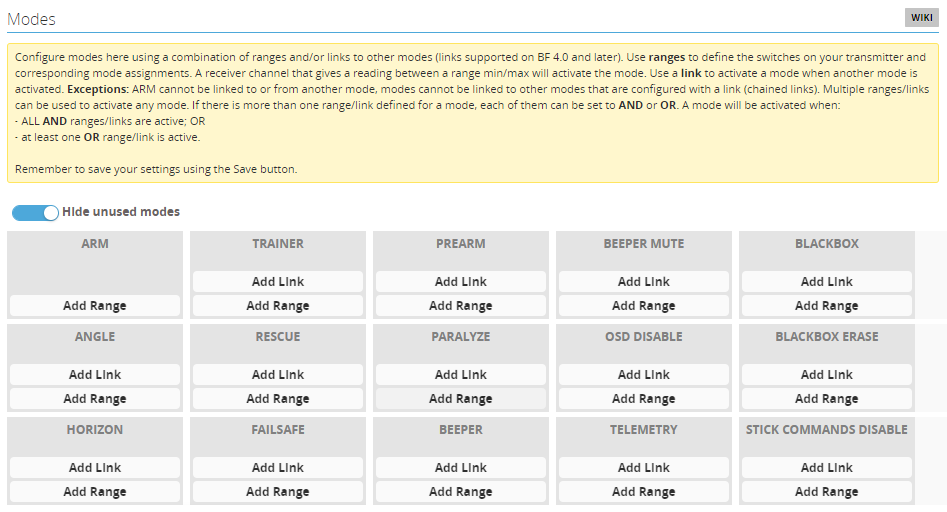
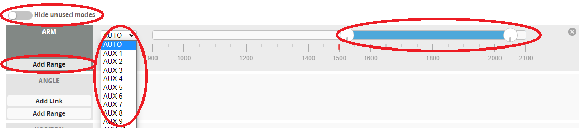
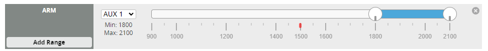
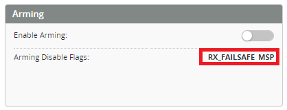
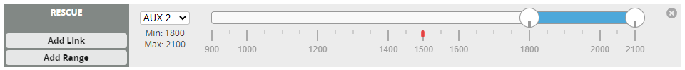
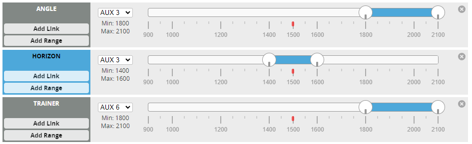
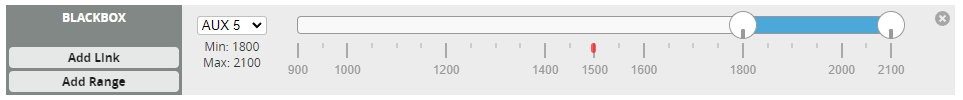

# Modes tab 

| **ID** | **Mode Name** | **Function** |
|--|--|--|
| 1 | ARM | Enables motors and flight stabilization. |
| 2 | ANGLE | Angle mode provides similar functionality to Horizon mode with the addition of limiting the helicopter attitude to the angle specified. |
| 3 | HORIZON | Horizon mode provides attitude stabilization which will level the helicopter when the transmitter sticks are let go. Constant stick input is required to keep the helicopter moving. |
| 4 | TRAINER | Acro trainer mode does not provide self leveling of the helicopter. It does however limit the angle the helicopter can reach. |
| 5 | RESCUE | Enable or disable the rescue mode. |
| 6 | FAILSAFE | Enter failsafe stage 2 manually. |
| 7 | PREARM | When arming, wait for this switch to be activated before actually arming. |
| 8 | PARALYZE | Permanently disable a crashed craft until it is power cycled. |
| 9 | BEEPER | Enable beeping - useful for locating a crashed helicopter. |
| 10 | BEEPER MUTE | Disable/enable beeper including warning, status and BEEPER mode. |
| 11 | OSD DISABLE | Enable/Disable On-Screen-Display (OSD). |
| 12 | TELEMETRY | Enable telemetry via switch.|
| 13 | BLACKBOX | Enable BlackBox logging. |
| 14 | BLACKBOX ERASE | Erase the contents of the onboard flash log chip (takes > 30 s). |
| 15 | STICK COMMANDS DISABLE | Disable/enable stick command. |

The mode selector tab enables several modes and functions to be enabled or disabled via the TX. This is done by configuring a channel on the TX, such as a switch, that you wish to use for operating the mode. From the **Modes** tab, select the required Mode you wish to assign and click **Add Range**, then select the AUX channel matching your TX switch and set a range where you wish the mode to be active. If the mode you wish to use is not visible deselect "Hide unused modes".

## ARM
:::caution ELRS
If using an ELRS receiver you must configure the ARM switch to AUX1 (1000 = Disarmed, 2000 = Armed). This channel is sent every cycle. Please see the [ELRS switch config documentation](https://www.expresslrs.org/software/switch-config/) 
:::

:::info ARM & throttle hold
ARM and throttle hold are not the same. Do not configure the ARM and throttle hold on the same channel. The Flight controller needs to see minimum throttle before it can arm and if they are both on the same channel it will fail the minimum throttle check and will not ARM.
:::

All flight controllers need to be **ARMED** before the motors are able to spool up. Once the Arming mode is configured (as shown above) the flight controller can be Armed ready for flight. If the flight controller detects an unsafe condition Arming will be disabled. If this occurs you can look at the Arming flag status on the **Status** Tab to identify what is preventing Arming being enabled.    

You can find out a description of these flags from the [List of Arming prevention flags](https://betaflight.com/docs/wiki/guides/current/Arming-Sequence-And-Safety#description-of-arming-prevention-flags)

This function can also provide the ability to prevent arming of the heli unless the correct model has been selected on your transmitter (if your RX does not have this functionality). This is done by adjusting the endpoint of your AUX channel to a different value for each model and setting the ARM range to enable the FC only for that model.   

## RESCUE
Enable Rescue mode from the tabs. Allocate the AUX channel and range to suit.

:::info
The purpose of the rescue mode is to arrest any decent, then put the helicopter at a safe altitude in a stable attitude. It does this in stages.   
* Immediately levels in current orientation (upright or inverted)
* Applies a pull up collective to rapidly stop any decent  
* Applies a climb Collective to gain some height
* if it is still inverted (and the flip toggle enabled) it will flip to upright.
* Hover collective is now applied.
:::

After enabling Rescue mode configure the rescue settings from the [**Profiles**](../Configurator/Profiles.md#rescue-settings) Tab.

## 6G flight modes
There are 3 types of self leveling stabilization modes available in Rotorflight. 6G modes (unlike the normal Acro) will auto level when the transmitter sticks are released. These modes make the heli fly more like a drone.  

### ANGLE
Angle mode provides similar functionality to Horizon mode with the addition of limiting the helicopter attitude to the angle specified. 

### HORIZON
Horizon mode provides attitude stabilization which will level the helicopter when the transmitter sticks are let go. Constant stick input is required to keep the helicopter moving.

### TRAINER
Acro trainer mode does not provide self leveling of the helicopter. It does however limit the angle the helicopter can reach. 

Enable ANGLE/HORIZON/TRAINER modes from the tabs. Allocate the AUX channel and range to suit.

In the example above AUX3, and AUX6 are each assigned to a separate 3 position switches on the TX. 

- Horizon mode has been assigned to the AUX3 Range when the middle position of AUX3 switch.
- Angle mode is assigned to AUX3 at full up position of the AUX3 switch.
- Nothing is assigned when AUX3 switch fully down. This means the Heli is in Normal or 3D mode. 
- Trainer mode is assigned to AUX6 at full up position of the AUX6 switch.

After enabling 3G modes you can configure their settings from the [**Profiles**](../Configurator/Profiles.md#auto-leveling-settings) Tab.

## BLACKBOX

When you select [**Normal**](../Configurator/Blackbox#logging-mode) logging mode, you need to activate the blackbox switch in the Modes Tab.

Enable Blackbox from the tabs. Allocate an AUX channel and range to suit.

Now in this example the blackbox logging will start when the heli is armed and AUX5 is at full up position.
