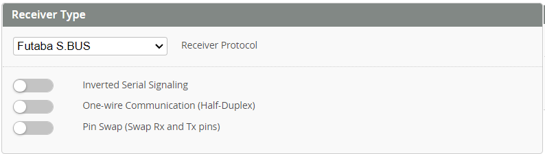

import Tabs     from '@theme/Tabs';
import TabItem  from '@theme/TabItem';
import styles   from './styles.module.css';

# Receiver tab

One of the first things you should do is to connect a receiver to the FC. Your FC has several UARTs, and each UART has a TX and an RX. A receiver needs to be connected to an RX and/or TX pad, depending on the type of receiver.

## Receiver Configuration

First activate `Serial Rx` on the UART you have connected your receiver.

## Receiver Options 

* One Wire Communication - 

The following options are only available on **F7/H7** and **G4** MCUs
* Inverted serial signaling - Some protoculs such as SBUS and FPORT
* Pin Swap - This feature can be 

## Receiver Type
Please see the documentation for your FC for more details on how to connect your receiver. 
There are many receiver protocols supported in Rotorflight. 
* It is preferable that a telemetry capable protocol be used with the [Rotorflight LUA scripts](../Tutorial-Setup/Lua-Scripts.mdx) to perform tuning using you radio.  
* Protocols that do not have telemetry are still compatible with Rotorflight (and transmitters without Lua Scripting); however, [Adjustments](../Configurator/Adjustments.md) have to be configured in order to tune from your radio.  

:::info Please choose to suit your receiver protocol
<Tabs groupId="receiver-types">
    <TabItem value="" label="Choose Rx">
        Rotorflight has great support for both EdgeTX and Ethos.  Please choose your radio.
    </TabItem>
    <TabItem value="ELRS" label="ELRS">
        * [CRSF/ELRS](https://www.expresslrs.org/2.0/quick-start/receivers/wiring-up/) needs an RX and a TX on the same UART. 

        

    </TabItem>
    <TabItem value="S.BUS" label="S.BUS">
        * SBUS needs to be connected to an RX pad.

        

    </TabItem>
    <TabItem value="S.BUS2" label="S.BUS2">
        * SBUS2 needs to be connected to an TX pad.

        

    </TabItem>
    <TabItem value="S.BUS + S.PORT" label="S.BUS + S.PORT">
        * [SBUS with S.Port](https://oscarliang.com/sbus-smartport-telemetry-naze32/): the SBUS pin needs to be connected to a free UART RX, and the S.Port pin needs to be connected to a free UART TX (of *another free UART*), and you activate `Telemetry: FrSky SmartPort` on that UART.

        
        
    </TabItem>
    <TabItem value="F.BUS" label="F.BUS">
        * F.Bus needs to be connected to a TX pad, with `Inverted Serial Signaling` activated ,and `Half-Duplex` activated. F.Bus is the preffered Frsky connection method, its faster that F.Port

        

    </TabItem>
    <TabItem value="F.PORT" label="F.PORT">
        * F.Port needs be connected to a TX pad, with `Inverted Serial Signaling` activated ,and `Half-Duplex` activated.

        

        ### note
        The **Inverted Serial Signaling** option will work only on **F7/H7** or **G4** type mcu, if you are using an **F4** mcu, then you need to use and external signal inverter, or hack your receiver to get an Un-Inverted signal for SBUS, S.Port, and F.Port.
        for more info check [Uninverted SBUS and Smart Port on Frsky Receivers](https://oscarliang.com/uninverted-sbus-smart-port-frsky-receivers/)
    </TabItem>
    <TabItem value="OTHER" label="OTHER">
        If your receiver is not listed here it may still be compatible. Rotorflight can operate with all receiver protocols compatible with Betaflight. Please see the betaflight website and your Receiver documentation for more information.
    </TabItem>
</Tabs>
:::

## Receiver Channels

Select the corresponding channels order based on the selected receiver type.

* For FrSky receivers, set the channels in your radio as per the below order.

* For ELRS receivers, set the channels in your radio as per the below order.

:::note
For **CRSF/ELRS** always set [*ARM*](./Modes.md#arm) switch to *CH5/AUX1* on the radio, also set *THR* to *CH6*
:::

* Reverse channels on your transmitter if a channel responds the wrong way around. Stick to the right should move the bar to the right. Push stick forward and bar should move to the right.

## Receiver Settings

* **Stick Center** - adjust as required by your radio to achieve 0% when the _ROLL, PITCH, YAW_ sticks are centered. 
* **Stick Maximum Travel** - adjust achieve 100% at the sticks limits.
* **Throttle Channel value for arming** - channel value under which arming is allowed.Throttle must be below this limit prior to ARM mode being selected. 
* **Throttle Channel value for 0% throttle** - The channel value (in µS) for the channel to be considered 0%.
* **Throttle Channel value for 100% throttle** - The channel value (in µS) for the channel to be considered 100%.
* **Cyclic Deadband** and **Yaw Deadband** - adjust to the smallest possible value that doesn't make your model drift in the *Rates Preview* window.

:::caution
Calibrating Stability Mode
The stability modes (Angle, Horizon or Rescue) can be calibrated so that the heli doesn't drift much when using such a mode. This can only be done via the [accelerometer trims](../Tutorial-Setup/Using-Stability-Modes-example.md). 
**Do not use trim on your transmitter**.
:::

You should end up with something similar to this:  

## Telemetry Sensors

Use the below switch to enable/disable the telemetry stream sent to your radio. Each sensor can then be enabled or disabled individual depending on your requirement.

:::tip
For ELRS receivers, follow the [ELRS Custom Telemetry](../Tutorial-Setup/ELRS%20Custom%20Telemetry.mdx) page for how to setup. This is new for Rotorflight 2.1 and ELRS Re-use is no longer available.  
:::

