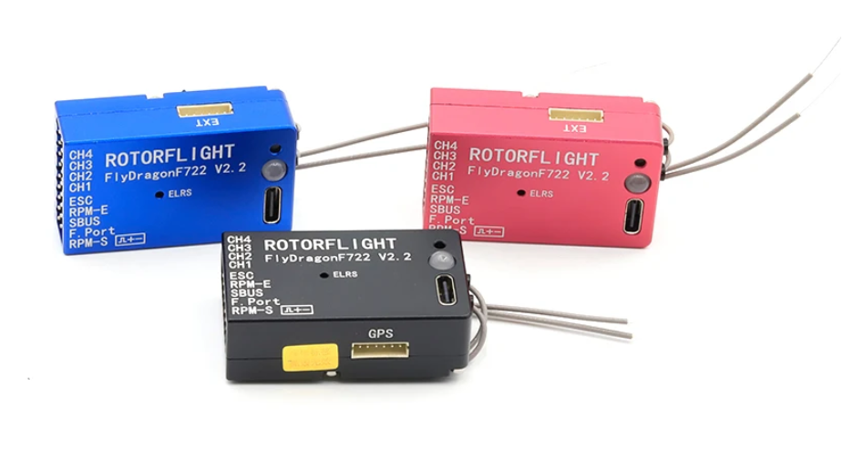
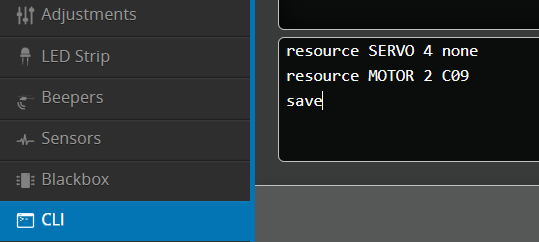
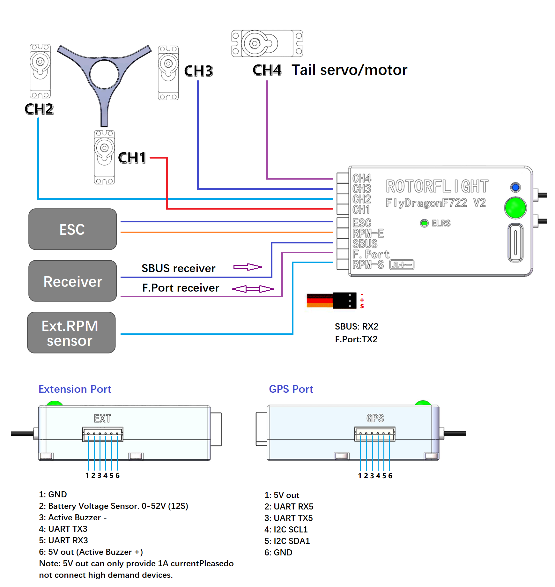

# Flydragon V2.2

:::info Specifications  
### Hardware Specifications： 
MCU: STM32F722RET6  
IMU: BMI270  
Black Box: W25N01G (128MB)  
Baro: SPL06 (I2C2） 
LED: WS2812  
Beeper: 5V Active Buzzer  
USB: Type-C  
UARTS: UART2，UART3，UART5  
I2C: I2C1  
ADC: ADC1 (12S)  
Servo Pins: CH1-CH4  
RPM Inputs: RPM_E (ESC RPM Wire)，RPM_S (External RPM Sensor)  
Internal Receiver: ELRS Diversity Receiver 2.4G (UART1)  
External Receiver: CRSF, S.BUS, F.PORT, GHOST, SUMD, SUMH, IBUS, XBUS, XBUS/RJ01, EXBUS, PPM, MSP, DSM (Needs 3.3V step
down BEC module)  
BEC Voltage: 5-15V  
5V Power Output: 5V-1.5A   
Dimensions: 45mm x 27mm x 14.5mm  
Weight: 27g  

### Receiver specifications:  
MCU：ESP8285  
RF：SX1280  
LAN/PA：SE2431L  
Active crystal oscillator：TCXO 52MHz  
Antenna：2 sticks ipex1 200mm 2.4GHz  
RF frequency：2.4GHz (2400-2480GHz)  
Transmit power：100mW (MAX)  
Maximum accepted refresh rate：500HZ/F1000HZ  
Firmware version：v3.3.2  
Firmware target：FlyDragonRC 2.4 GHz / FD R24D 2.4GHz RX  
:::

### Rotorflight Target
When updating Rotorflight firmware. Please use the FLYDRAGONF722_V2_2 target.

### Motorised Tail

To use the Flydragon with a motorised tail the Servo 4 needs to be remapped to Motor 2. This can be done in the CLI using the following command (just copy and past this into the CLI then push [ENTER]).  

`resource SERVO 4 none`  
`resource MOTOR 2 C09`  
`save`  

### Wiring

:::caution
 WARNING: The RPM-S Port is powered via the internal 5V supply which is also powered during USB connection. If you have any power supplies connected or innapropriate loads you are likely to damage your board. DO NOT plug in your ESCs BEC wire into here, many BECs act like a deadshort if you attempt to backfeed them and you WILL blow out the 5V supply on your board when you connect USB if you do this. Power to the rest of the ports is all common power you can connect whatever to.
:::

### UART ports

* UART 1 - Internal ELRS Receiver - (disable as shown below if not used)  
* UART 2 - SBUS or FPORT connector
* UART 3 - Rx and Tx on Extension port
* UART 5 - Rx and Tx on GPS port (can also be used for the Receiver)

### Can I use a receiver other than ELRS?
External receivers can be connected to the SBUS, FPORT or any of the Extension UART ports (UART 3 or 5). If not using the inbuilt ELRS receiver it should be disabled. 

#### How to Enable/Disable the Internal Receiver: 
* The internal receiver is default turned on. When using external receivers, we need to turn it off. Connect the Flydragon F722 V2 to 
the Rotorflight Configurator. Go to CLI (command line) page:

* Command to **DISABLE** the receiver:  
`set pinio_config = 1,1,1,1`  

* Command to **ENABLE** the receiver:  
`set pinio_config = 1,1,1,1`  

### Manuals

[Flydragon V2.2 Flight Controller Manual](./pdf/FlyDragonF722_v2.2_FBL_Specfications.pdf)  
[Flydragon V2 Flight Controller Manual](./pdf/FlyDragonF722_v2_FBL_Specfications.pdf)  
[Flydragon V2 internal ELRS Manual](./pdf/FlyDragonF722_v2_ELRS_Receiver_Manual.pdf)
