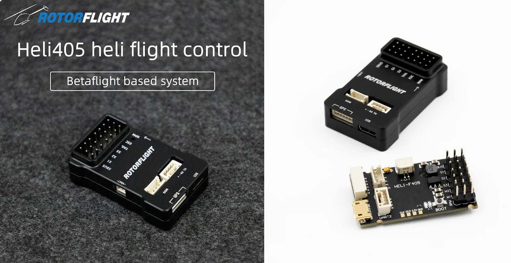
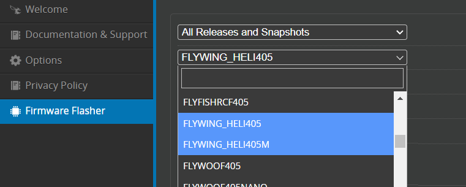
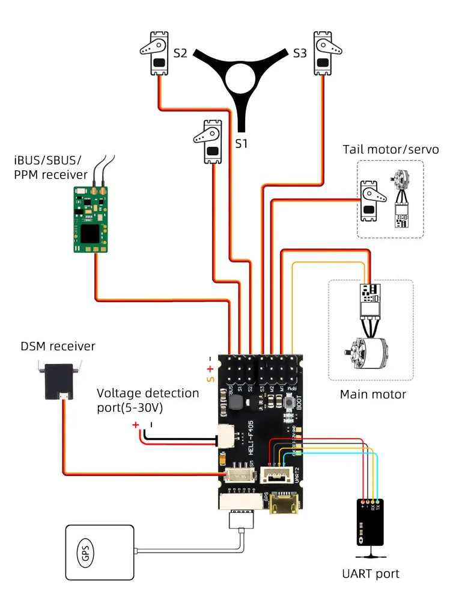
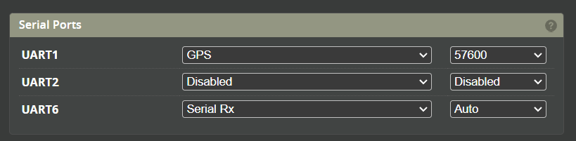
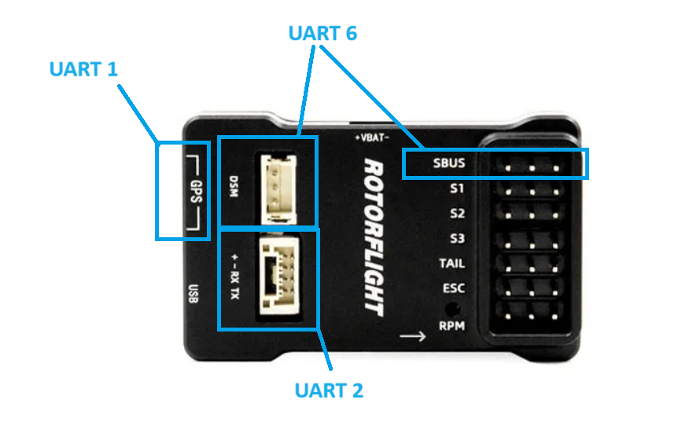
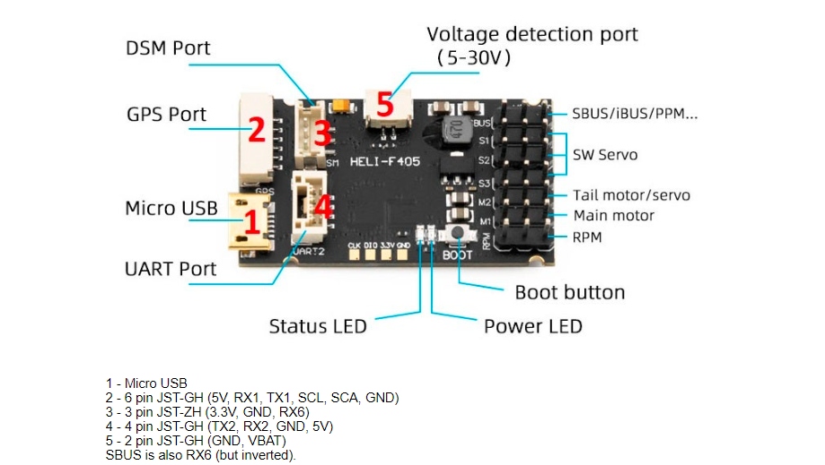

# Flywing Heli405

:::info Specifications  
### Hardware Specifications： 
MCU: STM32F405RGT6 
IMU: ICM42688  
Black Box: 16MB  
Baro: SPL06 (I2C2） 
USB: Micro  
UARTS: UART1，UART2，UART6  
I2C: I2C1  
ADC: Voltage measurement port VBat (5-30v)  
Servo Pins: CH1-CH4  
RPM Inputs: RPM (ESC RPM Wire) 
BEC Voltage: 5-19V  
Dimensions: 42mm x 22mm x 14mm  
Weight: 17g  
:::

### Rotorflight Target
**Servo Tail:**  
Use the FLYWING_HELI405 target for a servo tail Heli.

**Motorised Tail:**  
Use the FLYWING_HELI405M target for a Motorised tail. The 'M' is Motorised.

### Wiring

### UART ports

* UART 1 - GPS Connector
* UART 2 - Top JST-GH port
* UART 6 - DSM and SBUS

