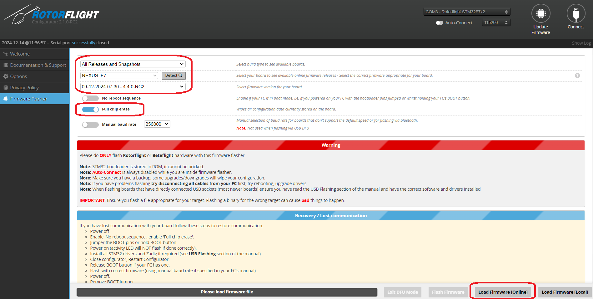
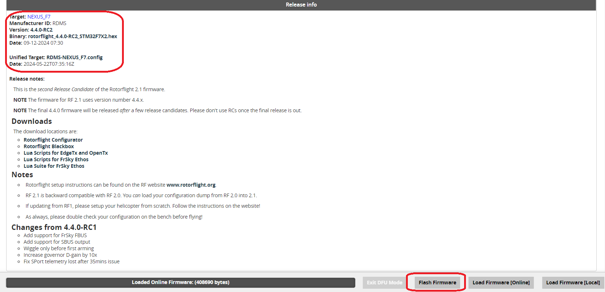
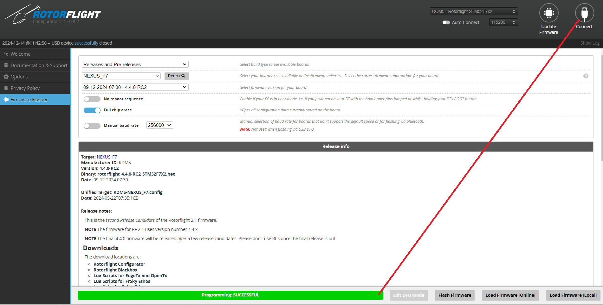
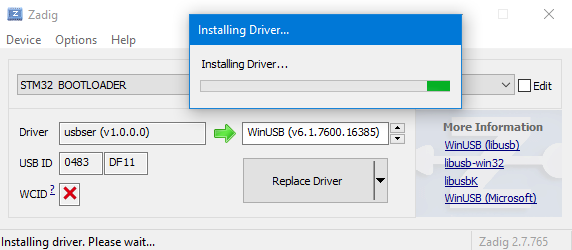
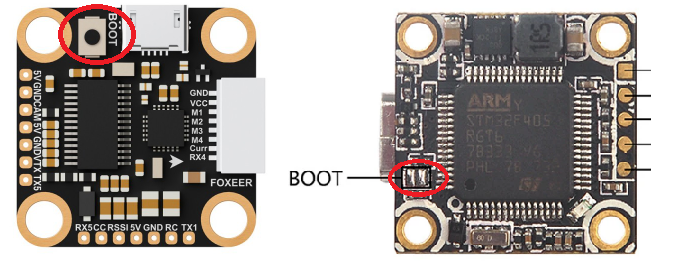
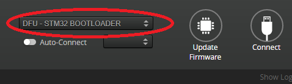

import DriverFixer           from './img/flash-driver.png';

# Flashing the firmware

## Install Rotorflight Configurator
Start by downloading and installing the latest [Rotorflight Configurator release download](https://github.com/rotorflight/rotorflight-configurator/releases). 

This walk-through uses Windows, but it should also work on Linux or macOS.

## Install Drivers
On Windows, install the **STM USB VCP Drivers** from the links on the Rotorflight Configurator page.

:::caution Driver issues
    If there are issues connecting to the flight controller please download the [ImpulseRC Driver Fixer](https://impulserc.com/pages/downloads).
    
:::

## Flash Firmware to FC
Connect the FC to your computer with an USB data cable. Now you are ready to install the Rotorflight firmware to your FC. There are five different versions of the firmware, each version targeting a specific microprocessor: F405, F411, F7X2, F745, and H743. Your FC must use one of those processors. Besides firmware, each FC has it's own configuration. The configuration specifies the FC board, e.g. what pads are used for what.

### Step 1.
Open the Rotorflight configurator and click on **Update Firmware**.

* Choose **All release and Snapshots** from the dropdown. **Note:** ***Snapshots are for development and testing purposes. They may contain bugs!! We recommend using snapshot firmware with care and to assist the project with testing. Choose "Releases" if you would rather use the latest stable firmware*** 
* Select the Target you identified in Step 1. You can also click on the "detect" button to auto detect the target.  
* Select Full chip Erase, this will remove all previous configurations.
* Click on **Load firmware[online]**  

### Step 2.
* Check and confirm the target board is correct.
* Click on **Flash Firmware**.

### Step 3.
* When the programming is successful click on **Connect**.

## Troubleshooting
'Initiating reboot to bootloader' hangs
If you're on Windows and it hangs while displaying Initiating reboot to bootloader, you'll need to install the proper driver for the STM32 BOOTLOADER device.

Make sure the device STM32 BOOTLOADER is installed and showing up in the Device Manager, either under Other Devices or under Universal Serial Bus devices. Select View > Show Hidden Devices in order to see all installed devices.

You might need to uninstall all STM Device in DFU Mode devices under Universal Serial Bus Controllers before Windows will install the STM32 BOOTLOADER device. Make sure to check Delete the driver software for this device.

In the Configurator, go to the CLI and type dfu. This puts the FC in Device Firmware Update mode.

Start Zadig (see download link on the Welcome tab in the Configurator), select Options > List all Devices, select STM32 BOOTLOADER and change the driver to WinUSB. Flash firmware should now work.

Error 'Rebooting device to bootloader: FAILED'
If you receive the error Rebooting device to bootloader: FAILED then you will need to manually place the FC into bootloader mode. Do this by holding down the BOOT button while connecting it to your computer.

Help... that didn't work. Its bricked!
Ok, so after rebooting you are no longer able to connect to the FC via USB. This can happen if your configuration file is not correct (USB becomes unallocated) or if you have loaded the incorrect firmware for the processor type. Don't worry: the bootloader can't be bricked, it's in ROM. You can always reload the firmware via the DFU (device firmware update) mode. Most flight controllers have a 'boot' button or pins which are used to enter DFU mode. Generally you can just enter DFU mode by pushing the button or bridging the boot pins as you plug the USB in (while the Rotorflight Configurator is open).

Rotorflight Configurator will display DFU - STM32 BOOTLOADER at the top of the page after a successful DFU connection. Click on the Update Firmware and follow the steps above to re-flash the firmware as required.

If you still having problem connecting to the MCU, install the [**Impulse-RC Driver Fixer**](https://impulserc.com/pages/downloads).

