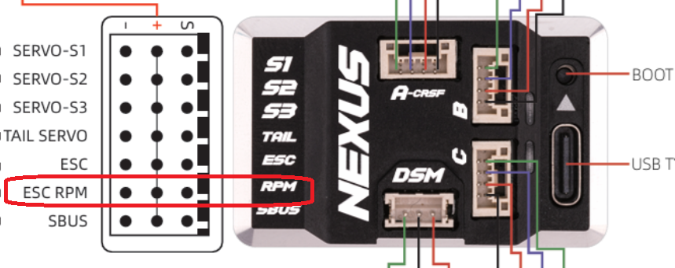
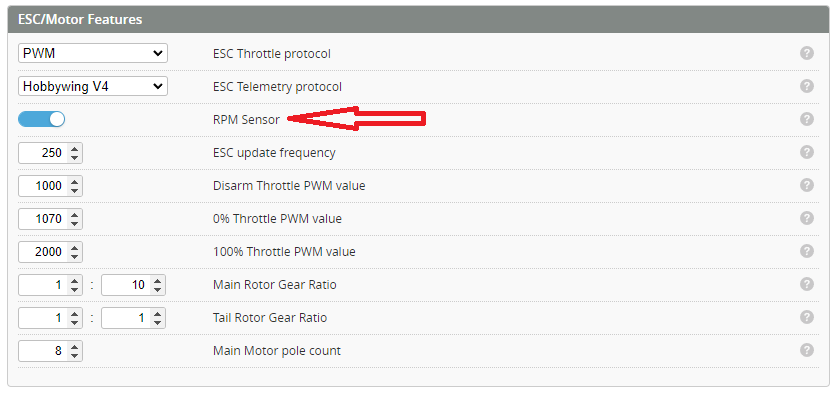

import Tabs         from '@theme/Tabs';
import TabItem      from '@theme/TabItem';
import tabStyles    from '../tabs.module.css';

import bluejay      from './img/bluejay_logo.png';
import blheliS      from './img/ESC_logo.png';
import ESC          from './img/ESC_logo.png';

# RPM Measurement

In order to use the Governor or RPM filters (and why wouldn't you!!) you must measure the RPM. There are two options for this:
* **RPM sensor**
* **Bi-directional D-shot**

:::info
RPM can sometimes also be read via ESC telemetry. However, this is at a refresh frequency that is **too slow to be used for filtering of governing**.
:::

:::caution
RPM filtering is used to remove frequencies related to the rotating components. This allows a much higher tune; HOWEVER!! If the helicopter is flown in an OverSpeed condition the rotation of the one way bearing means that the RPM measurement will not be correct. If the helicopter is tuned too critically this could mean the helicopter could become out of tune resulting in unwanted oscillations.
:::

:::info note
<Tabs groupId="RPM-measurement">
  <TabItem value="RPM Sensor" label="RPM Sensor" attributes={{className: tabStyles.tab}}>
## Frequency Sensor

Typically it is used when the RPM is not available via ESC telemetry. Only BLHeli_32, some BLHeli_S and APD F3 ESCs support Dshot/KISS telemetry, so this feature is needed with a wide range of traditional ESCs.

The RPM signal is used in multiple places in the FC, e.g. in the PID control, the governor and the RPM-filter. If these features are not needed, then there is no need for the frequency sensor either.

An electrical frequency signal is provided by some ESCs, e.g. Hobbywing with the "yellow" wire. Or it can come from an RPM sensor, which is converting the motor three-phase voltages into a frequency signal - e.g. Hobbywing RPM sensor. Please refer to your ESC's or sensor's manuals how to connect them correctly.

Note about the Hobbywing RPM sensor: it's safest to power it with 3.3V, as the input voltage of the sensor is also the output voltage of the RPM signal it generates. All inputs on a STM32 MCU tolerate 3.3V, and some will also accept 5V. But if you're using a 8.4V BEC to power the sensor, you'll likely damage the MCU.

Up to two frequency sensors are supported, for acquiring motor #1 and motor #2 speed.

If both Frequency Sensor and telemetry RPM signals are available, the Frequency Sensor has precedence.

### Connection

Plug the ESC RPM wire (often yellow wire) or separate RPM sensor (Hobbywing RPM etc) into the FC RPM input.  

### Configuration
Then the frequency sensor can be turned ON with the feature flag located on the [***Motors***](../Configurator/Motor-and-Esc.md#pwm-protocol) tab.

</TabItem>
    <TabItem value="Bi-directional D-shot" label="Bi-directional D-shot" attributes={{className: tabStyles.tab}}>
## Bi-directional DSHOT

Several features of Rotorflight require telemetry data for the motor speed such as the Govenor and RPM Filtering. One method for the FC to get this motor speed is via Bidirectional DSHOT. Bidirectional DSHOT is an ESC protocol which enables communications in both directions between the FC and the ESC. The speed command can be sent by the FC to the ESC and the ESC responds by sending the current motor eRPM (electrical RPM).

From the **Motors** tab in Rotorflight Configurator select an DSHOT ESC protocol (Recommended DSHOT300) and enable Bidirectional DSHOT. This requires ESC firmware that supports Bidirectional DSHOT.
### Supported ESC Firmware
    <Tabs>
        <TabItem value="Escape_32" label="Escape_32" attributes={{className: tabStyles.tab}}>  
            #### Escape_32
            Escape_32 is a new ESC firmware project. Which supports Bidirectional DSHOT, see [Escape_32 Wiki](https://github.com/neoxic/ESCape32/wiki). 

            ***Firmware for 32-bit BLDC motor electronic speed controllers that aims for simplicity. It is designed to deliver smooth and efficient motor drive, fast transitions from a complete stop to full throttle, robust direction reversals, and maximum hardware support.***

            [**Escape_32 Wiki**](https://github.com/neoxic/ESCape32/wiki)
        </TabItem>
        <TabItem value="BLHeli_32" label="BLHeli_32" attributes={{className: tabStyles.tab}}>  
            #### BLHeli_32
            **As of 2024 BLHeli_32 is no longer being manufactured**  
            The Blheli_32 configurator may no longer work with these ESCs. We no longer recommend these ESCs. 

            Bidirectional DSHOT is fully supported from firmware version 32.7.0 onward. ESCs with earlier firmware will have to be updated before speed telemetry will operate.
        </TabItem>
        <TabItem value="AM32" label="AM32" attributes={{className: tabStyles.tab}}>  
            ## More information
            More details on Bidirectional DSHOT and RPM filtering at [Betaflight](https://betaflight.com/docs/wiki/guides/current/DSHOT-RPM-Filtering).
            
            [**ESC Configurator**](https://esc-configurator.com/)
        </TabItem>
        <TabItem value="BLHeli_S" label="BLHeli_S" attributes={{className: tabStyles.tab}}>  
            #### BLHeli_S
            BLHeli_S ESCs **do not support Bidirectional DSHOT**. In order to access this functionality with a BLheli_S ESC, the firmware must be upgraded to Bluejay using the ESC Configurator.
            
            [**ESC Configurator**](https://esc-configurator.com/)
        </TabItem>
        <TabItem value="Bluejay" label="Bluejay" attributes={{className: tabStyles.tab}}>  
            #### Bluejay
            Bluejay is an open source firmware for BLheli_S ESCs which supports Bidirectional DSHOT, see [BlueJay](https://github.com/mathiasvr/bluejay). This firmware has been used successfully for several Rotorflight builds. Bluejay is capable of flashing individual settings to each ESC (tail and main) which is important when using an all in one (AIO) board. Bluejay v0.15 and later also supports disabling *damped light* (regenerative breaking), a must if your helicopter doesn't have a one way bearing. For example, a K110 will yaw/spin rapidly on throttle hold if *damped light* is enabled. Please follow the [Blheli_S to Bluejay](../Tutorial-Setup/Blheli_s-to-Bluejay.md) walkthrough.
             
            [**ESC Configurator**](https://esc-configurator.com/)
        </TabItem>
    </Tabs>
  </TabItem>
</Tabs>
:::

