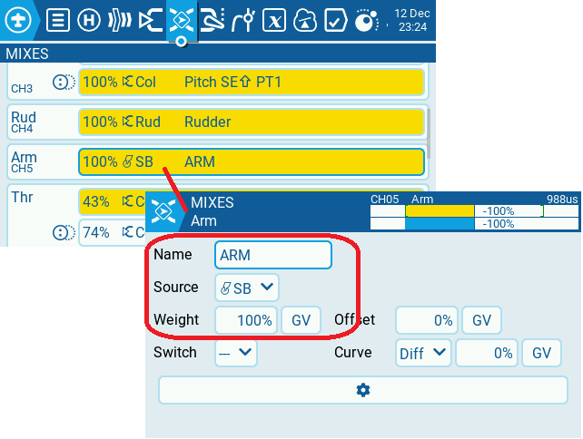
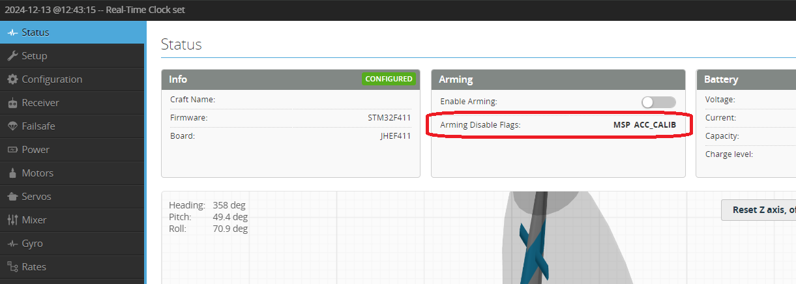
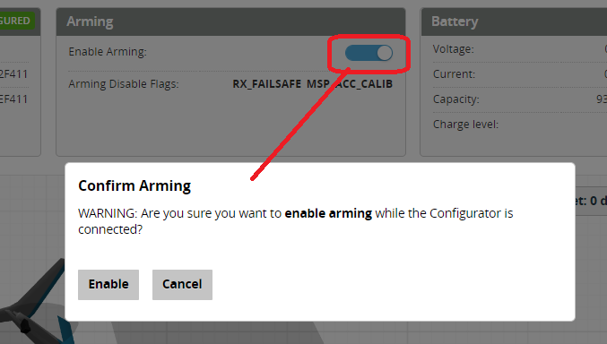
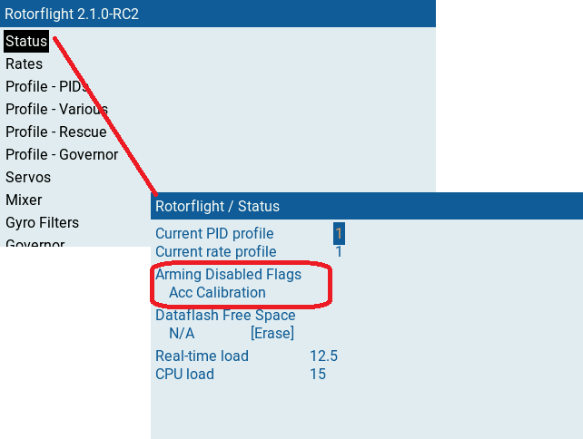
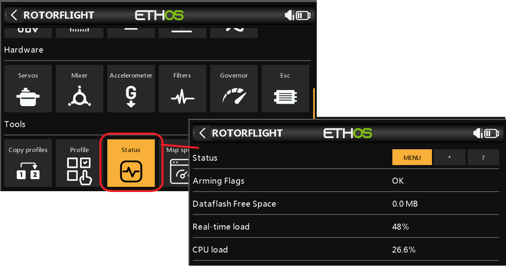

import Tabs     from '@theme/Tabs';
import TabItem  from '@theme/TabItem';
import tabStyles   from '../tabs.module.css';

import Arming2 from './img/arming-2.mp4';
import Arming3 from './img/arming-3.mp4';

# Arming 

**Arming** is a safety feature that checks a series of settings in the FC to make sure it is safe before allowing it to spool up. It checks for things like accelerometer calibration, gyro filtering, throttle not at minimum, RX not connected.  

* Arming should be on a separate switch and preferably one that is not easy to get to and switch by accident. Flick this switch to Arm the Flight controller, then once successful you turn off throttle hold (on an easy to get to switch so you can hold quickly if you need to) and let it spool up.
* Arm is entwined in a lot of the Rotorflight code (from the betaflight base). Lots of components are disabled while it is not armed. As a result if you disable in flight you are probably going to crash. 2 switches is the key.

The latest v2.1 when your helicopter Arm flags are clear and you are ok to Arm, the swashplate will do a wiggle to indicate everything is ready.

**Arming is different to throttle hold**. Throttle hold is just a switch that sets the throttle signal to minimum. It is only on the Transmitter and not on the Flight Controller. 

## Transmitter configuration
The transmitter simply needs a channel that switches between Low (disarmed) and High (Armed). This can be any switch; however, it is preferable that it is not easy to accidentally switch in flight. 

:::caution ELRS Arming Channel 
    For ELRS receivers - Put your arm switch on AUX1, and set it as 1000 is disarmed, 2000 is armed.  

    Please read [ELRS switch configs and Arming](https://www.expresslrs.org/software/switch-config/#why-do-you-keep-saying-put-arm-on-aux1) for more details  
:::

For EdgeTx this would look like this: 

This simply switches the Arm channel (CH5/Aux1) from 0% (1000us) to 100% (2000us).

      <video
        src={Arming2}
        autoPlay
        playsInline
        loop
        muted
        width="85%"
      />

## Flight Controller configuration
As shown in the video below:  
**1.** Open the [Modes tab](../Configurator/Modes.md)  
**2.** Set the channel to match your switch (in this case AUX1)  
**3.** Drag the sliders to the top end of the channel  
**4.** Save  
**5.** Toggle the chanel and watch the red indicator pip move. When it is inside the upper range the ARM box turns red.  
**Note** **-** The box shows as **"(Disabled)"** because it is connected to the Configurator.

      <video
        src={Arming3}
        autoPlay
        playsInline
        loop
        muted
        width="85%"
      />

## Swashplate Wiggle indication
The swashplate is configured to indicated ready for Arming as well as Errors. More details can be found on the [Swashplate wiggle](../Tutorial-Setup/Swash-wiggle.mdx) page.

## Arming Disable flags
The Arming disable flags are a list of issues that could be preventing your helicopter from Arming. These are things like Gyro not configured, Receiver fail ot throttle not at minimum. Please see the list below for details of each flag and how to fix it.   

There are several ways to identify what is preventing your helicopter from Arming. You can view the Arming disable flags from the configurator or on the transmitter (if you have a transmitter with Rotorflight Lua scripts).

:::info 
<Tabs groupId="Enable-flags">
  <TabItem value="Configurator" label="Configurator">
    ### Configurator
    The Arming disable flags are displayed on the Status tab. Disable flag **MSP** means you are connected to the configurator.   

    

    You can enable arming while connected to the configurator by the selecting the **enable arming** toggle.  
    **WARNING** this should only be done with blades off!!  

    
  </TabItem>
  <TabItem value="Edge_Tx" label="EdgeTX Lua">
    ### Edge Tx Lua
    From the Edge Tx Rotorflight Lua click on the Status tab to view the disable flags.

    
  </TabItem>
  <TabItem value="Ethos" label="Ethos Lua">
    ### Ethos Tx Lua
    Open the Rotorflight Lua, scroll to the bottom and click on the status tab. 

    
  </TabItem>
</Tabs>
:::

## Disable flags description  
| `Disable Flag`                                 | Description                                               |
| ------------------------------------------|---------------------------------------------------------- |
|   'NOGYRO'          | Gyro was not detected                                     |
|   'FAILSAFE'        | Failsafe is active                                        |
|   'RXLOSS'          | RX is in Failsafe. No valid receiver signal is detected.  |
|   'BADRX'           | Your receiver has just recovered from receiver failsafe but the arm switch is on                                                          |
|   'BOXFAILSAFE'     | You have enabled Failsafe in the Modes and it is currently active.                                |
|   'RUNAWAY'         | Runway Takeoff Prevention has been triggered. Disarm then re-arm to clear this condition.                                |
|   'CRASH'           | Crash Recovery has been triggered. Disarm then re-arm to clear this condition.                                                |
\   'GOVERNOR'        | Governor enabled but no valid 'fast' RPM source (RPM frequency input or bi-directional D-shot) OR Gove mode 2 and no Voltage input configured.|
|   'THROTTLE'        | Lower throttle below [Throttle Channel value for arming](../Configurator/Receiver.mdx#receiver-settings)                 |
|   'ANGLE'           | Craft is not level. Level craft to within (default) 25 degrees.                                                          |
|   'BOOTGRACE'       | Arming too soon after power on. Turn off Arm; pause, then Arm again.             |
|   'NOPREARM'        | Prearm switch has been set-up but is not activated or prearm has not been toggled after disarm   |
|   'LOAD'            | System load is too high. This may happen with some low spec boards. Reduce the [PID loop frequency](../Configurator/Configuration.md#system-configuration) and/or number of filters|
|   'CALIB'           | Sensor calibration is still ongoing. Wait for sensor calibration to complete.                       |
|   'CLI'             | CLI is active. Exit the CLI.                                                     |
|   'CMS'             | CMS (config menu) is Active - over OSD or other display. Exit the CMS (or OSD menu).                                                          |
|   'BST'             | A Black Sheep Telemetry device (TBS Core Pro for example) disarmed and is preventing arming. Refer to the manual for your hardware.                                                          |
|   'MSP'             | MSP connection is active, probably via Rotorflight Configurator. Terminate the Rotorflight Configurator connection (disconnect). **Note** **-** **you** **would** **expect** **this** **flag** **if** **you** **are** **looking** **at** **the** **Arm** **disable** **flags** **on** **the** **Status** **tab.**|
|   'PARALYZE'        | Paralyze Mode has been configured and is currently active. Power cycle/reset FC board.                        |
|   'GPS'             | GPS rescue mode is configured but required number of satellites has not been fixed. Wait for GPS fix, enable arming without GPS fix, or disable GPS rescue mode. **Note** **-** **Rotorflight** **GPS** **rescue** **is** **not** **functional** **so** **should** **not** **be** **configured.**|
|   'RESCUE_SW'       | Rescue mode has been configured and is currently Active. Switch off rescue mode and toggle the Arm switch.|
|   'RPMFILTER'       | RPM-based filtering is enabled but one or more ESC's are not configured or receiving valid RPM signals. RPM feedback can be from bi-directional Dshot or Frequency inputs using the ESC RPM signal or an external RPM sensor. See [RPM Measurement](../Tutorial-Setup/Rpm-Measurement.mdx) for more details.|
|   'REBOOT_REQD'     | Reboot required. Settings have been changed and the flight controller requires a Reboot for the settings changes to take effect.                                                          |
|   'DSHOT_BBANG'     | DSHOT Bitbang is not working. Check configuration of timers and DMA for your controller. Generally Dshot Bitbang is not required for Rotorflight so try `set dshot_bitbang = OFF` in the CLI |
|   'NO_ACC_CAL'      | Accelerometer calibration required. Calibrate the accelerometer or disable features that use it (e.g. Rescue, Horizon, Angle modes etc).|
|   'MOTOR_PROTO'     | ESC/Motor Protocol not configured. Select the ESC/Motor protocol to use on the Configuration tab.  |
|   'ARMSWITCH'       | Arm switch is in an unsafe position. Toggle the arm switch to arm.                                                          |
