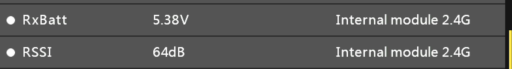
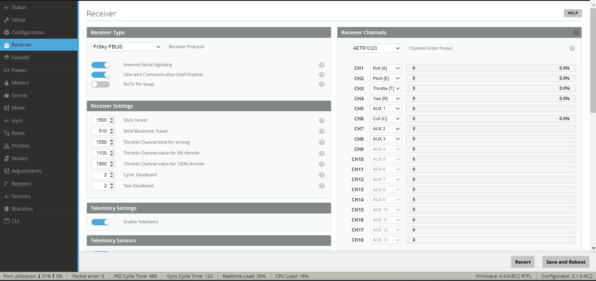

# FrSky Ethos and Nexus example 

Rotorflight-Frsky-Setup
Instructions for Frsky Ethos Initial Radio and Configurator Setup, this is a generic setup using a Nexus FBL, Frsky transmitter with an frsky access receiver

Radio
Following the manufacturers instructions register and bind your receiver to your newly created model or a clone

Once the bind is successful you will see Telmetry items updating in the Model\Telemetry screen, similar to this

And the radio will display signal in the top right similar to this:

Enter the Model screen and scroll to RF System, select the receiver, in this example we are using a Frsky Archer GR6Plus, click on the receiver type and select options. Under Telemetry port choose FBUS, and exit the screen. FBUS is the prefered method of connection.

Nexus and RF Configurator
In the following example the Frsky receiver is connected to Port (A) of a Nexus controller. With the supplied cables you can connect to either Port A, B or C

Connect the USB-C cable to the Nexus and connect to the PC\Laptop with the Configurator installed. The latest Rotorflight configurator can be found HERE

One connected this screen will be displayed if a new Nexus is attached.

This is a warning the accelerometer is not calibrated, click close and enter the main configurator page.

Select SETUP on the left, hold or keep the nexus flat on the bench and click 'Calibrate Accelerometer', the top status bar will show ' Accelerometer calibration finished'

Select STATUS on the left and the following page will be displayed

Item 1 is showing board firmware and identification. Item 2 is showing battery connection info - At this stage the main battery is not connected. Item 3 is showing the Nexus firmware version and the RF Configurator version.

Configurator Initial Setup
Select Configuration on the left

The screen is described as:

* Enter your craft name  
* Enable Accelerometer, Barometer and CMS  
* Set Port (A) or your assigned receiver port to Serial Rx  

By default the Nexus is setup to be installed horizontal servo pins facing towards the front, if the pins are facing to the rear of the heli enter 180 in the Yaw Degree's box.
Click Save and reboot

Enter the Receiver tab and select the options as per this view.

Under telemetry enable these options

Save and Reboot, please ensure your transmitter is switched on and connected to your receiver

Return to the receiver tab, you should now see the channel bars moving when the TX joysticks are moved. If not either the TX\RX are not bound or a step above has been missed.

