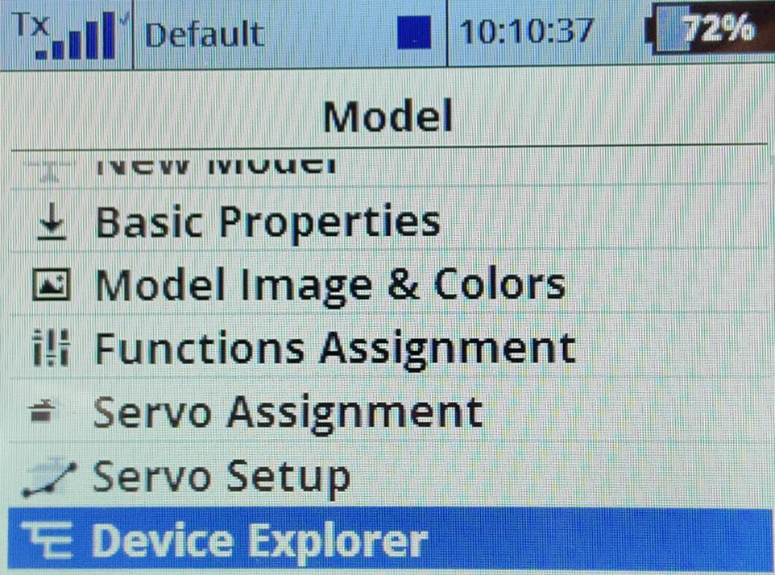
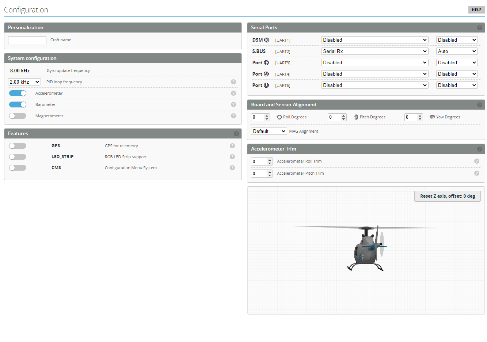
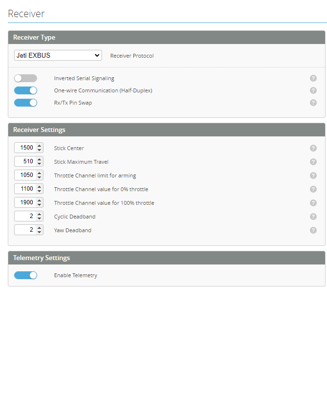
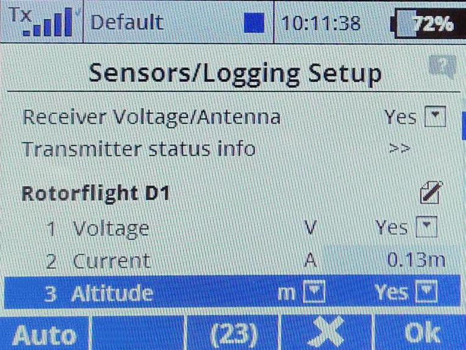

---
sidebar_position: 10
---

# Jeti and Nexus example 

**Rotorflight-Jeti-Setup**
Instructions for Jeti Initial Radio and Configurator Setup, this is a generic setup using a Nexus FBL, Frsky transmitter with a jeti exbus receiver

**Wiring**
The simplest is to use a male to male servo lead to connect from the ***SBUS*** port on the FBL to the ***E1*** port on your receiver.

**Receiver Setup**
Once your receiver has been bound to the radio; visit the device explorer page.

Select the receiver

Select the alternative pin configuration

Set the pin to use the ExBus protocol

Next steps are to configure the fbl to receive the Exbus signal.

Set the SBUS port to be used for serial rx communication

Then visit the receiver page and configure as follows

You should now have a control link and telemetry with all the sensors available on your radio.

