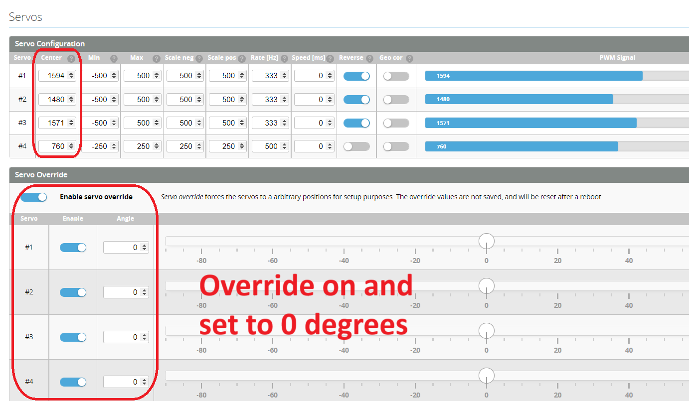
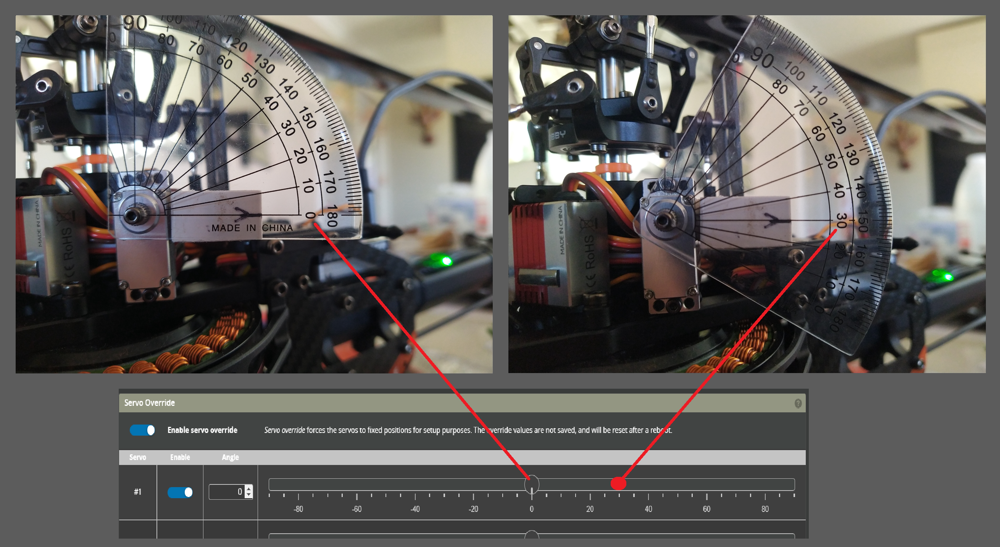

import ServoSetup from './img/servo-setup.mp4';

# Servo Setup and Calibration

### Step 1 - set frequency and center

* DO NOT CONNECT THE SERVOS YET!
* Confirm and set the servo [center](../Configurator/Servos.mdx#center) to your servo manufacturers recommendation. For Cyclic this will usually be 1520us, and for Tail it would be 760us.
* If a servo's center is 760us, make sure to change the min/max to -350/350 instead of -700/700, and pos/neg scales to 250 instead of 500.
* Confirm and set the servo [rate](../Configurator/Servos.mdx#rate) as specified by your manufacturer. For many digital cyclic servos this is 333Hz and for most tail servos this is 560Hz.

### Step 2 - Set servo directions

* Connect the servos.
* Set Servo override to `ON`.
* Fit servo arms to as close to 90 degrees as possible.
* Slide Servo 1 override in the **positive** direction (i.e. right).
* Confirm the servo arm travels **upwards** towards the swashplate. If not toggle the [servo reverse](../Configurator/Servos.mdx#reverse).

Repeat with remaining cyclic servos.

      <video
        src={ServoSetup}
        controls
        playsInline
        muted
        width="85%"
      />

### Step 3 - set arms at 90 degrees

* Set each of the override sliders to 0 degrees.
* Adjust [center](../Configurator/Servos.mdx#center) to level the servo arm (0° or 90° depending on servo installation orientation). One quick way is to slide the override bar and copy the output value from the blue bar into the [center](../Configurator/Servos.mdx#center) and press save. Make sure to reset the override to see the correct effect.

Repeat with remaining cyclic servos.

### Step 5 - calibrate range (Optional - recommended)

The purpose of servo calibration is so the FC is able to more accurately control its mechanical movements. Not all servos are the same. Sometimes identical servos can have several degrees of difference for the same output. Calibrating the servos can enable each servo to move by the same amount when commanded.  
Calibration is also required if using the Geometric Correction function.  

* Set the override to a positive value (e.g. 30°)
* measure the current servo arm angle and increase or decrease the [Scale Pos](../Configurator/Servos.mdx#scale-neg-and-scale-pos) until the servo arm angle matches the override angle.

### Step 4 - set final limits (Usually Not Required)

With the servos installed in the helicopter, adjust [Min/Max](../Configurator/Servos.mdx#min-and-max)  so that the arm & ball won't hit anything in the heli frame (servo override @ 80° / -80°).

Repeat with remaining cyclic/tail servos.

