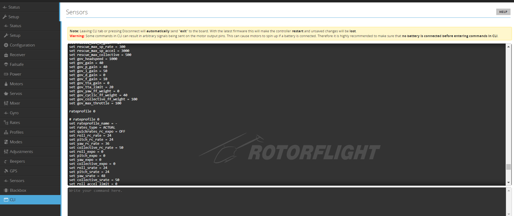

# CLI

This tab is the CLI or Command Line Interface. It is a method for sending commands and settings to the flight controller. We can also backup and restore our configuration using this tab. 

### CLI Usage

To save your settings type in `save`, saving will reboot the flight controller.

To exit the CLI without saving power off the flight controller or type in `exit`.

To see a list of other commands type in `help` and press return.

To dump your configuration (including the current profile), use the `dump` command.

See the other documentation sections for details of the cli commands and settings that are available.

#### Diff Backup Using CLI

This method shows all user-modified settings but avoids saving values left as default or values that are part of the
board targets

Note that `diff` only shows the current Rate and PID profiles, whereas `diff all` will show all profiles that have been
changed

```
diff all
```

This data should be sufficient to replicate the quad configuration on a new or erased flight controller board. Use the
save to file function to create a backup

#### Dump Using CLI

Note that the `dump` command will output every setting and their current values. Many of these will be firmware
defaults and are not needed to backup quad configuration changes

```
rateprofile 0
profile 0
dump
```

#### Dump Profiles Using CLI if You Use Them

```
profile 1
dump profile
profile 2
dump profile
```

#### Dump Rate Profiles Using CLI if You Use Them

```
rateprofile 1
dump rates
rateprofile 2
dump rates
```

copy screen output to a file and save it.

### Restore via CLI

Use the cli `defaults` command first.

When restoring from a backup it is a good idea to do a dump of the latest defaults so you know what has changed - if you do this each time a firmware release is created you will be able to see the cli changes between firmware versions. 

Use the CLI and send all the output from the saved backup commands.

You may find you have to copy/paste a few lines at a time.

Repeat the backup process again!

Compare the two backups to make sure you are happy with your restored settings.

Re-apply any new defaults as desired.


