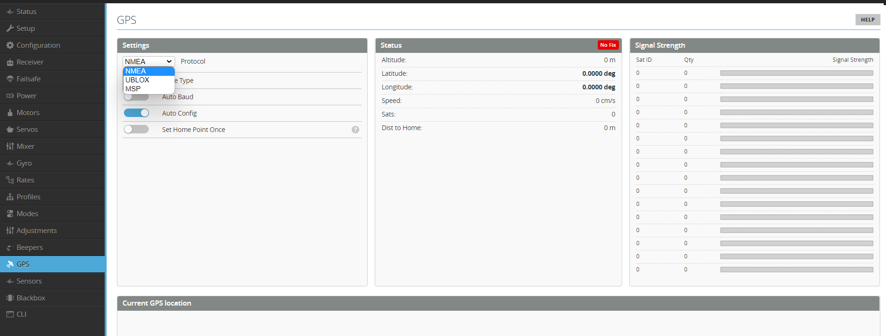

# GPS

Rotorflight currently only uses GPS for telemetry. Return to home, and other autopilot features are not available. 

The GPS Tab is not visible by default. You must enable the GPS feature and chose a UART port to connect your GPS unit to. Save and reboot. THe GPS Tab will now be visible.  

Select your GPS type from the dropdown. There is more details on the [Betaflight GPS tab](https://betaflight.com/docs/configurator/gps-tab) page.

