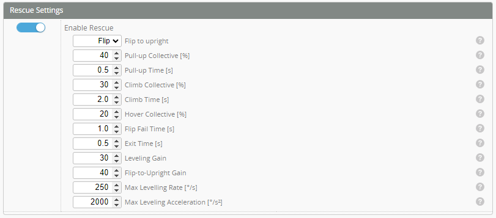

# Profiles
:::info
The purpose of profiles are to store in flight tuning parameters. The aim is usually to have several 'profiles' that you can switch between during flight to change flight performance. Things like different headspeeds, tuning, rescue settings etc can be 'tuned' for the individual flight mode. Please see the [profile switching example](../../setup/Profile-switching-example.md)
:::

## Main Tuning Parameters
### PID Controller Gains

#### Proportional
The gain factor that is proportional to the rate error. High proportional gain increase response speed of the helicopter. Low proportional gain results in overall slow system response. Too high results in fast oscillation (~20hz). It also helps reduce the slow oscillation due to high Integral gain.

#### Integral
The gain factor that is proportional to the accumulated error. Low integral gain results in drift when hovering, and uneven roll or flip rate during continuous roll / flips. It also results in the helicopter not "wanting" to finish maneuvers. Integral too high results in slow oscillation (1-3hz) during cyclic input stops and/or during high disturbance scenarios such as stops of (piro) pitch pumps and tick-tock stops.

#### Derivative
The gain factor proportional to the change of error. It is responsible for "dampening" the overshoot caused by proportional gain. The Derivative gain is particularly sensitive to noise. Ideally, high derivative gain dampens the system too much results in slow response. However, in practice, noise-induced fast oscillation would occur first. Too low results in fast oscillation during stops due to high proportional gain. 

#### Feedforward
The gain factor proportional to the input. In practice, feedforward gain is used to eliminate I-term windup, which occurs after continuous flips and rolls. If the helicopter does not stop immediately and continue moving in the rolling / flipping direction, feedforward gain needs to be increased. If FF gain is set to be too high, the helicopter may overshoot during such maneuver. Thus it is advised to start tuning from low.

#### Boost 
The setpoint boost - or B-term will increase the stick reaction speed. In case the heli is not reacting fast enough, the reaction can be boosted with this new B-gain on each axis separately. This seems to be in the range of 20..50

This provides a rapid short term increase in your command. This parameter is used in conjunction with the time [B-Cutoff](./profiles.md#b-term-cut-off).

## Advanced Settings
### PID Controller Settings

#### Error Rotation
If turned on, the I-term can transfer between pitch and roll axis during pirouetting. Increase the performance of overall piro related maneuvers. This is sometimes referred to as piro compensation.  

#### Ground Error Decay
A safety feature. This is to prevent the helicopter from tilting during takeoff.

#### I-term Relax Type
The axis that I-term relax is applied to. Generally this is Roll, Pitch and Yaw (RPY)

#### I-term Relax Cutoff Points
The I-term relax corresponds to the speed of control input for a given axis. When the control input exceed a certain speed, I-term would stop charging. This partially solved the slow overshoot at cyclic input stops due to I-gain charging at fast stick input. The cutoff value corresponds to the input FREQUENCY. A lower value gives more I-term relax, and a higher value provides less I-term relax. It is advised to start high and decrease until bounce back disappears.

#### Error Limits
The limit of how much I-term can be charged. During normal flights, it would not reach this limit. (More info needed)

### Offset Limit/Gain
The offset gains are used for the [High Speed Integral](../../Tuning/High-Speed-Integral.md) feature.

#### Offset Limits
This is a hard limit for the offset angle in the PID loop. The absolute offset and thus the O-term will never go above these limits.

#### Offset Gains
Gain for offset term,(Integral for high speed flight).

## Main Rotor Settings

### Collective To Pitch Feedforward Gain
The pre-compensation for pitch axis when collective is high. Since there is drag-induced pitching motion (there is more drag on the tail thus the helicopter would want to have nose-up tendency when climbing), increasing this gain would compensate that. High gain push the nose down during climb ups. However, it is also advised to select a relatively low value to be conservative.

### Cyclic Cross Coupling
Cyclic cross coupling compensation removes the aileron wobble when only elevator is applied.

#### Cross-Coupling Gain
Amount of compensation applied for Pitch-to-Roll decoupling.

#### Cross-Coupling Ratio
Amount of Roll-to-Pitch compensation needed, vs. Pitch-to-Roll.

#### Cross-Coupling Cutoff Frequency
Frequency limit for the compensation, higher value will make the compensation action faster.

## Tail Rotor Settings

#### CW/CCW Stop Gain
The increase of yaw (what) gain during stops. Higher gain results in crisper stops. Too high may cause fast oscillations.

#### Cyclic Feedforward Gain
Since cyclic input creates more torque on the main rotor, this gain aims to pre-compensate the tail motion due to cyclic inputs. a high cyclic value results CW motion on tail when starting pitching/rolling, a low value results CCW motion. (for CW main rotor)

#### Collective Feedforward Gain
The pre-compensation due to the increase of collective pitch. It is advised to tune it based on the immediate response after a the beginning of a climb up. Higher gain results in CW response, lower gain results in CCW response. It is advised to use a lower value since it may affect tail performance during other maneuvers.

#### Collective Impulse Feedforward Gain
The pre-compensation due to the sudden change of collective. Ideally it is designed to clean up any tail movement in small pitch pumps, however, the compensation is generally overcompensating. Thus it is suggested to turn it off for now.

#### Collective Impulse Feedforward Decay Time
Decay time for collective impulse feedforward mixed into yaw.

## PID Controller Bandwidth

#### Row/Pitch/Yaw Bandwidth
An extra low pass filter for each axis. It is specifically designed to preserve a weaker filter on the yaw axis to increase tail performance. High value corresponding to weaker filter. Too high may cause wobbles. Too low may cause delay and even instability in the control loop.

#### Row/Pitch/Yaw D-term cutoff
An extra first order low pass filter just for the D-gain to further reduce the sensitivity to noise. A high value decreases the effectiveness but may potentially increase the D-gain performance. A low value increase the filter effect but may hinder D-term effectiveness. It is advised to keep it around 20Hz to prevent oscillation.

#### B-Term Cut-off
This is controlling how "quick" or "twitchy" the boost is. This works exactly the same as D-cutoff, but on setpoint.
It is safe to start with the same cutoffs as used with D. Usually in the range of 10..20. This is used in conjunction with [Boost](./profiles.md#boost) or [B-gain](./profiles.md#boost)

## Auto Leveling Settings

#### Acro Trainer gain

This determines how aggressively the heli tilt back to the maximum angle (if exceeded) while in *TRAINER* mode.

#### Acro Trainer angle limit

This determines the maximum angle the heli can tilt to while in *TRAINER* mode.

#### Angle Mode leveling gain

This determines how aggressively the heli tilt back to level while in *ANGLE* mode.

#### Angle Mode maximum angle

This determines the maximum angle the heli can tilt to while in *ANGLE* mode.

#### Horizon Mode leveling gain

This determines how aggressively the heli tilt back to level while in *HORIZON* mode.

## Rescue Settings

### Enable Rescue 
Enable or disable the rescue mode.  

#### Flip to upright
Activate flip to upright option when the heli is inverted.

#### Pull-up Collective
Values 0.0-100. This is to be set to a level where the helicopter rapidly gains height.  

#### Pull-up Time
How long pull up collective should be applied. This is usually about 0.3 to 0.5s

#### Climb Collective
Values 0.0-100. This is to be set to a level where the helicopter gains height. 

#### Climb Time
How long Climb collective should be applied. This is usually about 0.5 to 1.5s

#### Hover Collective
Increase this value until the heli hovers at a stable altitude

#### Flip Fail Time
This is a safety feature. If there is a mechanical issue preventing the helicopter from completing the flip during this time the rescue mode will exit

#### Exit Time
This slows the transition from rescue back to normal mode. This is helpful if you have rescued from inverted where your collective may be in the opposite direction. This prevents it from rapidly pitching down.

#### Leveling Gain
How strong the helicopter will level. Too low and the helicopter will be sluggish to level. Too high and it will wobble/vibrate.

#### Flip-to-Upright Gain
How strong the helicopter will flip to upright.

#### Max Leveling Rate
Used to control how fast the helicopter levels. Set this to a value that is achievable by your helicopter. Larger slower helicopters may need this reduced.

#### Max Leveling Acceleration
Limit how fast the controller tries to accelerate the helicopter to level or flip. Larger slower helicopters may need this reduced.

## Copy Profile

You can use the _Copy profile_ button at the upper right corner to copy the values of the current profile to another one.
