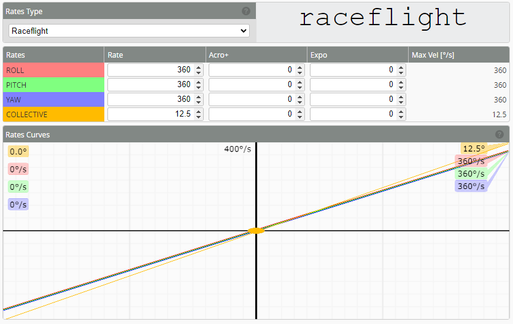

# Rates
:::info
The purpose of rates are to change in flight sensitivity and rotation rates. The aim is usually to have several 'rates' that you can switch between during flight to change flight performance. Please see the [profile switching example](/docs/setup/Profile-switching-example.md)
:::

Rotorflight offers a total of five rate systems:

* Actual Rates
* Betaflight Rates
* Raceflight Rates
* KISS Rates
* Quick Rates

However, the most widely adopted is Actual Rates.

## Understanding Actual Rates

“Actual Rates” are the default rates in Rotorflight, providing a straightforward approach to setting maximum rotational velocity (e.g., entering 1000 corresponds to 1000deg/sec) and center sensitivity values.

There are 3 values in Actual Rates: Center Sensitivity, Max Rate, Expo.

### Center Sensitivity

Center Sensitivity relates to the responsiveness around the center stick position. A lower value offers finer, smoother control, while a higher value results in a more reactive heli to stick movement.

### Max Rate

Max Rate defines the heli's rotation speed at full stick deflection. The value entered represents the exact maximum rotational velocity. For example, entering 300 means your heli will attempt to rotate at 300 degrees/sec at full stick.

However, keep in mind that the maximum angular velocity can be limited by your heli mechanics. When the heli reaches its physical limitation and cannot flip any faster, the maximum angular velocity is capped, regardless of the higher value set in Rotorflight.

### Expo

Expo flattens the curve between center stick and full stick. To achieve a more linear rate, keep Expo low. For a broader center stick region with finer control, increase Expo. Keep in mind that increasing Expo also reduces center sensitivity. 

While Expo can be as high as 1.0, excessive Expo might cause decreased center stick sensitivity and make the heli’s response more unpredictable towards full stick (more jumpy).

## Understanding Raceflight Rates

Actual Rates can be a little bit tricky for someone that does not have Betaflight knowledge and experience. So if you are coming from a different FBL system then Raceflight Rates might make more sense for you.

There are 3 values in Raceflight Rates: Rate, Acro+, Expo.

### Rate

Rate defines the heli's rotation speed at full stick deflection. The value entered represents the exact maximum rotational velocity. For example, entering 300 means your heli will attempt to rotate at 300 degrees/sec at full stick.

### Acro+

For the sake of simplicity, always keep Acro+ at 0.

### Expo

Expo flattens the curve between center stick and full stick. To achieve a more linear rate, keep Expo low. For a broader center stick region with finer control, increase Expo.

While Expo can be as high as 100, excessive Expo might cause decreased center stick sensitivity and make the heli’s response more unpredictable towards full stick (more jumpy).

## Dynamics

* **Response Time** - corresponds the smoothness of the reaction to stick inputs, also called  time constant of the input filter.

:::note
High response times smooths out the input but too high could cause significant input delay.
:::

* **Max Acceleration** - is the input acceleration limiter. Zero represents off. Low value reduces the load on the machine and could be desired for scale flying, not useful for 3D normally.

## Copy Rate Profile

You can use the _Copy rateprofile_ button at the upper right corner to copy the values of the current profile to another one.

