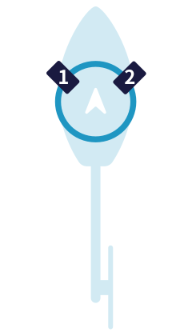

# Servos

Open the Servos tab and confirm that you have the correct number of servos. If this is not the case, please confirm you have installed the correct firmware (either 'M' motorized or servo tail) or if you are using a drone FC that your [Remapping](../setup/Remapping.mdx)  is correct.

## Servo Numbering

### Direct  

For helicopters that uses mechanical mixing, where the _Pitch_, _Roll_, and _Collective_ movements are each controlled by a dedicated servo by means of a complex series of linkages and levers from the servos up to the swashplate. 

Servo 1 - Pitch  
Servo 2 - Roll  
Servo 3 - Collective  
Servo 4 - Rudder  

### CCPM  

For 120, 135 and 140 deg CCPM swashplates. 
Looking from the tail towards the nose of the helicopter:

Servo 1 - Pitch (inline with the centerline of the helicopter)    
Servo 2 - Left side  
Servo 3 - Right side  
Servo 4 - Rudder  

### Fixed pitch  

#### 90deg L  

Servo 1 - Pitch (inline with the centerline of the helicopter)    
Servo 2 - Side servo  
Servo 3 - Rudder  

#### 90deg V   

Servo 1 - Left side    
Servo 2 - Right side  
Servo 3 - Rudder  

## Servo Override

The toggle at the bottom of this page enables the servo overrides. The purpose of this is so that each servo can be driven by the slider to calibrate the range and center points. Beside each servo is an individual override.

The servo override slider scale is in degrees

## Servo Configuration parameters 

### Center

In general this will be 1520us for cyclic servos and 760us for tail servos.

### Min and Max

These are hard limits to prevent servos binding or moving outside of their mechanical limits. If a servo is commanded to a point that is greater or less than it is capable it will buzz and likely burn out. These settings should be used to limit the command.

### Scale Neg and Scale Pos

Scales the negative and positive direction of the servo to match the commanded angle.

### Rate 

This is the servo frequency. This will be specified by the manufacturer. A large proportion of servos suitable for cyclic operate at 333Hz.  

:::note
For Rotorflight 2 it is recommended that tail servos are assigned to a different timer than cyclic servos (see [Remapping](../setup/Remapping.mdx)).

This means that tail servos can be set to a different frequency (i.e. faster).
:::

### Speed

Servo Speed Equalization. The aim of this parameter is to remove the collective "bobbing" when fast elevator changes are applied.

The bobbing happens because the elevator servo has to move double distance vs. the aileron servos, when elevator position is changed.
If the change is faster than the servos can go, the aileron servos will reach the target sooner than the elevator servo, causing the swash to jump slightly in the process.

To tune this value increase the speed value (it's actually ms/60°, like in the servo datasheet) until the bobbing is not visible any more. It should be always ok to use the value from the servo datasheet if unsure.

### Reverse

Toggle for forward or reverse servo direction.

### Geo Cor

Geometry Correction. Servos are rotary, so at high angles this results in smaller swashplate movement for each degree of servo movement. Geometry correction accounts for this and provides better control at high angles (e.g. 3D flight).

In order to use this feature it is important to set the servo arm at 90° (with servo center) and calibrating the servo scale. 

