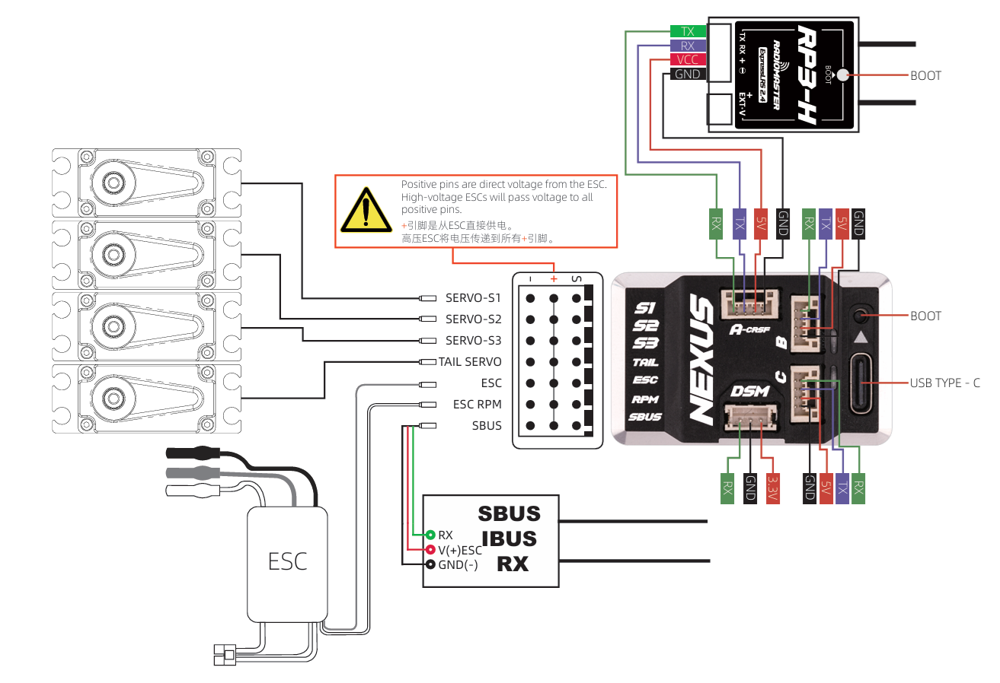
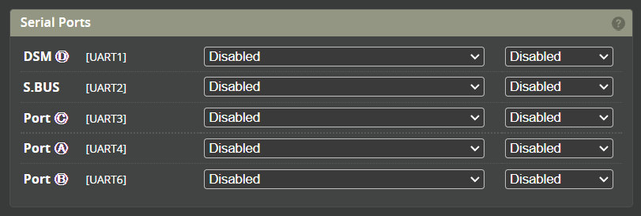

# Radiomaster NEXUS

## Release Video
<iframe width="100%" height="315" src="https://www.youtube.com/embed/G9lQ2TzKDRA?si=iZwL1pnlucgEwzXM" title="YouTube video player" frameborder="0" allow="accelerometer; autoplay; clipboard-write; encrypted-media; gyroscope; picture-in-picture; web-share" referrerpolicy="strict-origin-when-cross-origin" allowfullscreen></iframe>  

:::info Specifications  
### Hardware Specifications：  
NEXUS Heli Flight Controller  
MCU: STM32F722RET6  
Gyro (IMU): ICM-42688-P  
Flash Memory (Black Box. IC): 128MB (W25N01GVZEIG)  
Barometer: SPL06-001  
Uart: 6 - DSM[UART1], S.BUS[UART2], A-CRSF[UART4], PORT-B[UART6], PORT-C[UART3]  
Servo: 4 - S1, S2, S3, TAIL  
Rpm Sensor: 1 - FROM ESC FREQUENCY SENSOR  
Receiver Support: CRSF, ELRS, GHOST, S.BUS, SUMD, IBUS, XBUS, EXBUS, PPM, MSP, DSM2, DSMX  
Voltage Supply(DC): 5 - 12.6V  
A-B-C Serial Port Power Output: 5V - 2.0A  
DSM Serial Port Power Output: 3.3V - 0.5A  
Telemetry: S.BUS, HoTT, S.Port, MSP, EDGETX, ELRS  
ESC: PWM, Oneshot, Multishot, Dshot  
Support Tail ESC: 760μs/1520μs Servo  
Support Tail Motor: Yes  
Dimensions: 41.3 X 25.4 X 13.1mm  
Weight: 16.8g   

:::

### Rotorflight Target
When updating Rotorflight firmware. Please use the NEXUS_F7.

### Matching RP3-H ELRS receiver

Any of the Rotorflight receiver protocols can be used with the NEXUS. Radiomaster does have the RP3-H receiver which is a direct plug and play ELRS receiver. 

### F-Port
Nexus supports F.Port on:
The 'TX' pin of Port A, B or C or by remapping the SBUS to a TX for F.Port.  

F.Port is an Inverted protocol over a single wire so must configured with both of these options enabled.  
 

### Motorised Tail

To use the NEXUS with a motorised tail the Servo 4 needs to be remapped to Motor 2. This can be done in the CLI using the following command (just copy and past this into the CLI then push [ENTER]).  

`resource SERVO 4 none`  
`resource MOTOR 2 B03`  
`save`  

### Wiring

### UART ports

All the UARTS on the NEXUS are labeled to match each port. Just enter the function you wish to use for each port such as SerialRx (receiver), ESC Telemetry, blackbox, GPS etc. 

### Manuals

[Radiomaster NEXUS website](https://www.radiomasterrc.com/products/nexus-helicopter-flight-controller)  