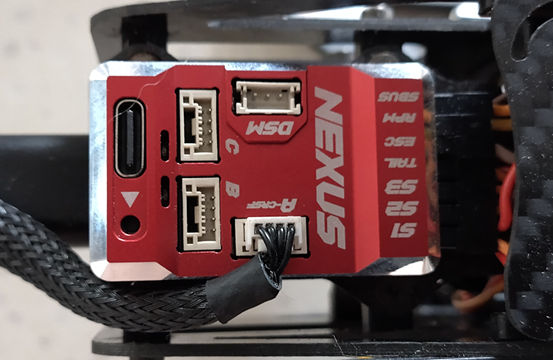
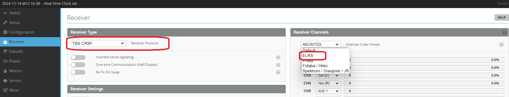
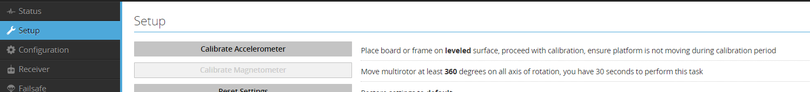
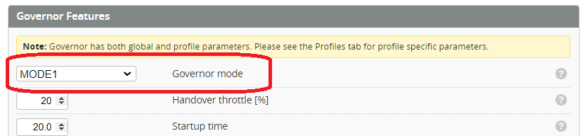

import Example1 from './img/example-1-5.mp4';

# Example setup - Servo tail
The following doc will give and overview for how to setup a servo tailed helicopter using Rotorflight. The purpose is just as a generic guide to outline the steps to take when setting up a helicopter of this type. 

This example will use:  

**Helicopter**  
Helicopter: OMP M4
Controller: Radiomaster Nexus  
Receiver: ELRS  
ESC: OMPHobby 65A  
Servos: OMPHOBBY  

**Features**  
* Telemetry: Yes  
* ESC telemetry: Yes
* RPM Measurement: ESC RPM signal  
* RPM Filtering: yes  
* Governor: Yes  

## Update Firmware
Update the Flight Controller firmware to the current release. Follow the description on the [**Flashing the firmware**](../setup/Flashing-the-firmware.mdx) page. 

## Setup Receiver

Choose where you want to connect your receiver. Any of the UARTS or SBUS port are suitable depending on your receiver and personal preference. In this example we are using ELRS and will connect to the Port(A) which is default ELRS port.   

:::caution
    Double check your wires between receiver and flight controller before powering on. Some ELRS receiver manufacturers use a different pin arrangement and connecting to your Flight controller will damage the receiver. 
:::

### Receiver - serial ports
Open the [configuration tab](../configurator/tabs/configuration.md) and set the serial port **Port (A)** to **Serial_RX**.  
**Save and Reboot**.

### Receiver -  Rx protocol
Open the [Receiver tab](../configurator/tabs/receiver.mdx). Set the receiver protocol to TBS CRSF (ELRS) and the channel order to ELRS (AECR1T).  
**Save and Reboot**.

### Receiver - Check
Your Receiver should now be connected and operating correctly.

      <video
        src={Example1}
        autoPlay
        playsInline
        loop
        muted
        width="85%"
      />

### Receiver - Update firmware
If you wish to update your firmware for your ELRS receiver you can now connect using ExpressLRS Configurator using the **Betaflight Passthrough** method.

:::info note 
You will need to disconnect and close the Rotorflight Configurator and power cycle the receiver before updating your Receiver
:::

### Receiver - Enable telemetry

Enable telemetry back to your transmitter  

## Enable ARM mode
Arming is an important step for Rotorflight. See the [**Arming setup**](../setup/arming.mdx) page for more details.  

## Gyro setup
The gyro can be put into the helicopter in many different ways. We now have to set the gyro alignment so that the gyro knows what direction it is pointing in.  

### Gyro - alignment
Check and confirm on the [configuration tab](../configurator/tabs/configuration.md) that while moving your helicopter (gyro installed) that the model in the configurator moves in the same direction.  

### Gyro - Calibrate accelerometer

With the flight controller installed in your Helicopter open the [setup tab](../configurator/tabs/setup.md) and click on the [calibrate accelerometer](../configurator/tabs/setup.md#calibrate-accelerometer)

## Servo Setup
The purpose of this step is to [**setup and calibrate servos**](../setup/setup-servos.mdx). On the M4 the servos are setup in the [CCPM 120 degree](../configurator/tabs/servos.mdx#ccpm) arrangement so the servos need to be plugged in as shown below.    

  

## Mixer Setup
The purpose of this step is to [**setup and calibrate the mixer**](../setup/setup-mixer.mdx).  

## Motor and ESC Setup
**ESC Throttle Protocol** - The OMPHobby 65A ESC uses a PWM protocol.  
**ESC telemetry Protocol** - Set this to OMPHobby to match the ESC.  
**RPM Sensor** - The nexus has an RPM input. The Yellow RPM signal wire from the ESC is plugged into this port. Enabling this toggle enables the RPM so it can be used for the [**Governor**](../setup/Governor.md) and [**RPM Filtering**](../setup/RPM-Filters.md)  
**Main Rotor Gear Ratio** - The M4 is a direct drive Helicopter so is set to `1 / 1`  
**Tail Rotor Gear Ratio** - Counting the teeth on the M4 gears is `22 / 99`  
**Main Motor Pole count** - The M4 motor has 42 poles `42`  

:::info note
If your helicopter has a two stage gear train, please [**follow this guide**](../setup/Two-Stage-Gear-Train-Ratios.md)
:::

**Governor Mode** - Set this to "Mode 1". This will control the Headspeed and provide slow spoolup.  
See the [**Govenor Modes**](../setup/Governor.md#governor-mode) and [**Governor setup**](../setup/governor-setup.mdx) for details and examples.

## Test motor and Telemetry
Now you can check and confirm your motor runs. 

:::caution 
    This step MUST be done with blades off!!
:::

Enable the motor override and slowly raise the motor override signal. The Motor should begin to spool up and RPM and other ESC telemetry should be displayed. 

## Power setup
Since we now have ESC telemetry working we can enable ESC Telemetry as the Voltage and current source.  

## ELRS custom telemetry
Since Rotorflight v2.1 ELRS will need to use the custom telemetry Lua. The Crossfire protocol is very limited for our helicopters so this is required to get the full range of telemetry that we may wish to see.  
See the [**ELRS Custom Telemetry**](../setup/ELRS%20Custom%20Telemetry.mdx) on how to set it up.

## RPM Filters
From the Gyro tab enable the RPM filters and accept the default.  

  
## Rates
Review and modify your Rates to taste. 

  

## Pre-flight test
Check and confirm all your controls are functioning. 
Pay particular attention to:  

* When connected to the configurator the model moves in the same way as the real helicopter (tilt forward/backward, sideways and yaw).  
* Tx stick forward, helicopter swash pitched down
