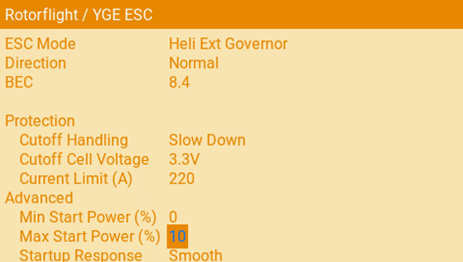
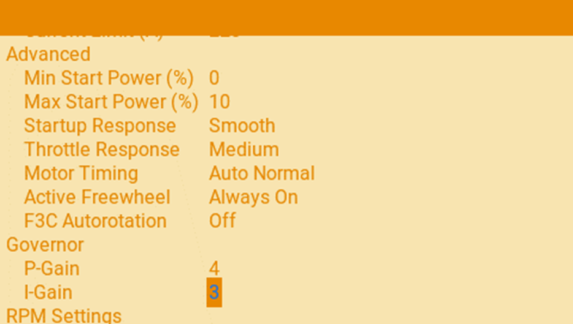
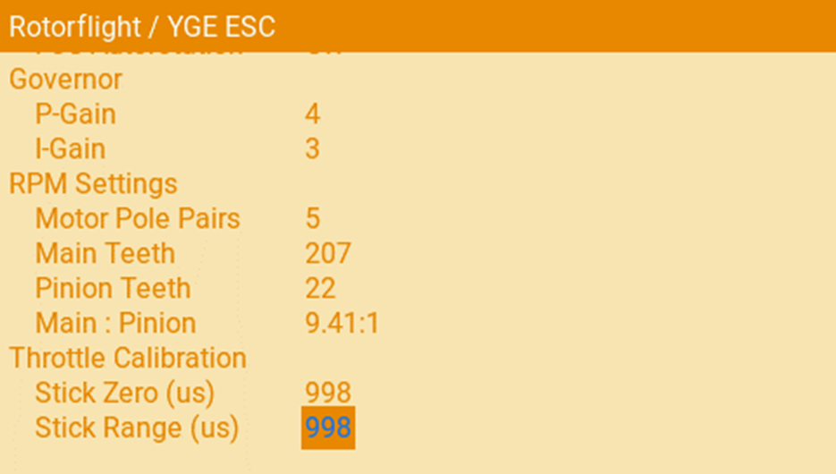
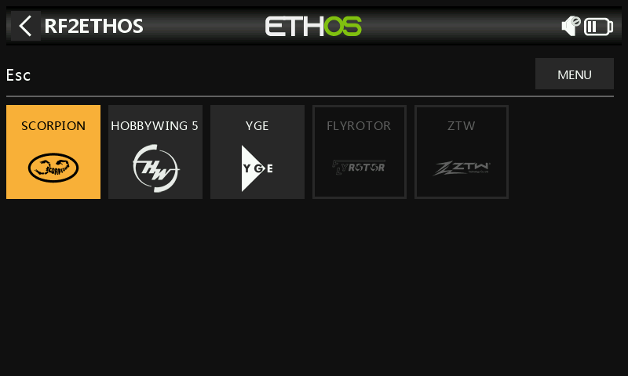

import Tabs     from '@theme/Tabs';
import TabItem  from '@theme/TabItem';
import tabStyles   from '../tabs.module.css';

import EdgeTX   from './img/edgetx-logo.png';
import ETHOS    from './img/ethos-logo.png';

Forward programming enables the connected ESC to be programmed via your transmitter rather than requiring a vendor programming box.  

A number of ESC vendor/models have forward programming support from the transmitter via Rotorflight’s Lua script. The ESCs currently supported are:  
* Hobbywing Platinum V5  
* Scorpion Tribunus  
* YGE  
* Flyrotor  
* ZTW  

## Configure the Flight controller  
### Set the UART 
Enable the UART port for ESC telemetry on the Configuration Tab.

  

### ESC telemetry protocol
Select one of the ESCs above that support Forward Programming. Enter this in the ESC telemetry protocol

### One Wire Communication (half-duplex)
Most ESCs have a single telemetry wire. This is used to transmit telemetry information from the ESC to the flight controller. For forward programming functionality, this wire also need's to transmit information from the Flight controller to the ESC. By enabling the half-duplex bi-directional communications are enabled. 

### Pin Swap
For standard ESC telemetry we need to connect to a UART RX (receive) pin; however, as we are using bi-directional communication this will require the telemetry wire being connected to the UART TX (transmit) pin. 

#### Option 1
Wire the ESC telemetry to any spare ***UART TX*** pin on the flight controller. If we are using a TX pin then Pin-swap remains off.

#### Option 2
Wire the ESC telemetry to the FC ***UART RX***. This may be desirable if you wish to use the ***SBUS*** or ***DSM*** ports (which are RX) or do not wish to solder or change connectors.  

  

## Setup the Lua scripts
:::info Please choose to suit your Radio - EdgeTX or ETHOS
<Tabs groupId="operating-systems">
  <TabItem value="" label="Choose Tx" default attributes={{className: tabStyles.tab}}>
  Rotorflight has great support for both EdgeTX and Ethos.  Please choose your radio.
  </TabItem>
  <TabItem value="EdgeTX" label="EdgeTX" attributes={{className: tabStyles.tab}}>

## EdgeTX
 

### Load Lua scripts onto radio
Ensure the latest version of Lua script is installed on your radio’s SD card.  
To access ESC Forward Programming, run the Rotorflight lua script on your transmitter by pressing the ‘Sys’ button on your radio and selecting ‘Rotorflight 2’ (under Tools). Ensure the FBL and ESC are powered up (in most cases, the battery pack will need to be connected to the ESC).

### Choose the connected ESC
Scroll down to the bottom of the page and select the ESC you have in your Helicopter (will match the ESC Telemetry Protocol set in the FC).  

### Make your changes
#### Page 1  

#### Page 2  
  

#### Page 3  
  

#### Page 4  
  

  </TabItem>
  <TabItem value="ETHOS" label="ETHOS" attributes={{className: tabStyles.tab}}>
  ## ETHOS
  

### Hardware
From the Hardware section select ESC.  

### Esc Type
Choose your ESC.  

### Basic/Advanced/Other
Different parameters are available in the Basic/Advanced/Other sections.  

Change your settings as required.  

  </TabItem>
</Tabs>

:::