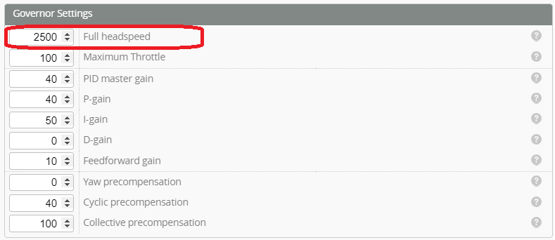
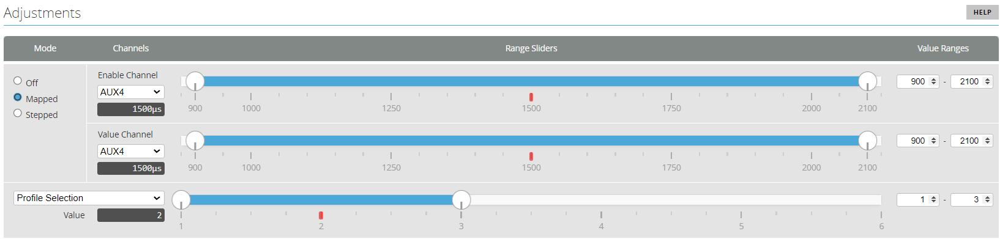
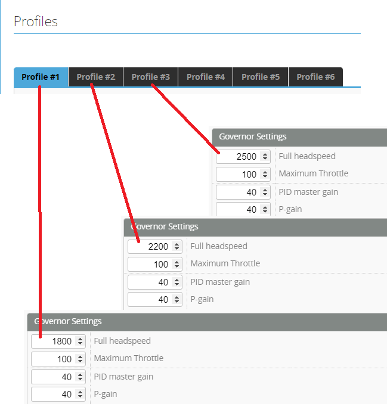

import Tabs     from '@theme/Tabs';
import TabItem  from '@theme/TabItem';
import tabStyles   from '../tabs.module.css';

# Governor setup
There are several options for configuring the Governor.

:::info Governor Options
<Tabs groupId="Gov-options">
    <TabItem value="Option 1" label="Option 1" attributes={{className: tabStyles.tab}}>
    ### Single profile - Multiple throttle settings
    Configuring a single profile with **Full Headspeed** set to the Maximum desired headspeed. 

    

    Transmitter throttle settings are configured to Separate throttle positions for each desired headspeed. 

    **Example:** If we configure a 2500RPM **Full headspeed**  

    On the transmitter set the required headspeeds. 
    * Throttle Hold = 0%
    * Idle up 1 = 70% = 2500 * 0.7 = 1750 RPM headspeed
    * Idle up 2 = 90% = 2500 * 0.9 = 2250 RPM headspeed
    * Idle up 3 = 100% = 2500 RPM Headspeed 

    This Method is easier to configure and simplifies the tuning as there is only one profile to change. You will have to tune so that it is suitable for each of the headspeed. 

    </TabItem>
    <TabItem value="Option 2" label="Option 2" attributes={{className: tabStyles.tab}}>
    ## Multiple Profiles - Single throttle setting

    In this option we set each profile with a separate Full headspeed. We use the Adjustments to switch between each profile. Our Transmitter throttle setting remains at 100% unless throttle hold is activated. 

     #### Set transmitter Headspeeds 
    On the transmitter set the required headspeeds.  

    * Throttle Hold ON = 0%
    * Throttle hold OFF = 100%

    Our Idle up switch (headspeed switch) is just a 3 position switch assigned to an AUX channel. This channel is used for the profile switching below (e.g. AUX4).

    #### Enable Profile Switching  
    This example switches between Profiles 1-3  
    More details can be found in the [**Profile Switching Example**](../setup/Profile-switching-example.md)  

    

    #### Set profile Full Headspeed  
    For each of the profiles set a separate **Full Headspeed**  

    
    </TabItem>
</Tabs>
:::