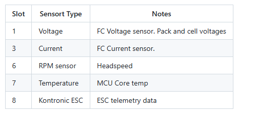

# Futaba and Nexus example 

**Rotorflight-Futaba-Setup**
Instructions for Futaba Initial Radio and Configurator Setup, this is a generic setup using a Nexus FBL, Frsky transmitter with a Futaba exbus receiver

## Wiring
The simplest is to use a male to male servo lead to connect from the ***SBUS*** port on the FBL to the ***SBUS2*** port on your receiver.

## Configure the FC
Next steps are to configure the fbl to receive the Exbus signal.

### Setup UART ports
Set the SBUS port to be used for serial rx communication

### Setup Receiver 
Then visit the receiver page and configure as follows

### Check sensors
You should now have a control link and telemetry with all the sensors available on your radio.

