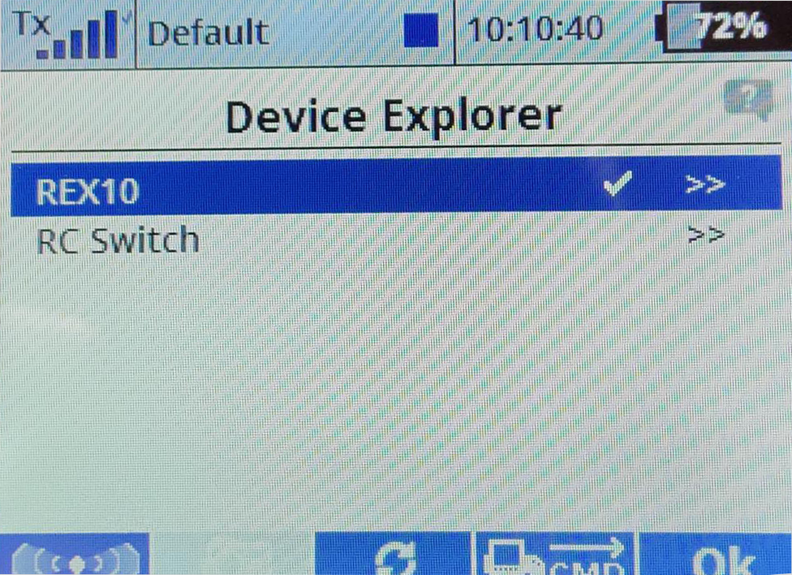

# Jeti example 

**Rotorflight Jeti Setup**

Instructions for Jeti Initial Radio and Configurator Setup, this is a generic setup using a Frsky transmitter with a jeti exbus receiver with a Rotorflight FC. This example shows a Nexus; however, the process is the same for any Rotorflight controller. Please choose the SBUS port related to your FC.

## Wiring
The simplest is to use a male to male servo lead to connect from the ***SBUS*** port on the FBL to the ***E1*** port on your receiver.

## Transmitter Setup
Once your receiver has been bound to the radio; visit the device explorer page.  

  

### Select Receiver type
Select the receiver  

  

### Set alternate pin
Select the alternative pin configuration  

  

### Select ExBus pin
* Set the pin to use the ExBus protocol  

  

## Configure the FC
Next steps are to configure the fbl to receive the Exbus signal.

### Setup UART ports
Set the SBUS port to be used for serial rx communication

### Setup Receiver 
Then visit the receiver page and configure as follows

### Check sensors
You should now have a control link and telemetry with all the sensors available on your radio.

