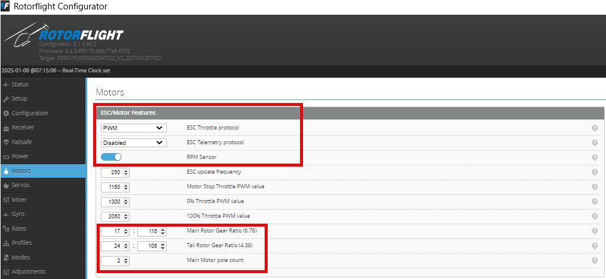
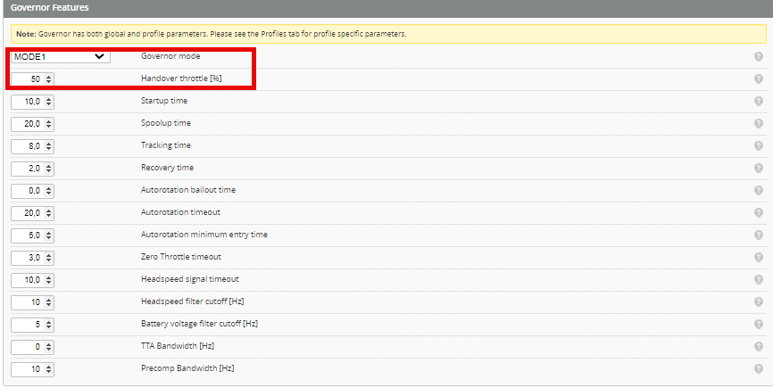

# Nitro/gasser throttle servo setup

1. First plug in the throttle servo into the ESC port. Go to the motors page.

    

2. Set *ESC throttle protocol* to PWM

3. Enable *RPM Sensor*

4. The default *ESC update frequency* is 250hz. For most servos that will work. You can increase this number if your servo is supporting higher frequencies.

5. Set the *Gear ratios* and set *Main Motor pole count* to 2.

    

    The *Motor Stop Throttle PWM value* is the throttle cut 
    *0% Throttle PWM value* is the motor idle 
    *100% Throttle PWM value* is the motor on full throttle

6. Set *Motor Stop Throttle PWM value* to 1300

7. Set *0% Throttle PWM value* to 1500

8. Set *100% Throttle PWM value* to 1700. 
    This way you make sure when you power the heli that the throttle servo is not binding. 
    Note: if the servo is moving around the wrong way, you need to swap the *100% Throttle PWM value* and *Motor Stop Throttle PWM value* values.

9. Now plug the battery in. The throttle servo will directly go to the *Motor Stop Throttle PWM value*. Adjust this value until the carb is fully closed without binding the servo. Do this in steps of 50 or 100µs depending on how much further the carb must be closed. You need to save and reboot after every change. It is a bit trial and error.

    

10. Set *0% throttle PWM value* around 100µs above *Motor Stop Throttle PWM value*.

    

11. Enable *Motor Override* and set the slider to 100%. Now adjust the *100% Throttle PWM value* until the carb is fully open. To adjust/save the value you need to save and reboot every time.

12.	Set *Governor mode* to MODE1 or MODE2.

13.	Set *Handover throttle* to around 40-50%. You can then use on the radio a curve on a pot meter or mixed on your collective stick so you can do the spool-up manually. Then you can also adjust the motor idle. Above this point the governor will take control over the headspeed.

Here's a video where Jiawen explains how to setup your throttle on the transmitter.

<iframe width="560" height="315" src="https://www.youtube.com/embed/WyALh4S6_ho" title="YouTube video player" frameborder="0" allow="accelerometer; autoplay; clipboard-write; encrypted-media; gyroscope; picture-in-picture; web-share; fullscreen" allowfullscreen></iframe>
