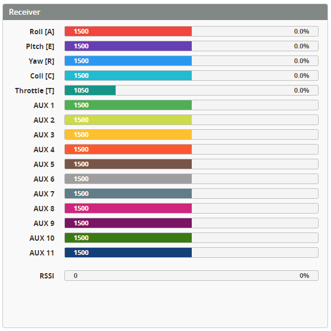

# Status tab

A place for basic flight controller information. The status tab is the first tab you see when you connect to your flight controller. You can check the gyroscope live preview, view the arming prevention flags and other FC information.

## Info

Shows some basic data from the flight controller and model. This includes:

* Craft Name
* Firmware
* Board

## Arming

* **Enable Arming:** Use this switch to enable arming while the configurator is connected.

:::caution
With the arming enabled, the motor can spoolup when the throttle is released.

Remove blades for safety.
:::

* **Arming Disable Flags:** Shows all of the "errors" that prevent the flight controller from arming. This is useful to check if you're having issues arming.

You can find out a description of these flags from the [List of Arming prevention flags](https://betaflight.com/docs/wiki/guides/current/Arming-Sequence-And-Safety#description-of-arming-prevention-flags)

## Battery

* **Voltage** - Shows the current battery voltage if the settings for it are set correctly.
* **Current** - Shows the current drawn from the battery if the settings for it are set correctly.
* **Capacity** - Shows the consumed capacity of the battery in mAh.
* **Charge Level** - Shows remaining battery capacity in percent.

## Live Gyro Preview

A live preview of the gyroscope data. This is useful to check if the gyroscope is aligned correctly, and if it isn't getting/giving noisy data.

* **Reset Z axis** - This button resets the heli heading to 0 degrees.

:::info
You can set the gyroscope alignment in the `Configuration` tab.
:::

## Instruments

A graphic replica of real aircraft instruments.

## Receiver

The receiver output preview shows the current state of the receiver channels, both in channel value and graph forms, and how those affect the heli movement.

