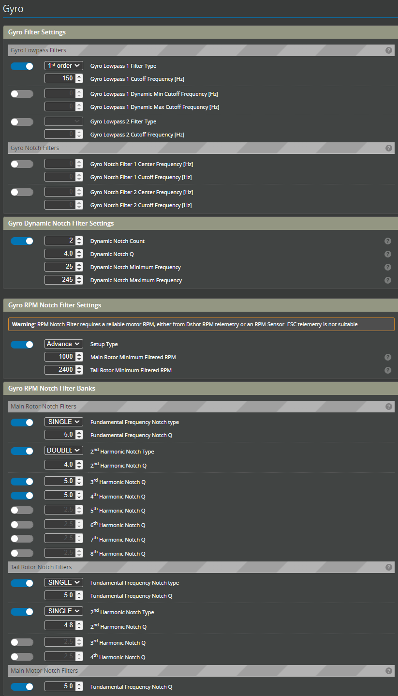
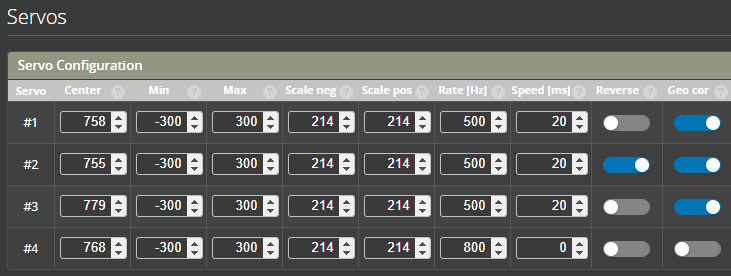
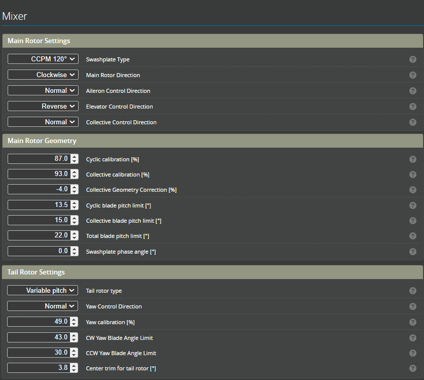
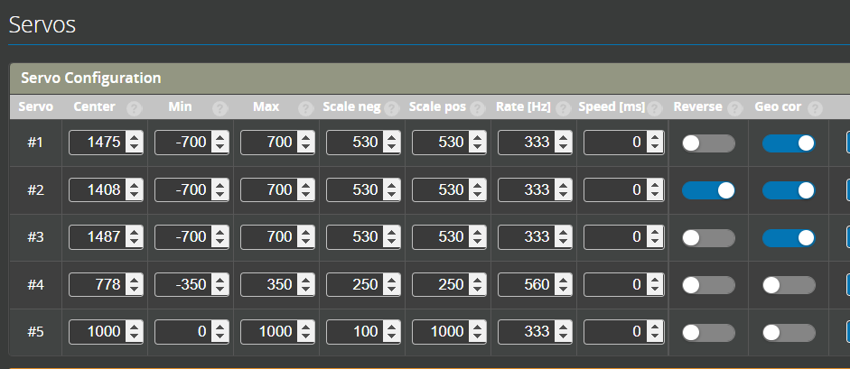
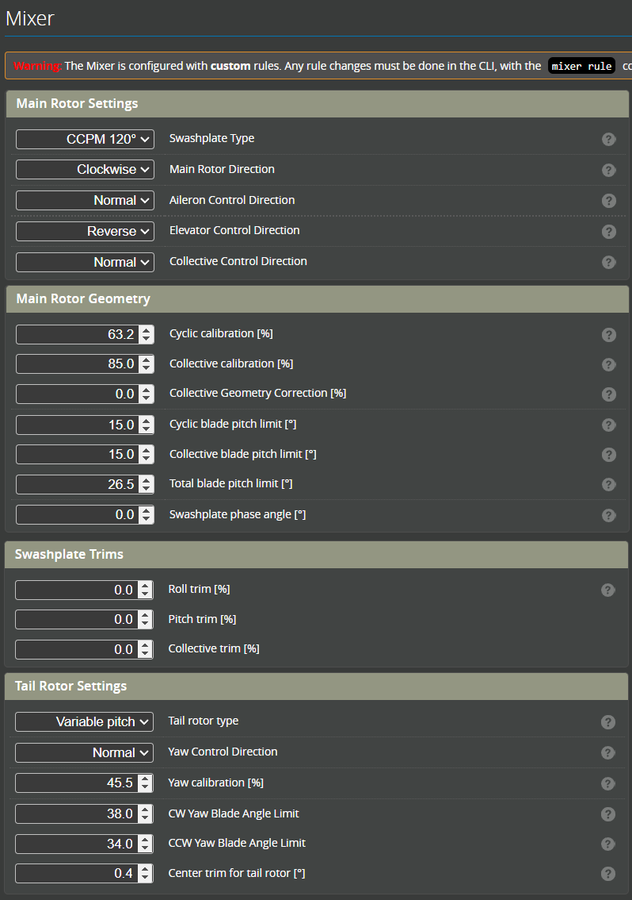

import Tabs     from '@theme/Tabs';
import TabItem  from '@theme/TabItem';
import tabStyles   from './tabs.module.css';

import noFilter         from './img/no-filter.png';
import Filter           from './img/working-filter.png';

import jonas_m4         from './img/jw-m4.jpeg';
import jonas_m4_max     from './img/jw-m4-max.jpeg';
import jonas_m7         from './img/jw-m7.jpeg';
import jonas_m7_light   from './img/jw-m7-light.jpeg';
import Jiawen_M7        from './img/jiawen-m7.jpeg';
import Jiawen_nimbus    from './img/jiawen-nimbus.png';
import Jiawen_specter    from './img/jiawen-specter.png';

# Tuning examples and presets

:::caution
  Please use the supplied defaults until a maiden flight has been conducted and the filtering is confirmed. Once this is done higher gains can be tested. Skipping this step and using these settings without adequate filtering could result in an uncontrollable helicopter. 
    <table>
        <td>
            **No filter**
            
        </td>
        <td>
            **Filters are working**
            
        </td>
    </table> 
:::
:::danger
⚠ THE CREATORS OF THESE PRE-SETS ASSUME NO RESPONSIBILITY OR LIABILITY FOR DAMAGE CAUSED BY USING THEIR PARAMETERS. IMPROPER USE MAY LEAD TO LOSS OF VEHICLE, INJURY OR DEATH. PROCEED AT YOUR OWN RISK. ⚠
:::

## How to use these presets?
There are two options for using these pre-sets. 
1. Follow the screen shots to configure your helicopter.  
2. Load from the supplied Diff file. **Please note:** This method may overwright some of your previously configured settings. Please check and confirm carefully.

:::info[OMPHOBBY M7]
### Jiawen Bao - M7  

<Tabs>
    <TabItem value="OMPHOBBY M7" label="OMPHOBBY M7" default>
    

        
    

    </TabItem>
    <TabItem value="View Pre-set" label="View Pre-set">
        <Tabs>
        <TabItem value="Author’s Notes" label="Author’s Notes" default>
            Author’s Notes - READ BEFORE USING THIS TUNE  

            **Creator:**&nbsp;&emsp;&emsp;&emsp;&emsp;&emsp;&nbsp;&nbsp;&emsp;&emsp;&emsp;Jiawen Bao @etocii   
            **Rotorflight Version:**&emsp;&emsp;&emsp;&nbsp;2.0.0 Release  
            **Rotorflight Hardware:**&emsp;&emsp;&nbsp;Flydragon F722 v2.2  
            **Tune Attributes:**&emsp;&emsp;&emsp;&emsp;&emsp;Precise, Locked-In, 3D, Robotic   

            This tune has a single profile using the Rotorflight Governor with maximum headspeed of 2200RPM. 

            **Helicopter:** 		OMPHOBBY M7  
            **Main Rotor Blades:** 	RotorTech 715mm Ultimate  
            **Tail Rotor Blades:**	RotorTech 106mm Ultimate  
            **FBL/Receiver:**	Flydragon F722v2  
            **Motor:**			SUNNYSKY R4530  
            **Pinion:**			13t  
            **ESC:**			Hobbywing 260A v5  
            **Dampers:** 		POM  

            <iframe width="560" height="315" src="https://www.youtube.com/embed/lk8hiFstBJM?si=nfFoVsEjYLGLDJU-" title="YouTube video player" frameborder="0" allow="accelerometer; autoplay; clipboard-write; encrypted-media; gyroscope; picture-in-picture; web-share" referrerpolicy="strict-origin-when-cross-origin" allowfullscreen></iframe>
        </TabItem>
        <TabItem value="Recommended Filters" label="Recommended Filters" default>
              
        </TabItem>
        <TabItem value="I have checked and filters are enabled and working" label="I have checked: filters are enabled and working">
            #### Diff all
            [**Jiawen M7 Diff All**](./diff-all/RTFL_cli_OMP_M7_Jiawen_20240708_212743.txt)  - This is suitable for all Rotorflight Controllers  

            #### Servos
              
            Mixer: Calibration  
              

            #### Headspeed: 2200RPM  
              
        </TabItem>
    </Tabs>
    </TabItem>
</Tabs>
:::

## XLPower Nitro Nimbus
:::info[XLPower Nitro Nimbus]
### Jiawen Bao - Nitro Nimbus.  

<Tabs>
    <TabItem value="Nitro Nimbus" label="Nitro Nimbus" default>
    

        
    

    </TabItem>
    <TabItem value="View Pre-set" label="View Pre-set">
        <Tabs>
        <TabItem value="Author’s Notes" label="Author’s Notes" default>
            Author’s Notes - READ BEFORE USING THIS TUNE  

            **Creator:**&nbsp;&emsp;&emsp;&emsp;&emsp;&emsp;&nbsp;&nbsp;&emsp;&emsp;&emsp;Jiawen Bao @etocii   
            **Rotorflight Version:**&emsp;&emsp;&emsp;&nbsp;2.0.0 Release  
            **Rotorflight Hardware:**&emsp;&emsp;&nbsp;Flydragon F722 v2.2  
            **Tune Attributes:**&emsp;&emsp;&emsp;&emsp;&emsp;Precise, Locked-In, 3D, Robotic   

            This tune has a single profile using the Rotorflight Governor with maximum headspeed of 2200RPM. 

            **Helicopter:** 		XLPower Nitro Nimbus  
            **Main Rotor Blades:** 	RotorTech 580mm Ultimate  
            **Tail Rotor Blades:**	RotorTech 96mm Ultimate  
            **FBL/Receiver:**	    Flydragon F722v2  
            ***Servos:***           Theta C1, D1  
            **Engine:**			    OS55HZR  
            **RPM sensor:**			ALIGN sensor   

        <iframe width="560" height="315" src="https://www.youtube.com/embed/SX1gI6EBy5k?si=LQsTeogDzOPADhxx" title="YouTube video player" frameborder="0" allow="accelerometer; autoplay; clipboard-write; encrypted-media; gyroscope; picture-in-picture; web-share" referrerpolicy="strict-origin-when-cross-origin" allowfullscreen></iframe>

        </TabItem>
        <TabItem value="Recommended Filters" label="Recommended Filters" default>
              
        </TabItem>
        <TabItem value="I have checked and filters are enabled and working" label="I have checked: filters are enabled and working">
            #### Diff all
            [**Jiawen Nimbus Diff All**](./diff-all/RTFL_cli_Nimbus_Nitro_20240712_125546.txt)  - This is suitable for all Rotorflight Controllers  
              
            [**S5 on SBUS Port**](./diff-all/S5-on-Sbus.txt) - Jiawen uses the SBUS port as an extra servo output which is used to control the glow ignighter. This file will configure the extra servo and is suitable for Flydragon F722V2 and NEXUS. It can also be used for the FlywingF405; however, it is output on the DSM port. 

            #### Servos
              
            Mixer: Calibration  
              

            #### Headspeed: 2100RPM  
            With a throttle signal of 100%  
              
              
        </TabItem>
    </Tabs>
    </TabItem>
</Tabs>
:::

## XLPower Specter Nitro
:::info[XLPower Specter Nitro]
### Jiawen Bao - Specter Nitro.  

<Tabs>
    <TabItem value="Specter Nitro" label="Specter Nitro" default>
    

        
    

    </TabItem>
    <TabItem value="View Pre-set" label="View Pre-set">
        <Tabs>
        <TabItem value="Author’s Notes" label="Author’s Notes" default>
            Author’s Notes - READ BEFORE USING THIS TUNE  

            **Creator:**&nbsp;&emsp;&emsp;&emsp;&emsp;&emsp;&nbsp;&nbsp;&emsp;&emsp;&emsp;Jiawen Bao @etocii   
            **Rotorflight Version:**&emsp;&emsp;&emsp;&nbsp;2.0.0 Release  
            **Rotorflight Hardware:**&emsp;&emsp;&nbsp;Flydragon F722 v2.2  
            **Tune Attributes:**&emsp;&emsp;&emsp;&emsp;&emsp;Precise, Locked-In, 3D, Robotic   

            This tune has a single profile using the Rotorflight Governor with maximum headspeed of 1950RPM. 

            Setup:  
            **Helicopter:** 		Specter Nitro  
            **Main Rotor Blades:** 	RotorTech 700mm Ultimate  
            **Tail Rotor Blades:**	RotorTech 116mm Ultimate  
            **Engine:**				OS91speed  
            **Pipe:**				Kenny Ko pipe  
            **Servos:**				Theta Kenny Ko 12V servos  
            **Throttle Servo:**		GDW G28-06  
            **FBL/Receiver:**		Flydragon F722v2  
            **Battery:**			Gens ACE 3S 2200mah  
            **RPM sensor:**			XGuard Back Plate Sensor  
            **Glow Ignighter:**		XGlow Pro ICE igniter  
            **Capacitor:**			Panasonic 16V 2200μF  
            **Fuel:**				VP30%  

        <iframe width="560" height="315" src="https://www.youtube.com/embed/YqX0sLBM68Y?si=-JR9_gq1iSERcdCT" title="YouTube video player" frameborder="0" allow="accelerometer; autoplay; clipboard-write; encrypted-media; gyroscope; picture-in-picture; web-share" referrerpolicy="strict-origin-when-cross-origin" allowfullscreen></iframe>
        </TabItem>
        <TabItem value="Recommended Filters" label="Recommended Filters" default>
              
        </TabItem>
        <TabItem value="I have checked and filters are enabled and working" label="I have checked: filters are enabled and working">
            #### Diff all
            [**Jiawen Nitro Specter Diff All**](./diff-all/SpecterN_before_awesome.txt) - Jiawen uses the SBUS port as an extra servo output which is used to control the glow ignighter. 

            #### Servos
              
            Mixer: Calibration  
              

            #### Headspeed: 1950RPM  
            With a throttle signal of 85.5%  
              

        </TabItem>
    </Tabs>
    </TabItem>
</Tabs>
:::
