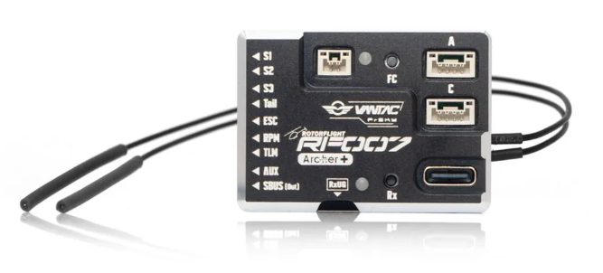

# FrSky Vantac RF007

:::info Specifications  
### Hardware Specifications：  

● Flight Controller Firmware: Rotorflight 2.x  
● Dimension: 43.5×31.2×13.7mm  
● Weight: 25.2g  
● Receiver Options:  
    RF007 ARCHER+: Built-In 2.4G Archer Plus RS Receiver  
    RF007 TWIN: Built-In Dual 2.4G TW R6 Receiver  

● Operating Voltage Range: 5-16V  
● Operating Current (FC Only): 125mA@5V  
● Voltage Measurement Range via AIN (External device): 0-80V  
● RxUG Port: For Upgrading Internal RX Firmware (In case of OTA upgrade failure)  

**Note:** When powering this RxUG port, do not introduce additional power input from other ports to ensure the safe operation of the connected devices.  

● MCU: STM32F722RET6  
● Gyroscope (IMU): ICM-42688P  
● Barometer: SPL06-001  
● Blackbox Flash: 128MB  
● Servo Ports: Servo 1, Servo 2, Servo 3, Tail  
● ESC Ports: ESC (Throttle), RPM (Sensor), TLM (ESC Telemetry or other functions)  
● Other Ports: AUX and SBUS Out/In  
● Expansion Ports: Port A, C, and RxUG  

### Features
● Runs Rotorflight 2.x Helicopter Control Software  
● Built-In FrSky FBUS-Capable Receiver (TW or AP Protocol)  
● Robust CNC Aluminum Case, Functional Heatsink for MCU  
● STM32F722 Microcontroller for Power and Flexibility  
● Precision Barometer, 3-Axis Gyroscope and 3-Axis Accelerometer  
● 128MB Blackbox Function for Tuning/Troubleshooting  
● 9 Primary Main Header Pins for Flexibility and Power Distribution  

:::

### Rotorflight Target
When updating Rotorflight firmware. Please use the VANTAC_RF007.

### wiring

### UART ports

All the UARTS on the Vantac 007 are labeled to match each port. Just enter the function you wish to use for each port such as SerialRx (receiver), ESC Telemetry, blackbox, GPS etc. 

### Manuals

[FrSky RF007 Manual](https://www.frsky-rc.com/wp-content/uploads/Downloads/Amanual/VANTAC%20RF007%20Manual.pdf)  