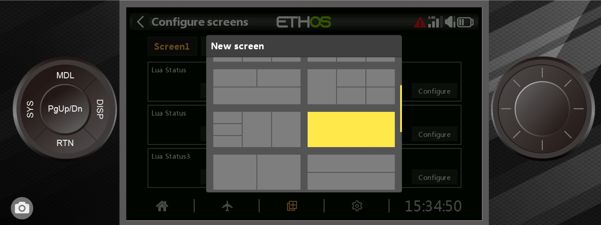
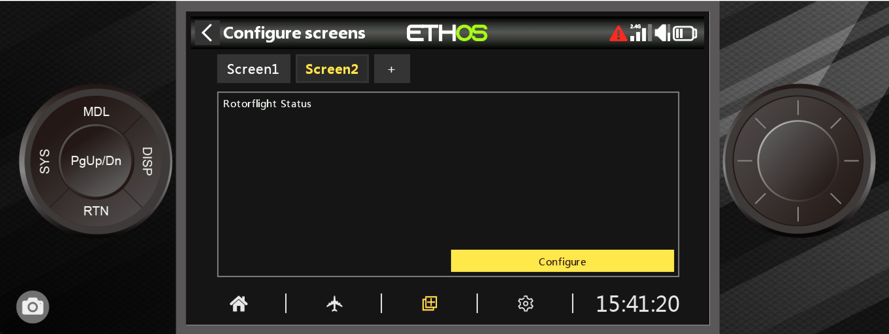
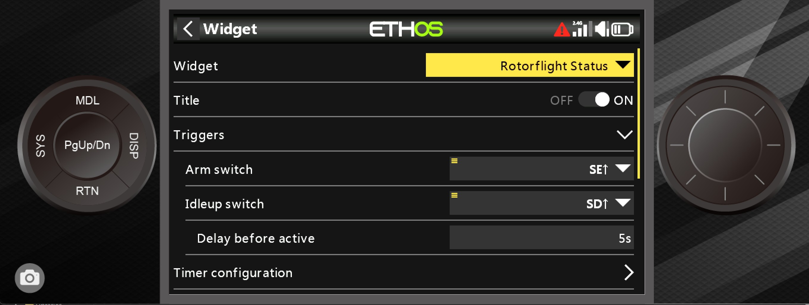
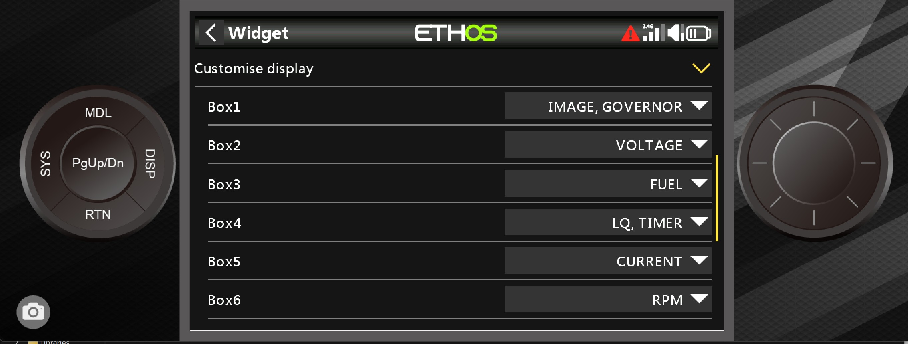
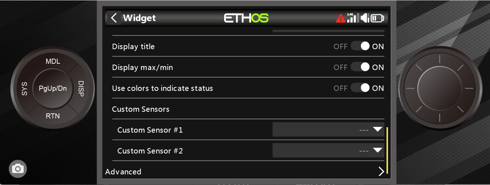

# FrSky Ethos RFStatus LUA Script

Installation
As part of the RFSuite installation detailed above the RFStatus Widget is installed in the background and is ready for configuration.

Before proceeding please ensure the Heli, RX and Rotorflight FBL are powered on and connected to your Ethos transmitter, At this point please ensure you have the full list of Telemetry sensors showing in the Model\Telemetry screen.

##-- PLEASE REMOVE THE BLADES --

Ethos Screen Setup
From the main screen press the DISP button and a screen similar to this will be shown.

Press the + symbol to add another screen, scroll down and select the full screen icon as shown.

Select Change Widget, scroll thru the list and select Rotorflight Status

The following screen is shown, select Configure

The following screen is the main configuration options for the Rotorflight Status widget

TRIGGERS

The ARM and IDLE-UP switch positions MUST be entered as per your Rotorflight configurator setup, in this example SE is ARM (Motor) and SD is IDLE-UP or Throttle Enable. Delay before active is the time taken for your motor to reach idle-up RPM. Current measurements will be started after this timeout.

TIMER CONFIGURATION

This is a count UP timer and will alarm at the set point, you can disable if using another Ethos timer.

BATTERY CONFIGURATION

Enter your Battery \ Voltage settings and preferences, the 'Play alert on' can be configured for your preference.

SWITCH ANNOUNCEMENTS

This section allows you to have the status widget play announcements depending on your TX switch positions.

TELEMETRY ANNOUNCEMENTS

Similar to the above, allows the status widget to play various Telemetry announcements depending on your TX switch positions, this could include, for example, using the rear panel SJ momentary switch to announce Fuel and/or Voltage.

GOVERNOR ANNOUNCEMENTS

Similar to the above but recommended to enable as per your preferences.These are primarily intended for use when using the Rotorflight Governor - If using an External ESC governor you will receive basic announcements of ARMED, DISARMED, ACTIVE and THROTTLE OFF.

CUSTOMISE DISPLAY

This is the main widget display which has 6 pre-defined boxes each of which can display a range of items for your layout preference.

The additional display options allow the widget to display the min\max of the sensors as well as colours to indicate status or low battery. You also have the option to add additional sensors from Telemetry and choose these to display in the main screen.

ADVANCED OPTIONS

This is where you select Rotorflight Internal or an External governor for the widget, as well as any temp conversion from Centigrade to Fahrenheit.

The Voltage section allows you to choose how sensitive the low voltage alarms will be depending on the voltage sag whilst in flight.The sag compensation is a time delay before the alarms are announced.

Gimbal monitor effectively monitors your stick positions based on the drop down selection, and alerts if the given value is met. Normally disabled.

The Headspeed option allows you to set the announcement which will tell you when the headspeed has changed, 10% default, useful to monitor if the Governor is maintaining the requested headspeed during fast 3D manoeuvres. Could point to Governor PID tuning.

Calculate fuel locally can be used in the event your ESC does not send a current measurement.

