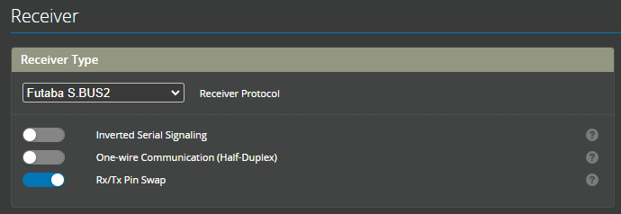

# Futaba example 

:::info Rotorflight Futaba Setup
Instructions for Fu.taba Initial Radio and Configurator Setup, this is a generic setup using Futaba T26SZ transmitter and SBUS2 receiver with a Rotorflight FC. This example shows a Nexus; however, the process is the same for any Rotorflight controller. Please choose the SBUS port related to your FC
:::

## Wiring
The simplest is to use a male to male servo lead to connect from the ***SBUS*** port on the FBL to the ***SBUS2*** port on your receiver.


## Configure the FC
Next steps are to configure the fbl to receive the SBUS2 signal.

### Setup UART ports
Set the SBUS port to be used for serial rx communication


### Setup Receiver 
Then visit the receiver page and configure as follows



### Setup Radio
On the ```Linkage Menu``` -> ```System Type``` page, make sure you are using a protocol that supports telemetry, like T-FHSS or FASSTest 18ch and that telemetry is enabled.


Once you have activated telemetry, you have to configure the list of sensors in the ```Linkage Menu``` -> ```Sensor``` page. The slot assignment and sesor types are important, otherwise your radio won't display the telemetry information correctly.
Follow the assignment map and example bellow:


Once your sensors are configured correctly, you should be able to customize your telemetry screen to include the data you want. 
